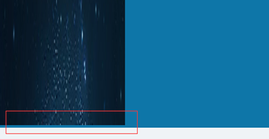
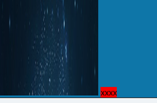

# background

1. 注意：`<bg-size> `只能紧接着` <position> `出现，以"/"分割，如： "center/80%".

## background-size

1. 设置背景图片大小
2. 百分比：背景图片相对背景区的百分比
3. auto：以背景图的比例缩放图片
4. cover
	- 背景图保持原始比例放缩以完全覆盖背景区，可能有部分图片看不到；
	- 背景图以它的全部宽或者高覆盖所在容器
5. contain
	- 缩放背景图片以完全装入背景区，可能背景区部分空白

## background-image

1. 用于为一个元素设置一个或多个背景图，绘制时，以z轴方向堆叠
2. border在image之前，background-color在image之下绘制
3. 如指定的url无法加载，则视为none

## background-position

1. 多个图片的初试位置

## background-clip

1. 设置背景是否延伸到边框下面
2. `background-clip: border-box | padding-box | content-box;`

## background-origin

1. 图片开始绘制的地方，从border开始，border内部开始，还是从padding内部开始
2. `background-origin: border-box | padding-box | content-box;`

# vertical-align

## 基本现象

1. ```html
	<div style="background-color: #0e76a8">
	   
	</div>
	```

2. 

3. 图片下有留白——图片后会有一个隐藏的x作为基线

4. 如下，显式表示，xxxx背后的红色是因为line-height默认为font-size的1.2倍

	- ```html
		<div style="background-color: #0e76a8">
		   
		   <span style="background-color: red;">xxxx</span>
		</div>
		```

	- 

5. 解决办法

	- 让vertical-align失效：img { display: block; }
	- vertical-align不使用baseline，使用bottom，middle等
	- 利用line-height具有继承性，将div { line-height: 5px; }，但span要为inline-block
	- 外围div的font-size设置为0

# border

## currentColor

1. ie9+=，表示的是当前color值

## border

1. 经常使用border配置边，忘记了有border-style，border-color，border-width，可以分别表示上右下左的边框
2. border-radius设置后，会使线条两端变细，如要实现一头细，或者两头都宽，需要使用border-color:transparent来进行处理

# margin: auto

1. 通常做法是，利用margin:auto和固定宽度，保持居中

	```css
	#main {
	  width: 600px;
	  margin: 0 auto; 
	}
	```

2. 问题：当浏览器窗口比元素的宽度还要窄时，浏览器会显示一个水平滚动条来容纳页面。 

3. 解决：利用max-width代替width，可以使浏览器更好地处理小窗口的情况 

# 渐变色

## Linear gradient

1. `linear-gradient(side-or-corner,color-stop)`
2. side-or-corner：可以是
	- 角度值：20deg
	- to top, to bottom, to left 和 to right会被转换为0度、180度、270度和90度
	- 注意：必须要有to这个关键字
3. color-stop，可以是：
	- 一系列颜色值+终点位置，如linear-gradient(side-or-corner,red 10%,green 30px)
	- 30px是沿渐进轴的终点位置

## radial gradient

1. 默认是椭圆形渐变色，可以更改为圆形渐变：`background: radial-gradient(circle,red,blue);`  
2. 默认绘制为中心点，更改绘制position：
	- `radial-gradient(at 40px 20px,red,blue)`
	- 使用关键字`radial-gradient(at top,red,blue)`

## repeat gradient

1. 分为`repeating-linear-gradient`与` repeating-radial-gradient`两个函数
2. 表示创建重复的线性渐变或径向渐变
3. 参数与上面的相同