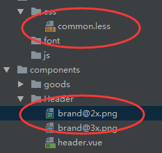

# 主要特点

## 变量

```less
@width: 10px;
#header {
  width: @width;
}
```

## 转义

1. 可以使用字符串作为变量

	```less
	@min768: ~"(min-width: 768px)";
	.element {
	  @media @min768 {
	    font-size: 1.2rem;
	  }
	}
	// =>
	@media (min-width: 768px) {
	  .element {
	    font-size: 1.2rem;
	  }
	}
	```

	

## 混合

```less
.bordered {
  border-top: dotted 1px black;
  border-bottom: solid 2px black;
}
#menu a {
  color: #111;
  .bordered();
}
```

## 嵌套

1. 可以将层级的css转为嵌套写法

## 循环

1. extract函数：获取list的某一个位置值

	```less
	@list: apple, pear, coconut, orange;
	value: extract(@list, 3);// output:coconut
	```

2. 循环设置图片

	```less
	.backgroundcard(@className,@pngName){
	    .@{className}{
	        background: url("./resource/@{pngName}.png") top/100% no-repeat;
	    }
	}
	@bgcardList:a,b,c,d,e,f,g;
	.loop(@i) when (@i < length(@bgcardList)+1){
	    .backgroundcard(extract(@bgcardList, @i),extract(@bgcardList, @i));
	    .loop(@i+1);
	}
	.loop(1);
	```

	

# 变量

## 变量多次定义选取规则

1. 当同级类中定义变量两次时，将使用变量的最后一个定义

2. ```less
	@var: 0;
	.class {      //.class同级中定义了一次@var
	  @var: 1;
	  .brass {     //.brass同级中定义了两次@var，最后取最后一个定义的变量值
	    @var: 2;
	    three: @var;
	    @var: 3;
	  }
	  one: @var;
	}
	```

3. ```css
	.class {
	  one: 1;
	}
	.class .brass {
	  three: 3;
	}
	```

# less路径问题

1. 文件目录如下 

2. 

3. common.less 

	- 使用~，在header.vue中可以利用@import引入直接以相对路径获取图片 "

	- ```less
		.bg-image(@url){
		  background: ~"url(@{url}@2x.png)";
		  @media (min-device-pixel-ratio: 3){
		    background: ~"url(@{url}@3x.png)";
		  }
		}
		```

4. 如不使用~

	- html会解析为：background:url(brand@2x.png)