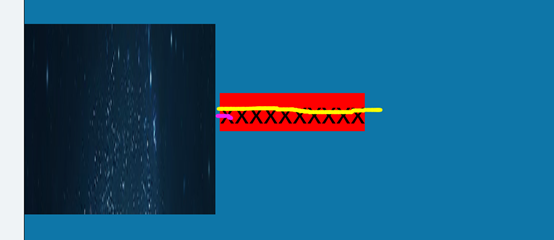

### td的padding如何设置都会有

1. 如果给table设置高度后，td会自动增加padding以保证文字垂直居中

#### 解决办法

1. 删除td或table设置的高度

### table少右边或下边边框

1. 当设置colspan或colspan，合并数目不对时，会造成border:1px solid #000的某个边不显示

#### 解决办法

1. 检查合并数目是否正确


### 图片不绝对居中

1. ```html
	<div style="background-color: #0e76a8;border:1px solid;line-height: 400px;">
	   
	</div>
	```

2. 外围div设置line-height，里面隐藏的x根据继承性，相当于撑高了div

3. 

4. 为何为近似居中，因为字体会有下沉效果，不同字体下沉的不一样，黄线为绝对中心位置，粉线为middle对齐的是x中心位置

5. 

####  解决办法

1. font-size：0，所有线都是绝对中心了 

### 改写样式后页面没有效果

1. 查看html，浏览器上是否有此样式
2. source，文件样式是否已经刷新到浏览器上
3. div，单独加自己写的样式还是没有效果
4. 查看样式文件，是不是自己写的样式前面有多个}}情况，解决

### ei浏览器出现问题，所有页面样式全部缺失

1. 更新ei9，没有结果
2. 使用360——功能大全——人工服务——搜索EI修复，ei就自动进行修复，修复后可用

### Window.print()打印阅览是空白（chrome浏览器），或并不弹出打印的窗口

1. Document.write写入一个脚本；（不能用onload，不起作用）

2. ```javascript
	function printCanvas(canvas){
	    var dataURL = canvas.toDataURL("image/png");
	    var newWindow=window.open();
	    var headstr = "<html><head><title>打印二维码</title></head><body>";
	    var footstr = "<script>document.getElementById('img').onload = function () {window.print()}</script></body>";
	    var newstr = '';
	    newWindow.document.write(headstr+newstr+footstr);
	    return false;
	}
	```

### 处理不同分辨率页面

1. 使用width:90%+max-width
2. 使用chrome带的分辨率测试工具