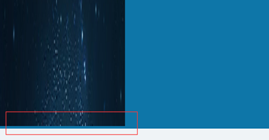

# vertical-align

## 基本现象

1. ```html
	<div style="background-color: #0e76a8">
	   
	</div>
	```

2. 

3. 图片下有留白——图片后会有一个隐藏的x作为基线

4. 如下，显式表示，xxxx背后的红色是因为line-height默认为font-size的1.2倍

	- ```html
		<div style="background-color: #0e76a8">
		   
		   <span style="background-color: red;">xxxx</span>
		</div>
		```

	- 

5. 解决办法

	- 让vertical-align失效：img { display: block; }
	- vertical-align不使用baseline，使用bottom，middle等
	- 利用line-height具有继承性，将div { line-height: 5px; }，但span要为inline-block
	- 外围div的font-size设置为0

# border

## currentColor

1. ie9+=，表示的是当前color值

## border

1. 经常使用border配置边，忘记了有border-style，border-color，border-width，可以分别表示上右下左的边框
2. border-radius设置后，会使线条两端变细，如要实现一头细，或者两头都宽，需要使用border-color:transparent来进行处理

# margin: auto

1. 通常做法是，利用margin:auto和固定宽度，保持居中

	```css
	#main {
	  width: 600px;
	  margin: 0 auto; 
	}
	```

2. 问题：当浏览器窗口比元素的宽度还要窄时，浏览器会显示一个水平滚动条来容纳页面。 

3. 解决：利用max-width代替width，可以使浏览器更好地处理小窗口的情况 


