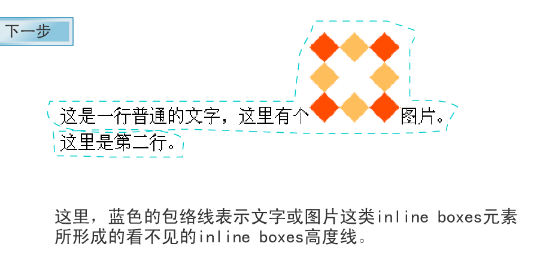
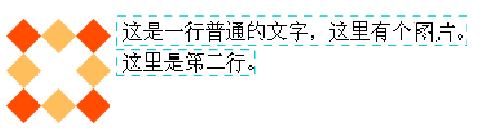
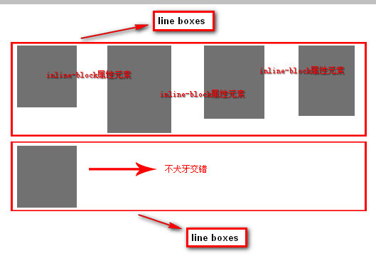

# 浮动

1. 浮动元素脱离文档流，不占据空间。浮动元素碰到包含它的边框或者浮动元素的边框停留

## 本质

### 包裹性

1. 浮动就是个带有方位的`display:inline-block`属性。 

2. 实现按钮要自动包裹在文字的外面

3. ```css
	.btn1{ display: inline-block;background:red;  color:#000; padding:30px;}
	```

4. ```html
	<a href="javascript:" class="btn1">float方法asdfasdfasdf</a>
	```

5. 将display:inline-block换为float:left也会实现相同的效果，只是float带有向左或向右的方向

### 破坏性

1. float，会形成高度塌陷
2. 
3. 图片增加浮动，则图片高度塌陷为0，剩余文字形成新的包裹线，图片虽然高度为0，但占了文档流的位置

## 清除浮动

### 投机取巧法

1. 浮动末尾直接一个`<div style="clear:both;"></div>` 
2. 浪费了一个标签，而且只能使用一次 

### overflow大法

1. ```css
	.fix{overflow:hidden; zoom:1;}
	```

2. 要是里面的元素要是想来个`margin`负值定位或是负的绝对定位可能会出现问题

### after大法

1. ```css
	.fix{zoom:1;}
	.fix:after{display:block; content:'clear'; clear:both; line-height:0; visibility:hidden;}
	```

## 浮动布局

### 局限性

1. 每个列表元素的高度必须要一致，否则会出现类型俄罗斯方块的排列

## inline-block布局

1. 

	

### inline-block元素间的换行符空格间隙问题

1. 父级font-size设置为0
2. letter-spacing:-4px
	- 通过设置letter-spacing来控制文字水平间距
	- 换行符产生的空格与按一下space键的作用是一样的。
	- 此空格所撑开的水平距离受空格字符所在环境的字体以及字体影响 


