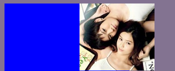
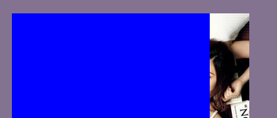
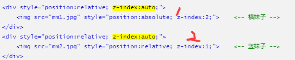
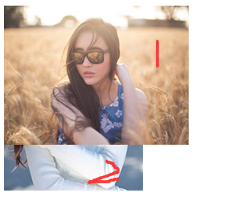
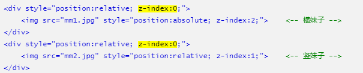
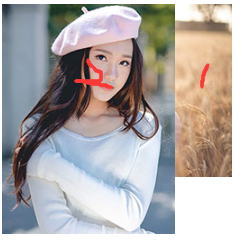
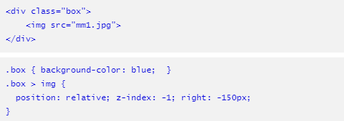
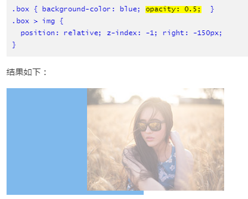

# z-index

## 概述

1. 由使用::before引起z-index深入复习

## 注意

1. 层叠主要是比较同级元素，父级元素的z-index会决定子节点的层级
2. 如父元素为普通元素（未形成层叠上下文），子元素设置z-index:-1，可以让子元素显示父元素之下
3. 当父元素为层叠上下文时，子元素会显示在父元素之上（无论怎么调整两者z-index，都不能时父级在子元素之下）
4. 当父级未设置postion与z-index，但子元素在父元素之上，可能是某些css元素，使父级形成了层叠上下文（关注一下）

## 层叠顺序

1. 

### 举例

1. ```html
	<style>
	.box { background-color: blue; width:250px;}
	.box > img {
	    position: relative;  right: -150px;
	}
	</style>
	<div class="box">
	    
	</div>
	```

2. 图片在box文档流之后，两者都没有创建层叠上下文，故根据文档先后进行堆叠

3. ```css
	// img增加样式z-index:-1
	.box { background-color: blue; width:250px;}
	.box > img {
	    position: relative;  right: -150px; 
	    z-index:-1
	}
	```

4. 根据层叠顺序z-index:-1，构建了层叠上下文，但是在block元素之后

5. ```css
	// box上再增加样式z-index:-1，position: relative;
	.box { 
	    background-color: blue; width:250px;
	    position: relative;
		z-index:-1
	}
	.box > img {
	    position: relative;  right: -150px; 
	    z-index:-1
	}
	```

6. 但当box成为层叠上下时，子元素会显示在父元素之上，无论如何调整z-index大小

## 层叠上下文

### 创建途径

1. 页面根元素天生具有层叠上下文 
2. z-index值为数值的定位元素的传统层叠上下文 
3. 其他CSS3属性 

### 根层叠上下文

1. 页面根元素

### 定位元素的传统层叠上下文

#### z-index不是auto会创建

1. 
2. 
3. z-index:auto不会创建层叠上下文，故可以认为1,2两个图在一个层叠上下文中，所以根据img的z-index进行叠放
4. 但如设置父级z-index
5. 结果为：
6. 因为，两者同时创建层叠上下文，z-index：0，按照文档顺序叠放，不在看里面的img元素

### css3的层叠上下文

1. 根据层叠顺序中的例子，如下，box无层叠上下文，img的z-index为-1；故img在box后面

### opacity 

1. 会使当前元素形成层叠上下，在box设置了opacity后，图片跑到box上面

### transform

### 等一些css3元素

## ::before与z-index

1. ::before是当前元素的子元素

