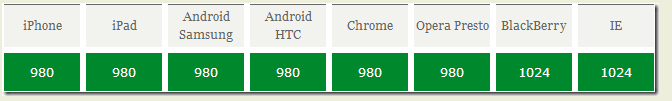
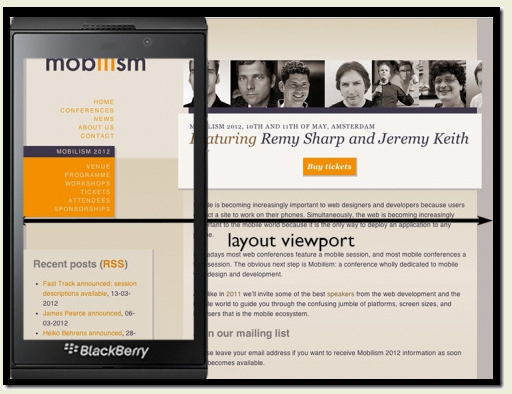
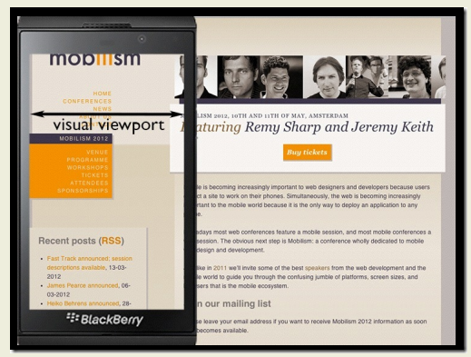
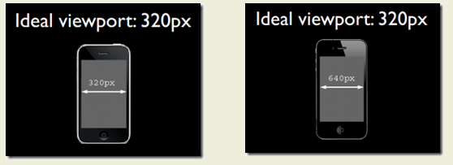

viewport的深入理解
==================

viewport的概念
--------------

1.  通俗的讲，移动设备上的viewport就是设备的屏幕上能用来显示我们的网页的那一块区域

2.  在默认情况下，一般来讲，移动设备上的viewport都是要大于浏览器可视区域的，但带来的后果就是浏览器会出现横向滚动条，因为浏览器可视区域的宽度是比这个默认的viewport的宽度要小的

3.  下图列出了一些设备上浏览器的默认viewport的宽度。

css中的1px并不等于设备的1px
---------------------------

### 概述

1.  在css中我们一般使用px作为单位，在桌面浏览器中css的1个像素往往都是对应着电脑屏幕的1个物理像素

2.  但实际情况却并非如此，css中的像素只是一个抽象的单位，在不同的设备或不同的环境中，**css中的1px所代表的设备物理像素是不同的**

3.  在早先的移动设备中，屏幕像素密度都比较低，如iphone3，它的分辨率为320x480，在iphone3上，一个css像素确实是等于一个屏幕物理像素的

4.  从iphone4开始，苹果公司便推出了所谓的Retina屏，分辨率提高了一倍，变成640x960，但屏幕尺寸却没变化，这就意味着同样大小的屏幕上，像素却多了一倍，这时，一个css像素是等于两个物理像素的

### 用户缩放引起的像素变化

1.  还有一个因素也会引起css中px的变化，那就是用户缩放。例如，当用户把页面放大一倍，那么css中1px所代表的物理像素也会增加一倍；

### devicePixelRatio

1.  定义: 设备物理像素和设备独立像素的比例，也就是 devicePixelRatio = 物理像素 / 独立像素。

2.  设备物理像素和设备独立像素的比例，也就是 devicePixelRatio = 物理像素 /
	独立像素。

3.  例如，在Retina屏的iphone上，devicePixelRatio的值为2，也就是说1个css像素相当于2个物理像素

4.  但注意有兼容性问题:

PPK的关于三个viewport的理论
---------------------------

### layout viewport

1.  document.documentElement.clientWidth获取布局宽度

2.  如果把移动设备上浏览器的可视区域设为viewport的话，某些网站就会因为viewport太窄而显示错乱，所以这些浏览器就决定默认情况下把viewport设为一个较宽的值，比如980px

3.  这样的话即使是那些为桌面设计的网站也能在移动浏览器上正常显示了(需要拖动滚动条)

### visual viewport

1.  浏览器可视区域的大小，通过window.innerWidth 来获取

### ideal viewport

1.  ideal viewport并没有一个固定的尺寸，不同的设备拥有有不同的ideal viewport

2.  所有的iphone的ideal
	viewport宽度都是320px，无论它的屏幕宽度是320还是640，也就是说，在iphone中，css中的320px就代表iphone屏幕的宽度。

3.  ideal viewport 的意义在于，无论在何种分辨率的屏幕下，那些针对ideal viewport，而设计的网站，不需要用户手动缩放，也不需要出现横向滚动条，都可以完美的呈现给用户。

利用meta标签对viewport进行控制
------------------------------

1. 移动设备默认的viewport是layout viewport，也就是那个比屏幕要宽的viewport，但在进行移动设备网站的开发时，我们需要的是ideal
	viewport

2. 开发移动设备的网站时，最常见的的一个动作就是把下面这个东西复制到我们的head标签中

	`<meta name="viewport" content="width=device-width, initial-scale=1.0,maximum-scale=1.0, user-scalable=0"\>`

	- 该meta标签的作用是让当前viewport的宽度等于设备的宽度

| width         | 设置*layout viewport*  的宽度，为一个正整数，或字符串"width-device" |
|---------------|---------------------------------------------------------------------|
| initial-scale | 设置页面的初始缩放值，为一个数字，可以带小数                        |
| minimum-scale | 允许用户的最小缩放值，为一个数字，可以带小数                        |
| maximum-scale | 允许用户的最大缩放值，为一个数字，可以带小数                        |
| height        | 设置*layout viewport*  的高度，这个属性对我们并不重要，很少使用     |
| user-scalable | 是否允许用户进行缩放，值为"no"或"yes", no 代表不允许，yes代表允许   |

width=device-width与initial-scale=1
-----------------------------------

### width=device-width

1.  只设置这个属性的缺陷：在iphone和ipad上，无论是竖屏还是横屏，宽度都是竖屏时ideal viewport的宽度。

### initial-scale

1.  缩放是相对于 ideal viewport来进行缩放的

2.  如下代码，也可以把当前的的viewport变为 ideal viewport

3.  因为缩放比例按照ideal viewport设置缩放

\<meta name="viewport" content="initial-scale=1"\>

1.  只设置initial-scale=1的缺陷：windows phone 上的IE
    无论是竖屏还是横屏都把宽度设为竖屏时ideal viewport的宽度

### width=400与initial-scale=1同时设置

1.  当遇到这种情况时，浏览器会取它们两个中较大的那个值。例如，当width=400，ideal viewport的宽度为320时，取的是400；当width=400， ideal viewport的宽度为480时，取的是ideal viewport的宽度。（ps:在uc9浏览器中，当initial-scale=1时，无论width属性的值为多少，此时viewport的宽度永远都是ideal viewport的宽度）

2.  由于上述iPhone，ie缺陷，故两个属性都要设置

initial-scale缩放问题
---------------------

1.  缩放是相对于ideal viewport来缩放的，缩放值越大，当前viewport的宽度就会越小，反之亦然

2.  例如在iphone中，ideal viewport的宽度是320px，如果我们设置 initial-scale=2 ，此时viewport的宽度会变为只有160px了，这也好理解，放大了一倍嘛，就是原来1px的东西变成2px了，但是1px变为2px并不是把原来的320px变为640px了，而是在实际宽度不变的情况下，1px变得跟原来的2px的长度一样了，所以放大2倍后原来需要320px才能填满的宽度现在只需要160px就做到了
