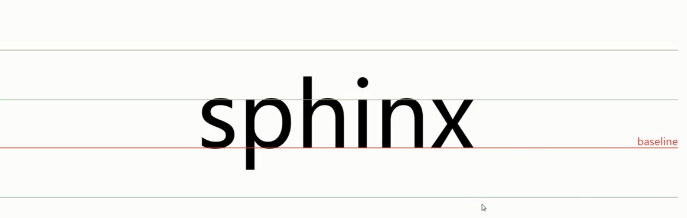
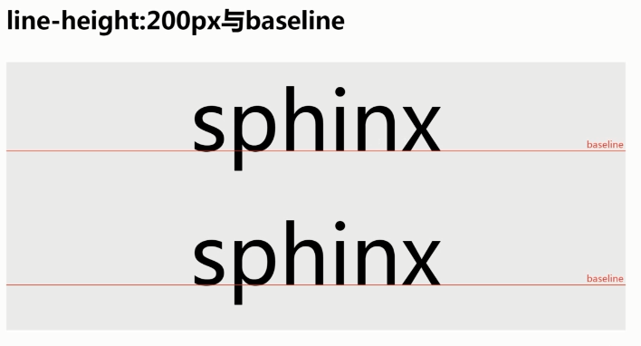
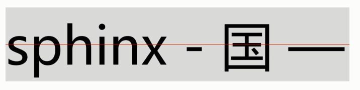
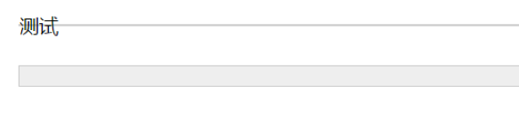
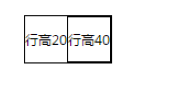

## 定义

1. line-height为行高，两行文字基线之间的距离

2. 什么是基线：一般是英文x下边缘的位置

   

3. 不同文字的基线位置可能不太一样，顾行高为0，则两行文字会重叠在一起

## 内联元素的高度由line-height决定

1. 如`<p>我爱北京天安门</p>`，一旦p元素中有文字，则p有了高度，这个高度由line-height决定
2. 如将p的line-height设置为0，则可以看到p并没有高度

## 各类值

1. 百分之继承的是

## 行高200px



## 为何可以让单行文本垂直居中

1. 注意：只是感觉垂直居中，并没绝对的垂直居中

   

## line-height撑开div高度

1. 可以看到，当line-height为0时，div高度为0，line-height：20px，div高度为20px

   ```html
   <head>
       <style>
           div {border:1px solid #cccccc;   background:#eeeeee;margin-bottom: 40px;}
           .test1{font-size:20px; line-height:0; }
           .test2{font-size:0; line-height:20px; }
       </style>
   </head>
   
   <body style="padding: 40px;">
       <div class="test1">测试</div>
       <div class="test2">测试</div>
   </body>
   ```

   

   - 原因：每个文字都会形成一个inline-box，行高默认为1.2文字大小


 

## 外层div未设置高度，则由一个个inline-box堆叠

1. 行高40的`span`将整行撑高

   ```html
   <style>
   	span {border:1px solid;font-size:10px;display: inline-block;}
   </style>
   <span style="line-height: 20px;">行高20<span style="line-height: 40px">行高40</span></span>
   ```

   - 

 


 

 

 

 

 

 

 