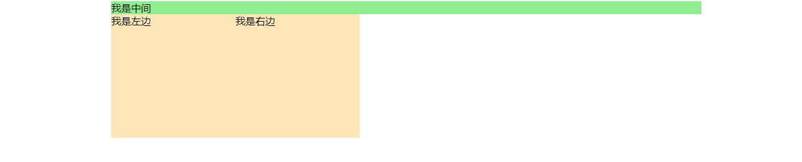
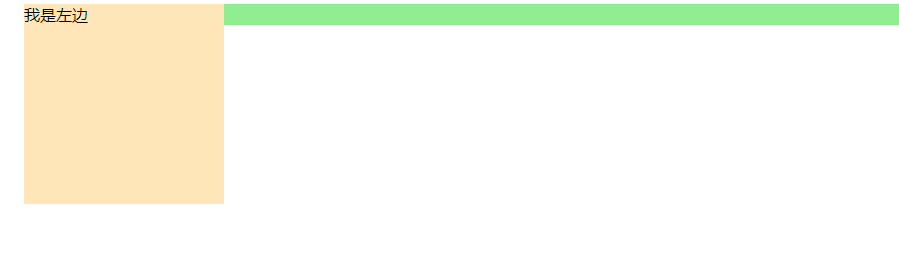

# 常见定位方案

## 普通流

1. 在普通流中，元素按照其在 HTML 中的先后位置至上而下布局
2. 行内元素水平排列，直到当行被占满然后换行
3. 块级元素则会被渲染为完整的一个新行
4. 所有元素默认都是普通流定位

## 浮动

1. 首先按照普通流位置出现，然后尽可能向左边或右边偏移

## 绝对定位

1. 元素脱离文档流，绝对定位元素不会对兄弟元素造成影响
2. 元素具体的位置由绝对定位的坐标决定


# 常见的布局方案

## 静态布局

1. 主要是在body上增加min-width，所有内容以该容器为标准
2. 如页面过小，会出现滚动条
3. 主要问题是：无法适用于移动端，移动端需要设计另一套布局

## 流式布局

1. 通常是左边固定+右边自适应或者左右固定+中间自适应
2. 元素宽高用百分比作为单位，元素会根据分辨率调整，布局不会发生变化
3. 主要问题：屏幕尺寸跨度大时，页面无法正常显示

## flex布局

1. 简单、方便
2. 主要问题：兼容性问题

## 响应式布局

1. 主要是利用媒体查询，检测不同屏幕宽度，设置不同的css样式

# 响应式布局方案

## 概述

1. 响应式布局：一个网站能够兼容多个终端，而不是为每个终端做一个特定的版本，不需要分配子域名

## 第三方库

1. boostrap

## rem布局

1. js获取屏幕宽度，然后设置html的font-size，这样移动端就可以自适应了

## 媒体查询

1. @media+px
2. 缺点：可能需要提供多套代码

## 百分比布局

1. 缺点：
	- 从设计稿转换为百分比，计算麻烦
	- 百分比的继承关系较为复杂，使得布局也变得稍微麻烦

# 三栏自适应布局

## 概述

1. 两边宽度固定，中间自适应

## 普通玩法

1. 注意：html，中间的元素

2. 绝对定位法

  ```html
  <style>
  #left,#right{
      width: 200px;
      height: 200px; 
      background-color: #ffe6b8;
      position: absolute;}
  #left{left:0px;}
  #right{right: 0px;}
  #center{
      margin:2px 210px ;
      background-color: #eee;
      height: 200px; }
  </style>
  <div id="box">
      <h3>实现三列宽度自适应布局</h3>
      <div id = "left">我是左边</div>
      <div id = "right">我是右边</div>
      <div id = "center">我是中间</div>
  </div>
  ```

  - 优点：三个div顺序可以任意改变，注意要设置div的top值

3. 浮动大法

  ```css
  #left,#right{
      width: 200px;
      height: 200px; 
      background-color: #ffe6b8;}
  #left{float: left;}
  #right{float: right;}
  #center{
      margin:2px 210px ;
      background-color: #eee;
      height: 200px; }
  ```

  - center元素必须放在最后，如放第一个会独占一行
  - 后面的元素会在下一行分别左右浮动

4. flex大法

  ```html
  <style>
      #box{display: flex;}
      #left,#right{
          width: 200px;
          height: 200px;
          background-color: #ffe6b8;
      }
      #center{flex: 1;background-color: lightgreen;}
  </style>
  <div id="box">
      <div id = "left">我是左边</div>
      <div id = "center">我是中间</div>
      <div id = "right">我是右边</div>
  </div>
  ```


### 进阶玩法（main先显示）

1. 即html结构需要是，main在最前面，实现三列布局

  ```html
  <div id="box">
      <div id = "center">我是中间</div>
      <div id = "left">我是左边</div>    
      <div id = "right">我是右边</div>
  </div>
  ```

2. 绝对定位，可以随意安排div顺序

3. flex布局

  ```css
  #left{
      order:-1;
  }
  ```

  - 利用flex的order将调整显示顺序，元素默认的order都是0，顾给center增加1，并不能让center在left与right中间

4. 浮动大法（圣杯布局）

  ```css
#box{
    padding: 0 200px;
}
#left,#right,#center{
    position: relative;
    float: left;
}
#left,#right{
    width: 200px;
    height: 200px;
    background-color: #ffe6b8;
}
#right{
    margin-left: -200px;
    right: -200px;
}
#left{
    margin-left:-100%;
    left:-200px;
}
#center{
    width: 100%;
    background-color: lightgreen;
}
  ```

  - 首先将外围包裹的div设置padding;

  - 设置center，width:100%,撑开整行

    

  - 现在将left，margin-left设置为-100%，会形成

    

  - 而对于right元素，需要-200px才能将元素上移

  - 再分别利用left和right进行移动左右元素


# 水平垂直居中的方法

## margin:auto法

1. 利用absolute与`margin:auto`

   ```html
   <style>
       .outer{
           width: 400px;
           height: 400px;
           position: relative;
           border: 1px solid #000;
       }
       .inner{
           position: absolute;
           left: 0;
           top: 0;
           right: 0;
           bottom: 0;
           margin: auto;
           background-color: #000;
           width: 30px;
           height: 30px;
       }
   </style>
   <div class="outer">
       <div class="inner"></div>
   </div>
   ```

## 负margin

```html
<style>
    .outer{
        width: 400px;
        height: 400px;
        position: relative;
        border: 1px solid #000;
    }
    .inner{
        position: absolute;        
        background-color: #000;
        width: 30px;
        height: 30px;
        left: 50%;
        top: 50%;
        margin-left: -15px;
        margin-top: -15px;
    }
</style>
```

## transform方法

1. 利用`transform：translateX(-50%)和transform：translateY(-50%) `

## table-cell（未脱离文档流的）

1. 设置父元素的display:table-cell,并且vertical-align:middle，这样子元素可以实现垂直居中。 

## flex

1. 将父元素设置为display:flex，并且设置`align-items:center;justify-content:center;`


# 多元素水平居中

1. 把子级div设置成display:inline-block; 然后父级div设置text-align:center;

2. 更方便灵活的做法还是使用flex-box, 设置水平居中 justify-content: center

   ```css
   main{
       display:flex;
       justify-content:center;
   }
   ```

   

   # 