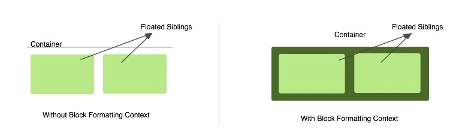

# BFC

## 概述

1. 块级格式化上下文（Block Fromatting Context）是按照块级盒子布局的
2. 一个html元素要创建BFC，则要满足下面任意一个或多个条件
	- float的值不是none
	- position的值不是static或者relative
	- display的值是inline-block、table-cell、flex、table-caption或者inline-flex
	- overflow的值不是visible

## 避免外边距折叠

1. 默认情况下，垂直排列的盒子外边距会进行重叠
2. 两个相邻元素要处于同一个BFC中，元素会发生折叠；
3. 若两个相邻元素在不同的BFC中，就能避免外边距折叠。

## 消除浮动

1. 浮动元素会脱离文档流，并会造成外围容器高度塌陷
2. 通常利用`::after`来解决这个问题，BFC包含浮动也能解决这个问题（即经常使用overflow:hidden）
  

# 

# 元素隐藏

## display:none

1. 浏览器不会生成属性为display: none;的元素
2. 不占据空间，动态改变此属性时会引起重排（改变页面布局），可以理解成在页面中把该元素删除掉一样 
3. 不会被子孙继承，但是其子孙是不会显示的，毕竟都一起被隐藏了。  

## visibility:hidden

1. 占据空间
2. 会被子孙继承，子孙也可以通过显示的设置visibility: visible;来反隐藏。  
3. 动态修改此属性会引起重绘。  
4. 不会触发该元素已经绑定的事件。 

## opacity=0

1. 透明度为100%，占据空间
2. 会被子孙继承，子元素并 不能通过opacity=1，进行反隐藏。
3. 依然能触发已经绑定的事件 

# CSS三大特性

1. 层叠性：浏览器解析CSS是从上至下，当CSS冲突时以最后定义的CSS为准。
2. 继承性：继承就是子标签继承了上级标签的CSS样式的属性
3. 优先级：!important > 内联样式>ID选择器 > 类选择器 > 标签 > 通配符 > 继承 > 浏览器默认属性

## 