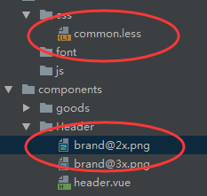

# 变量

## 变量多次定义选取规则

1. 当同级类中定义变量两次时，将使用变量的最后一个定义

2. ```less
	@var: 0;
	.class {      //.class同级中定义了一次@var
	  @var: 1;
	  .brass {     //.brass同级中定义了两次@var，最后取最后一个定义的变量值
	    @var: 2;
	    three: @var;
	    @var: 3;
	  }
	  one: @var;
	}
	```

3. ```css
	.class {
	  one: 1;
	}
	.class .brass {
	  three: 3;
	}
	```

# less路径问题

1. 文件目录如下 

2. 

3. common.less 

	- 使用~，在header.vue中可以利用@import引入直接以相对路径获取图片 "

	- ```less
		.bg-image(@url){
		  background: ~"url(@{url}@2x.png)";
		  @media (min-device-pixel-ratio: 3){
		    background: ~"url(@{url}@3x.png)";
		  }
		}
		```

4. 如不使用~

	- html会解析为：background:url(brand@2x.png)