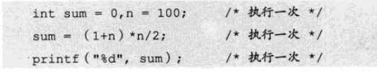
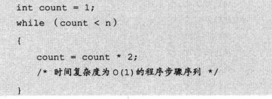
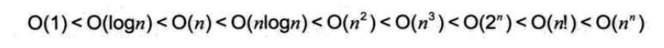
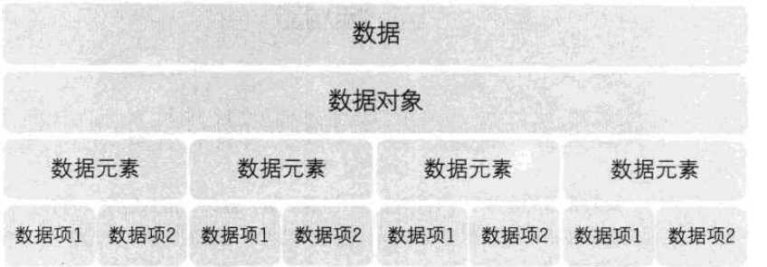
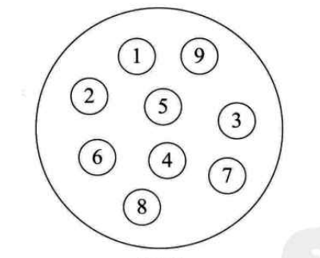
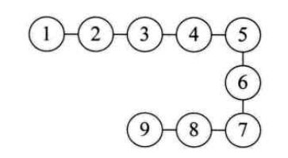
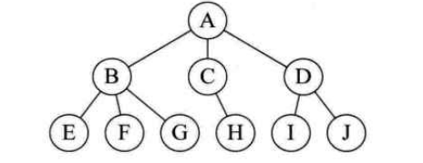
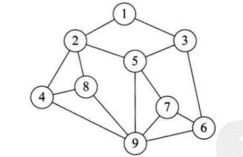

算法概述
========

概述
----

1.  学习算法原因是他们能节约非常多资源，甚至能够让我们完成一些本完成不了的任务
2.  很多库已经实现了基本算法，为何还要学习？经常需要重现这些基础算法，甚至在全新的环境中，原有实现无法将新环境的优势全部发挥出来

算法效率的度量方法
------------------

### 事后统计法

1. 通过设计好的测试程序和数据，利用计算机计时器对不同算法的运算时间进行比较，从而确定算法的效率高低
2. 统计的时间依赖于计算机硬件与软件环境，有时会遮盖算法本身的优劣
3. 算法测试数据设计困难

### 事前分析估算方法

1. 一个程序的运行时间，依赖于算法的好坏与问题输入规模；

函数渐进增长
------------

1. 输入规模n没有限制的情况下，只要超过一个数值N，这个函数总是大于另一个函数，则称这个函数是渐进增长的
2. 判断一个算法的效率时，函数中的常数与其他次要项常常可以忽略，而更应该关注主项（最高阶项）的阶数
3. $2n^2$与$2n^2+3n+1$，当n无限大时，两个算法实际较为接近

算法时间复杂度
--------------

### 定义

1. 在进行算法分析时，语句总的执行次数T(n)是关于问题规模n的函数，进而分析T(n)随n的变化情况并确定T(n)的数量级；
2. 算法的时间复杂度，也就是算法的时间度量，记作：T(n)=O(f(n))；表示随问题规模n的增大，算法执行时间的增长率和f(n)的增长率相同，称作算法的渐近时间复杂度，简称时间复杂度；其中f(n)是问题规模n的某个函数
3. O()来体现算法时间复杂度的记法，称作大O记法

### 推到大O阶的方法

1. 用常数1取代运行时间中的所有加法常数
2. 只保留最高阶
3. 最高阶去除与之相乘的常数项

### O(1)

1. 对于如下算法运行次数函数为：$f(n)=3$，时间复杂度为O(1); 

	

2. 不管常数是几，都记作O(1)

3. 对于分支结构，无循环，执行次数一定的，时间复杂度也为O(1)

### O(logn)

1. 如下图所示，count每次乘以2，当大于n时，故$2^count=n,count= log2(n)$，所以时间复杂度为O(longn)

常见是时间复杂度关系
--------------------

数据结构概述
============

基本概念与术语
--------------

### 数据元素

1. 是组成数据的、有一定意义的基本单位，在计算机中通常作为整体处理，也被称为记录
2. 比如人类中，人就是数据元素

### 数据项

1. 一个数据元素可以由若干干数据项组成
2. 如人的耳朵，鼻子等为数据项；姓名，出生地等也为数据项，具体哪些数据项，根据系统决定

### 数据结构

1. 相互之间存在的一种或多种特定关系的数据元素的集合
2. 类似于分子结构，表示数据与数据直接关系的集合

### 数据对象

1. 相同性质的数据元素的集合，是数据的子集
2. 根据视点不同将数据结构分为逻辑结构与物理结构

逻辑结构
--------

### 集合结构

1. 各个数据元素平等，他们共同属性是，都属于同一个集合

### 线性结构

1. 数据元素是一对一的关系

### 树形结构

### 图形结构

1. 数据元素是多对多的关系

物理结构
--------

1. 元素存储在计算机的形式，可以理解为存储结构

### 顺序存储结构

1. 数据元素存在地址连续的存储单元中，其数据间的逻辑关系与物理关系是一致的
2. 数组就是这样的顺序存储结构

### 链式存储结构

1. 数据元素存放在任意的存储单元中，这组存储单元可以是连续，也可以是不连续的

抽象数据类型
------------

1. 数据类型
	- 高级语言中，每个变量，表达式都有各自的取值范围；类型是用来说明他们的取值范围和所能进行的操作
	- 因为计算机内存不是无限大的，需要为不同运算开辟不同大小的内存空间，故需要对数据进行分类，分出多个数据类型
