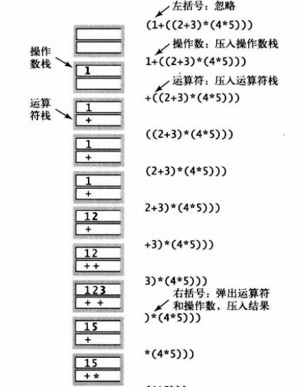
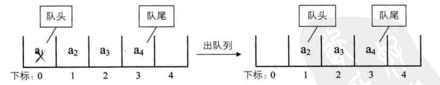
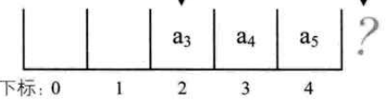

# 栈与队列

## 栈

### 概述

1. 栈是后进先出(Last In First Out)的线性表，简称LIFO结构
2. 首先它是线性表，只是特殊形式的线性表而已

### 栈顺序存储实现方式

1. 小应用------Dijkstra的双栈算术表达式
2. 获取字符串表示的算术表达式的值，比如求$(1 + ((2+3)*(4*5)))$
3. 算法思路：
	- 数字就放入操作数栈 
	- 操作符就放入符号栈 
	- 忽略左括号，遇到右括号，拿出所需要操作符和操作数进行计算，在把结果压入操作数栈。
	-  
4. Java实现变长stack
	- 思路是，在pop与push时，判断Stack长度，如果stack到达最大N，则重新构造一个2\*N的数组，将之前数据拷贝到新数组，然后再新增元素
	- 如，pop后，发现数组空元素过多，则将数组缩短，避免空间浪费
	- 主要缺点是：push和pop方法会调用resize遍历整个数组，因此这项操作和栈的大小成正比

### 栈链表存储实现方式

1. Java举例说明：

	- Node类，需要具有储存内容的Item，以及下一个Node的实例变量

		```java
		private class Node{
		    Item item;
		    Node text;
		}
		```

	- 构建Node实例，分别为其赋值，并赋next节点；third节点的next为空，相当于空链表

		```java
		Node first = new Node();
		Node second = new Node();
		Node third = new Node();
		first.item = 'to';
		second.item = 'be';
		third.item = 'or';
		first.next = second;
		second.next = third;
		```

2. 这样的列表对于表头插入节点，表头删除节点，表尾插入节点都比较容易操作，但是在指定位置删除或添加节点，就比较困难，需要遍历整个链表；如要删除尾部节点，需要知道N-1节点是谁，将N-1的node指向，由原来的N指向为Null，故需要循环整个链表

3. 实现任意插入与删除节点的标准解决方案是双向链表

	- 下压堆栈（链表实现）

	- 即不再使用数组作为内部数据结构

		```java
		public class Stack<T> {
		   private int N = 0;
		   private Node first;
		   private class Node{
		       T item;
		       Node next;
		   }
		   public void push(T item){
		       Node newNode = new Node();
		       newNode.item = item;
		       newNode.next = first;
		       N++;
		
		   }
		   public T pop(){
		       T item =  first.item;
		       first.next = null;
		       N--;
		       return item;
		   }
		}
		```

		

## 队列

### 定义

1. 是一种先入先出（First In First Out）的线性表，简称FIFO
2. 因为队列也是线性表，因此同样存在顺序存储与链式存储两种方式

### 循环队列

1. 队列顺序存储的不足
	- 如队列有n个元素，需要开辟大于n的数组，如a\[0\]为队头，添加元素在队尾，时间复杂度为O(1)
	- 但如出队一个元素，需要挪动全部剩余元素，时间复杂度为O(n)
	- 为了使出队的时间复杂度也为O(1)，可以不挪动元素，出队之后，让a\[1\]称为队首元素
2. 不挪动元素队列的缺点
	- 如数组长度为5，但当数组中有3个元素时，队首在a\[2\]处，此时再添加元素，会出现数组越界，但实际0,1位置还是空闲的，这种情况称之为"假溢出"



### 循环队列定义

1. 把队列的头尾相连的顺序存储结构称之为循环队列
2. 循环队列要注意的几点：
	- 如将队首指针设为rear，队尾设置为front，那么空队列时，rear=front，但当循环队列满时也是rear=front
	- 可以通过增加一个标志位flag，来判断是否为空队列或满队列
	- 还可以将满队列中间空一个位，当front与rear相差一个位置时，则为满队列
	- 还要考虑，rear与front不知谁大谁小，如相差一个位置，可能是满队列，也可能整整相差一圈

# 