# 字符串

## 概述

### 定义

1. 串（string）：是由零或多个字符组成的有限序列，又名字符串
2. 串中的每个成员称为字符
3. 所谓序列，说明串相邻字符之间具有前驱和后继的关系
4. 术语
	- 相等：长度相等，且对应字符都相同
	- 空串：长度为0的串，注意与由空格组成的串不同

### 抽象数据类型（ADT）

1. 串的逻辑结构与线性表很相似，不同之处是串针对的字符，即字符集
2. 通常，字符种类不多，而串长很长
	- 比如英文文章，就是a-z加上标点，字符种类很少，但字符串长度要远远大于字母表长度
3. 串的操作与线性表差别也很大；线性表更关注单个元素的操作，如查找一个元素，插入或删除元素；串更多的是找子串位置，替换子串等操作
4. 其实串匹配问题，主要就是如何高效的实现indexOf接口

### 串的存储方式

1. 顺序存储
2. 链式存储：与线性表区别是：并不是每一个节点存储一个字符，这样会浪费很多空间；一般一个节点存储一个字符串，但存储多少比较合适，需要根据实际分析
3. 链式存储在连接串与串操作有一定方便外，总的来说不如顺序存储灵活，性能好

## 串匹配

### 概述

1. 串匹配根据难度不同，可以分为如下：
	- 只关心匹配串是否在文本中出现，如查找病毒，只是看文件中是否有病毒的关键码
	- 定位：文本出现在哪
	- 出现次数
	- 枚举问题：文本出现多次，每次出现在哪些位置
	- 关键是：定位问题，如能高效的找到文本在哪，出现次数以及枚举问题则会高效

### 编码方式

1. 常用编码集是标准的ASCII编码；7位二进制数表示一个字符，总共128个
2. 后来一些特殊的符号出现，使用扩展ASCII编码；8位二进制数，总共256个
3. 包含中文等多国符号，Unicode编码，16位二进制数；前256与AscII一致；

### 串如何比较

1. 通过组成串的字符之间的编码来进行的
2. 字符的编码指的是字符集中字符的序号

## 朴素的模式匹配算法

### 模式匹配

1. 子串的定位操作通常称为模式匹配；串中比较重要的操作
2. 如要在goodgoogle中查询google的位置，需要循环外面的goodgoogle，再循环google，不停比较每一个位置是否一致，来决定是否匹配

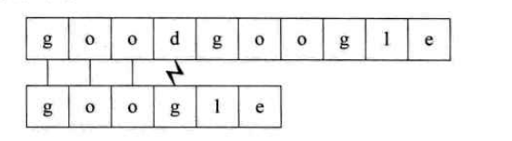

### 代码实现

#### 方式1

### 缺陷

1. 如n为主串长度，m为匹配子串长度，时间复杂度为O((n-m+1)\*m)
2. 更糟糕的是字符串会被处理为二进制形式，进行匹配，可能主串为00000000000000000000000001,匹配的为0001，循环到最后才能匹配到

## KMP模式匹配算法

### 算法原理

1. 通过每次移动多余1位比较，减少比较次数
2. 一个基本事实是，当空格与D不匹配时，你其实知道前面六个字符是\"ABCDAB\"。KMP算法的想法是，设法利用这个已知信息，不要把\"搜索位置\"移回已经比较过的位置，继续把它向后移，这样就提高了效率。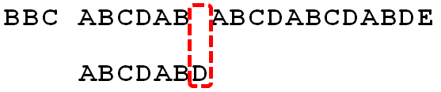

1. 怎么做到这一点呢？可以针对搜索词，算出一张《部分匹配表》（Partial Match Table）。这张表是如何产生的，后面再介绍，这里只要会用就可以了。
2. 已知空格与D不匹配时，前面六个字符\"ABCDAB\"是匹配的。查表可知，最后一个匹配字符B对应的\"部分匹配值\"为2，因此按照下面的公式算出向后移动的位数：
	- 移动位数 = 已匹配的字符数 - 对应的部分匹配值
	- 因为 6 - 2 等于4，所以将搜索词向后移动4位。
3. 因为空格与Ｃ不匹配，搜索词还要继续往后移。这时，已匹配的字符数为2（\"AB\"），对应的\"部分匹配值\"为0。所以，移动位数2，于是将搜索词向后移2位。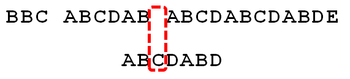
4. 因为空格与A不匹配，继续后移一位。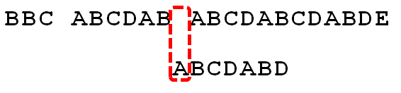
5. 逐位比较，直到发现C与D不匹配。于是，移动位数$ = 6 - 2$，继续将搜索词向后移动4位。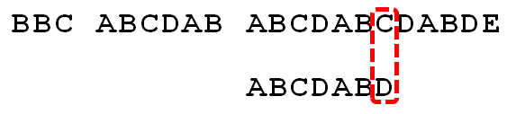
6. 逐位比较，直到搜索词的最后一位，发现完全匹配，于是搜索完成。

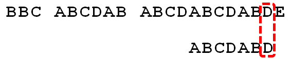

### 部分匹配值获取

1. \"部分匹配值\"就是\"前缀\"和\"后缀\"的最长的共有元素的长度。以\"ABCDABD\"为例
	- \"A\"的前缀和后缀都为空集，共有元素的长度为0；
	- \"AB\"的前缀为\[A\]，后缀为\[B\]，共有元素的长度为0；
	- \"ABC\"的前缀为\[A, AB\]，后缀为\[BC, C\]，共有元素的长度0；
	- \"ABCD\"的前缀为\[A, AB, ABC\]，后缀为\[BCD, CD,D\]，共有元素的长度为0；
	- \"ABCDA\"的前缀为\[A, AB, ABC, ABCD\]，后缀为\[BCDA, CDA, DA,A\]，共有元素为\"A\"，长度为1；
	- \"ABCDAB\"的前缀为\[A, AB, ABC, ABCD, ABCDA\]，后缀为\[BCDAB, CDAB,DAB, AB, B\]，共有元素为\"AB\"，长度为2；
	- \"ABCDABD\"的前缀为\[A, AB, ABC, ABCD, ABCDA,ABCDAB\]，后缀为\[BCDABD, CDABD, DABD, ABD, BD,D\]，共有元素的长度为0。

### Next数组

1. 主要解决计算机如何实现部分匹配值数组
2. 构造next数组，j表示要匹配的字符串挪动的位置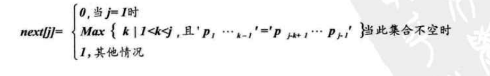
3. T=abcabx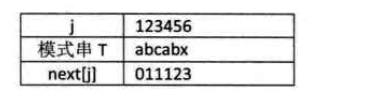
	- j=1时，根据上述公式，next\[1\] = 0
	- j=2时，j由1到j-1串只有字符a，属于其他情况，故next\[2\]=1
	- j=3时，字符串为ab，属于其他情况，next\[3\] = 1
	- j=4时，字符串为abc，next\[4\] = 1
	- j=5时，字符串为abca，前缀字符a与后缀字符a相等，故p1=p4，得到k=2，故next\[5\] = 2
	- j=6时，字符串为abcab，其中p1p2 = p4p5,故k=3，即next\[6\] = 3

4. next值使用
	- 匹配字符串为abcabx，主串为abcabcabc，如下，开始时，直到主串匹配到i=6，j=6时，才发现不匹配，现在需要挪动子串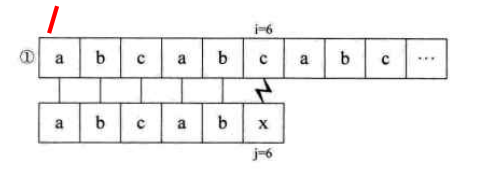
	- 朴素的模式匹配是将匹配字符串向后挪动1位，再匹配；这样是不必要的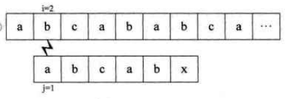
	- KMP算法则是根据next数组，来判断移动位置数，根据数组可以得到j=6时，next\[6]= 3，因此需要在匹配字符串j=3开始匹配；即不再回溯主串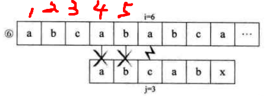

5. 主串为aaaabcde与匹配串aaaaax
	- 匹配串的next数组为  012345
	- 开始匹配到主串i=5时，发现匹配不对，读取next数组；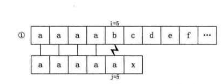
	- 此时next\[5\]=4，因此，需要将子串挪动到j=4，将i=5与j=4的数据判断是否匹配；不匹配，再判断j=3；依次类推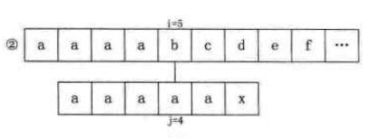
	- 直到j=1判断不对，再挪动i=7再匹配子串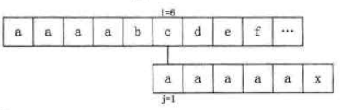

## 改进的KMP模式匹配算法

### 普通KMP算法的缺点

1. 对于主串为aaaabcde与匹配串aaaaax；这样的匹配中间有些过程是没有用的；如i=5时不匹配，根据next数组得知，当前j=4；但由于匹配串前4个都是a，i=5不匹配，前面i=4，i=3等都不匹配，没必要进行循环

### 新next推导

1. T=ababaaaba，next为KMP，nextval为改进的KMP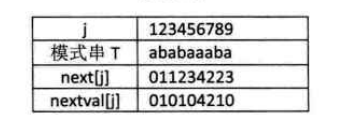
2. 计算出next数组为011234223
	- j=1时， nextVal\[1\] = 0
	- j=2时，由于b这个字符，需要next值为1，但next为1时，是a字符，不相等，保留原有next值，nextVal\[2\]=1
	- j=3时，此时字符为a，next为1，next为1时，字符为a，相等，使用之前的next值，因此nextVal[3]=0
	- j=4时，nextVal\[4\] = 1
	- j=5时，nextVal\[5\] =0
	- j=6时，此时字符a，next值为4，next值为4时，实际字符为b，故保留原有next值，nextVal\[6]= 4
