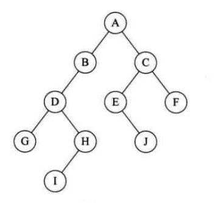
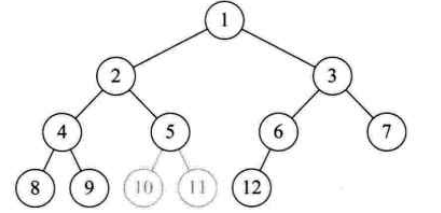

# 树

## 概念

### 定义

1. **树是一对多的数据结构**
2. 树是n(N\>=0)个节点的有限集合；n=0时称为空树；
3. 在任意一个非空树中：
  - 有且仅有一个特定的称为根的节点
  - 当n\>1时，其余节点可分为m(m\>0)个互不相交的有限集T1，T2。。。Tn，其中每一个集合本身又是一个树，并且称为根的子树；如下结构则不符合树的定义
  - 

### 结点与度

1. 树的结点包含一个数据元素及若干个指向其子树的分支
2. 度
	- 结点拥有的子树数称为结点的度
3. 叶子结点（终端结点）
	- 度为0的结点
4. 分支节点
	- 除了根结点以外的结点
	- 称内部节点，非终端结点
5. 树的度
	- 树内结点度的最大值

### 结点间关系

1. 结点子树的根称为该结点的孩子，相应的，该结点称为孩子的双亲；如下，B这个树的根结点为B这个结点，B是A的孩子，A是B的双亲
2. 兄弟：同一个双亲的孩子之间称为兄弟
3. 祖先：结点祖先是从根到该结点所经分支的所有结点；如H的祖先是DBA
4. 子孙：以某结点为根的子树中任一个结点都是子孙；B的子孙是：DGHI

### 结点的层次与树的深度

### 有序树与无序树

1. 如将树中结点的各个子树看成从左到右是有次序的，不能互换的，则称该树为有序树

### 森林

1. M棵互不相交树的集合，如上，BC两颗树可以理解为森林

### 线性表与树对比

### 树的抽象数据类型

1. 相对于线性表，树的操作就完全不同了
2. 比如树操作：是否为空树，查询某个结点值；结点是否为叶子结点；某个结点的度；树的度；查询某个结点的兄弟，祖先，子孙等；类似于DOM树的操作了

## 树的存储结构

### 概述

1. 无论按照何种顺序将树的结点存储在数组中，都无法根据存储位置直接反应出树的逻辑关系
2. 简单的顺序存储无法满足树的实现需要
3. 通过利用顺序存储与链式存储的特点，可以实现树的存储

### 双亲表示法

1. 思路是：每个结点不一定有孩子，但都有双亲

2. 假设用一组连续的空间存储树的结点，每个数组项存放的是当前数据data与双亲结点parent；

3. 由于根结点无双亲，假设他的双亲为-1

4. 优势是：查找parent的时间复杂度为O(1)；但查找结点的孩子，需要遍历整个树

	- 

	- 

5. 为了遍历孩子方便，可以在每个数据项增加一个第一个孩子的索引项

	- 

6. 增加孩子域后，查找兄弟域还是不容易查找，故可以增加一个兄弟域

	- 

7. 但并不是域越多越好，需要根据具体的运算来判断一个存储结构设计的是否合理，是否方便

### 孩子表示法

1. 思路：每个结点有多个指针域，其中每个指针指向一棵树的根节点，我们把这种方法叫做多重链表表示法；但主要问题是，每棵树的度不同
2. 方案一：每个结点度为树的度
	- 树的度为3，因此，每个结点的指针域为3个
	- 
	- 
	- 主要问题是：当树结点度相差很大时，造成空间浪费；但如果相差不大，则成为了优点
3. 方案2：按需分配空间，每个节点的指针域与度相同；数组增加一个表明树的度的域
	- 
	- 问题：由于各个结点的链表不同结构，加上维护度的数值，运算消耗了，但空间节省了
4. 方案3：孩子表示法
	- 把每个结点的孩子结点排列起来，以单链表作为存储结构，n个结点有n个链表；即先将节点存为数组，然后每个数组项，形成孩子结点的链表形式
	- 
	- 优势：查找某个结点的子结点，某个结点兄弟结点，直接查找链表就可以；遍历整个树也比较方便，直接遍历数组即可
	- 比如：查找E的子节点；直接根据数组4，的指向得到子节点为9；但查找兄弟结点是，查找如类似a的子节点的兄弟节点，直接遍历a的链表即可
	- 劣势：无法知道某个结点的双亲结点（因为单列表的问题）；同时给定一个结点，如B，查找其兄弟结点无法查找
5. 改进办法：
	- 根据双亲表示法的启发，可以在数组提供一个双亲的表示列
	- 

### 孩子兄弟表示法

1. 思路：指针域为一个孩子和一个兄弟

1. 结点结构为：
  - A结点有一个孩子B，没有兄弟
  - G结点没孩子，只有兄弟；依次为H，I
  - 同样具有无法找到双亲的缺点
2. 最大优势：将复杂树转换为二叉树，可以使用二叉树的算法；

## 二叉树

### 概念

1. 定义

	- 二叉树是n(n\>=0)个结点的有限集合，该集合或者为空集（称为空二叉树），或者由一个根结点和两颗互不相交的、分别称为根结点的左子树与右子树的二叉树组成

		

2. 特点

	- 每个结点最多有两棵树，所以二叉树结点的度小于等于2；没有子树或者一颗子树也可以称为二叉树
	- 左子树与右子树是有顺序的
	- 某个结点只有一棵树，也区分它是左子树还是右子树；如下为不同的二叉树

### 特殊二叉树

#### 斜树

1. 所有结点只有左子树的二叉树叫左斜树；只有右子树的二叉树叫右斜树；两者统称斜树
2. 斜树特点：每层只有一个结点；结点个数与二叉树深度相同
3. 线性表可以理解为树的一种极其特殊的形式

#### 满二叉树

1. 一颗二叉树，如果所有分支结点都存在左二叉树与右二叉树，并且所有叶子都在同一层上；

	

2. 特点：

	- 叶子只能出现在最下一层
	- 非叶子结点的度一定是2
	- 在相同深度的二叉树中，满二叉树结点个数最多，叶子数最多

#### 完全二叉树

1. 满二叉树一定为完全二叉树；完全二叉树不一定是满二叉树

2. 按层序编号；此树在10,11位置空缺；故树的编号不是连续的，因此不是完全二叉树

	

3. 特点：

	- 叶子结点只能出现在下两层
	- 最下层的叶子结点一定集中于左部连续位置
	- 倒数第二层，若有叶子结点一定是右部连续如结点度为1，该结点只有左孩子
	- 同样结点树的二叉树，完全二叉树深度最小

### 性质

1. 

  - 可以根据满二叉树来考虑；第一层1个，第二层最多2，第三层最多4，第四层最多8个

2. 

  - 表示的是k层，有二叉树最多有多少个节点
  - K=1，最多1个，$2^1-1$
  - K=2，最多2+1=3个，$2^2-1$
  - K=3，最多4+2+1 = 7个，$2^3-1$

3. 对于任意一颗二叉树T，如果其终端结点数为n0；度为2的结点数为n2，则n0=1+n2

	- 根据下图树，假设结点数为1的结点为n1；因为二叉树，结点度只有0,1,2这3种，故结点总是$T=n0+n1+n2=5+1+4=10$

		

	- 换个角度考虑，二叉树中的孩子总数：0度没有孩子，故理解为$n0=0$；1度一个孩子，2度2个孩子，根不是任何结点的孩子,故表示为1，因此二叉树从孩子角度可以表示为：$T=n1+2*n2+1=1+2*4+1=10$;

	- 故得到结果：$n0 = n2+1$

4. （表示不大于x的整数）

	- 深度为k的满二叉树结点个数为：$n = 2^k -1$ ;因此n结点的满二叉树深度$k= log2(n+1)$

5. 

	- 
	- 针对第一条：i=1时是根节点；无双亲；如i=7，双亲为7/2 取整为3；
	- 针对第二条：如i=6,2\*6\>10(10为树的结点数)，无左孩子，i=6为叶子结点；如i=2，或i=5,2\*i\<10；故2\*i为左孩
	- 针对第三条：比如结点5：2\*5+1=11\>10，所以无右孩；结点3：2\*3+1\<10；右孩子为7

## 二叉树的存储结构

### 顺序存储

1. 虽然树使用顺序结构存储较为困难，但由于二叉树是特殊的树，使用顺序结构依然可以实现

2. 完全二叉树可以使用顺序存储，而且可以使逻辑结构与顺序存储结构一致

3. 普通二叉树树根据完全二叉树的标号，也可以使用顺序存储；数组中的^项表示无数据

	  

	  

4. 但存在一个问题是：如果是深度为k的右斜树，那么会浪费很多存储空间；

5. **因此，顺序存储一般只用于完全二叉树**

### 二叉链表

1. 二叉树每个结点最多有两个孩子，所以设计为一个数据域和两个指针域；称这样的链表为二叉链表

## 遍历二叉树方法

### 前序遍历

1. 从根结点开始，前序遍历左子树，然后前序遍历右子树，如下遍历顺序是：ABDGHCEIF
2. 前序表示的是，先访问结点，然后左子树，然后右子树；

### 中序遍历

1. 口诀：左根右；如下遍历顺序为：GDHBAEICF
2. 结点的访问在左子树与右子树中间；访问A后，开始访问A的右子树C的最左子树，应该是E的左子树（红色方块处），但不存在结点，故认为访问了，访问了左子树，应访问结点，故访问E，然后是右子树I
3. 中序遍历可以使用投影法，判断遍历顺序，如下的二叉树，使用中序遍历的顺序是DJGBHEAFIC

### 后序遍历

1. 结点的遍历，在左子树与右子树之后；顺序为GHDBIEFCA
2. 对于树D，应该先遍历GH最后是D；对于A应先遍历左子树B，然后右子树C；

### 层次遍历

1. 从上层到下层，同层从左到右遍历
2. 顺序为：ABCDEFGHI

### 综述

1. 前序遍历：根结点 ---> 左子树 ---> 右子树
2. 中序遍历：左子树---> 根结点 ---> 右子树
3. 后序遍历：左子树 ---> 右子树 ---> 根结点
4. 层次遍历：仅仅需按层次遍历就可以
5. 前序、中序、后序，可以理解为遍历根节点的位置，如前序，就是先遍历根节点，后序，就是最后遍历根节点

### 推导遍历结果

1. 如前序遍历序列为ABCDEF，中序为CBAEDF，后序排列应该为什么呢？
	- 主要思路是：前序是根左右，中序是左根右，后序是左右根
	- 根据口诀，知道A是根，根据中序，可以知道，cb为A左子树，EDF为右子树的；故后序排列应该为(CB)(EDF)A；括号中顺序未确定
	- 根据前序BC，与中序CB，可以知道，B是C的双亲，C是B的左孩；故后序应该是CB，因为无后孩
	- 根据前序DEF，中序EDF，知道D是EF的双亲，EF分别为左右孩子；故后序应该为EFD
2. 最终的后序排列为CBEFDA
3. **注意：知道后序与前序是无法推导出唯一的中序的**

## 线索二叉树

### 原理

1. 普通二叉链表，会存在多个空指针域的情况；如叶子结点的指针域都是空
2. 线索二叉树的思路是按照某种遍历顺序，将这些空指针改为前驱和后继；这种前驱和后继的指针称为线索，加上线索的二叉链表称为线索链表，相应的二叉树称为线索二叉树
3. 对二叉树以某种次序遍历使其变成线索二叉树的过程叫做线索化
4. 线索化的实质是：将二叉链表中的空指针改为向前驱或后继的线索

### 举例

1. 对于HIJFG,前后指针域都为null；E的后指针域为null

2. 比如使用中序遍历，遍历顺序为：HDIBEAFCG，在遍历时，为空域增加前驱与后继；

3. H无前驱，后继为D，I的前驱后继分别为D，B依次类推

	

4. 但这种方式存在一个问题：比如E的后指针域，指向的是A，并不知道A到底是E的孩子，还是E的后继

1. 鉴于这个问题，为结点增加一个0,1标志位，表示当前指针域是孩子还是后继
2. 因为只存0,1布尔类型，要比存指针的指针域占用更少的空间

### 优势

1. 线索二叉树，充分利用了空指针域的空间，又保证了一次遍历可以终身受用的前驱后继信息
2. 如二叉树需要经常遍历或查找节点时需要某种遍历序列的前驱或后继，使用线索二叉链表存储方式是非常不错的选择

## 树、森林与二叉树的转换

### 树转换为二叉树

1. 加线：所有兄弟加一条线
2. 去线：除了第一个孩子，去掉其他兄弟与双亲的线
3. 层次调整：使结构更加清晰，如A的第一孩子是B，B的兄弟是CD，那么CD是B的孩子
4. **兄弟是第一孩子的右孩子**

### 森林转换为二叉树

1. 将每颗树转换为二叉树
2. 第一棵树不动，之后的每一棵树都看做是前一棵树的右孩子

### 二叉树转换为森林或树

1. 主要是判断根节点是否有右子树，如有则是森林
2. 树与森林转换为二叉树，主要是将树或森林复杂的存储问题找到简单的解决办法

## 赫夫曼树及其应用

### 赫夫曼树

1. 赫夫曼编码是最基本的编码方法
2. 赫夫曼编码在编码时使用了特殊的二叉树称之为赫夫曼树
3. 引例：成绩不同分为优良中等合格与不合格；但一份好试卷，应该让大部分人落在70以上
4. 如普通的if-else判断：要经过3次以上的判断才能得到70分以上结果
5. 如对判断进行改进：效率就会高一些

### 赫夫曼树定义与原理

1. 路径长度：从树中一个结点到另一个结点之间的分支构成两个结点之间的路径，路径上分支数目称为路径长度；如a树，根到D的路径长度为4，b树，根到D的路径长度为2
2. 树的路径长度为从树根到每一个结点的路径长度之和；a树，树的路径长度为：1+1+2+2+3+3+4+4=20；b树的路径长度为：1+1+2+2+2+2+3+3
	=16
3. 其中，路径上的数值表示权重，根据上述成绩的例子；总共有5中情况，分为ABCDE，每种情况所占的比例写在了路径上
4. 带权路径长度WPL最小的二叉树称作赫夫曼树
5. 根据赫夫曼树定义：计算ab两棵树的WPL值
6. A树：5\*1+15\*2+40\*3+30\*4+10\*4=315
7. B树：5\*3+15\*3+40\*2+30\*2+10\*2 = 220
8. 这个结果意味着，如有1w学生需要计算；b树判断2.2万次，a树判断3.15w次；差了三分之一

### 构造赫夫曼树

1. 先把有权值的叶子结点按从小到大排列：A5,E10,B15,D30,C40
2. 取头两个最小权值的作为一个新结点N的子结点，较小的为左孩子
3. 计算新结点N1的权重，N15,放入之前的序列，排序N15，B15，D30，C40
4. 然后重复上述步骤
5. 得到最终的赫夫曼树
6. 此树WPL最小为205
7. 但是实际上，并不是说最优的二叉树就是运算最快的；如此图，由于每次都要进行两种判断（a\<80&&a\>=70）总体性能不一定比上面b树好

### 赫夫曼编码

1. 主要是为了解决当时远距离通信数据传输问题

2. 如要传输ABCDEF，对于传输需要使用二进制编码，可以使用如下常见的编码形式

	

3. 但考虑到，如中文的"的 了 在 有"这些字出现频率要高很多，假设只有上面这6个字母，一篇文章权重分别为27,8,15,15,30,5；合并起来正好是100%；可以使用赫夫曼树来规划他们

	

4. 将权重的赫夫曼树，转换为0,1的赫夫曼树，二叉树中权重大的为1，权重小的为0

	

5. 这样，根据0，1的赫夫曼树得到编码；因为不同字母不再使用相同位数，故编码字符会减少

	

6. **注意一个问题**：如设计长短不等的编码，必须是任一字符的编码都不是另一个字符编码的前缀，比如，A的编码为01，B的编码为011，这样在解码时，如遇到011，到底是解码为A呢？还是B呢？但上表并不存在这样的问题

7. 如现在发送BAD：得到的编码是：1001 01 00

8. 在接收时，要使用相同的赫夫曼树来解码；从10010100的头开始，从赫夫曼树的根开始，1001是B；B就是叶子结点，然后再从根开始查找，只要查到元素就再从根出发

9. 规定赫夫曼树左分支代表0，右分支代表1，如上方式编码，称为赫夫曼编码
