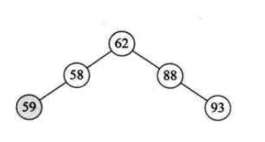
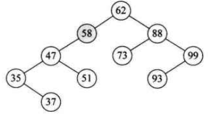
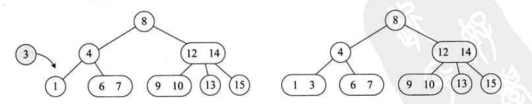

# 查找

## 查找概述

### 静态查找表

1. 只作查找操作的查找表
2. 主要操作有：
   - 查询某个特定数据元素是否在查找表中
   - 检索某个特定数据元素和各种属性

### 动态查找表

1. 在查找过程的同时，插入查找表中不存在的数据元素，或者从查找表中删除已经存在的某个数据元素

### 存储结构划分

1. 逻辑上查找基于的数据结构是集合，集合中的记录并没有本质关系
2. 为了提高查找性能，可以将改变数据元素之间的关系，存储时存为树，线性表等结构
3. 如对于静态表，多是查找，可以用线性表组织数据结构，使用顺序查找，或者将数据按主键排序，可以使用折中查找等高效的查找方法

## 顺序表查找

### 顺序查找

1. 又称线性查找，是最基本的查找技术，就是从头到尾一个个查找
2. 类似如下代码：

### 顺序表查找优化

1. 上面的循环，需要比较i与n大小，还要判断i不要超过数组界限
2. 实际上，可以这样进行优化：
3. 直接将拷贝过来的数组最后一项设置为key，如不相等，则往前循环，直到相当为止；
4. 注意：要为a\[0\]赋值为key；并没看出优化了什么？？？？？？？？？？？

### 优缺点

1. 算法简单
2. 时间复杂度为O(n),当数据量很大时，查找效率低下

## 有序表查找

### 折半查找

1. 折半查找，又称二分查找；前提是**线性表中的记录是关键码有序的，线性表必须是顺序存储**
2. 主要思想是：取中间作为比较对象，如要查找是key比中间小，则在左半区选中间位置查找，不断重复此过程查找

#### 时间复杂

1. 如参数是a={0,1,16,24,35,47,59,62,73,88,99},要查找key=62，使用二分查找，先将其转为二叉树

   

2. 根据图示，如开始查找时不是47，则只需查找整个数组的一半，工作量减少了一半

3. 对于完全二叉树，n结点的完全二叉树的深度为$[log_2n]+1$；虽然图不是完全二叉树，但查找最坏的情况是$[log_2n]+1​$

4. 因此，二分查找的时间复杂度为O($log_2n$)

#### 优缺点

1. 二分查找必须是有序，顺序存储，最好是排序后不再变化
2. 如频繁插值或删除值，维护排序需要很大工作量，不建议使用

### 插值查找

1. 是对二分查找的改变，二分查找使用折半方式查找，那为何不是1/4,1/3这样查找呢？

2. 二分查找的数组下标计算公式为：low为数组开始下标，high为结束下标；如a=\[1,2,3,4,5\]，使用二分查找4，则先查找mid= 0+ (4-0)/2 = 2，即a\[2\]=3小于4；再将low改为3进行查找

  

3. 插值查找是更改1/2这个系数为：，得到mid计算公式为：

   

4. 如a=\[1,2,3,4,5]，假设要查询key=4，故$mid= 0 + \frac{4 - 1}{5-1}(4 - 0) = 3$

5. 优缺点

   - 时间复杂度也是O($log_2$)；主要优势是针对表长较大，关键字均匀分布的，性能比二分查找好
   - 如数组分布类似a=\[0,1,2,2000,2001...,999998,999999\]，这样极端不均匀的数据，用插值查找未必很合适

### 斐波那契查找

1. 先构建一个斐波那契数列  

2. 要查找的数组如下，查找其中的59

3. 由于要查找数组长度为11，根据斐波那契数列可以得到F(6)\<11\<F(7)；故选择F(7)=13；

4. 将数组补齐为斐波那契数组长度13

5. 由于斐波那契数值13前两个数值分别为5,8，将数组分为8,5两个部分；mid值为$F(k-1) =F(6) = 8​$;即比较数组8位置与59的大小，73小于59；故选择前面一部分继续比较

   

6. 舍弃后面数据，使用前面部分，再根据斐波那契数列将8拆分为5和3两段数组；即比较F(5)=5位置上的数据，5上数据为47小于59；因此选择后面3部分数据

   

7. 此时，low坐标起始为6，high为7；由于使用的是3这部分，即key大于上面的5和3数组中间值47；故选用$F(k-2)= F(3) = 2​$；则需要判断a\[6+2-1\] = a\[7\] = 62\>59这个值

8. 最后，F(3-1) = F(2) = 1;a[6+1-1\] = a\[6\] = 59查询到值

### 三种有序表查找算法比较

1. 时间复杂度都是O($log_2n​$)
2. 平均性能，斐波那契查找优于折半查找；但如key=1，性能要比折半查找差
3. 二分查找使用除法运算，插值查找使用四则运算，斐波那契查找使用加减运算，理论上斐波那契查找会更快
4. **3个查找方法只是在每次查找的分割点选择的不同**

## 线性索引查找

### 概述

1. 对于海量数据，如日志等，都是根据时间进行先后顺序存储的，如要全部排序需要时间代价会非常高
2. 数据结构的最终目的是提高数据的处理速度，索引则是为了加快查找速度而设计的一种数据结构
3. 索引就是把一个关键字与它对应的记录相关联的过程
4. 索引技术是组织大型数据库以及磁盘文件的重要技术
5. 所谓线性索引就是将索引项集合组织为线性结构，也称索引表

### 稠密索引

1. 稠密索引：把数据集的每个记录对应一个索引项
2. 对于稠密索引，索引项一定是按照关键字有序的
3. 因为索引项是有序的，可以使用二分查找，插值查找等方法加快查找
4. 但主要问题是：如数据很大，则每一项都需要建立索引项，占用内存很大

### 分块索引

1. 针对稠密索引的缺点，不是每一个数据都进行索引，而是减少索引数，将数据集分成多个块，块间是有序的，块内是无序的
2. 一般分块索引的索引项结构分为：
	- 最大关键码，即块内的关键码都小于此
	- 块内记录数，便于循环
	- 指向块的数据元素指针，用于对记录遍历
3. 因为块间是有序的，如要查询63，发现57\<63\<96，故数据在\[2\]块中，再在块中进行顺序查找
4. 块间可以使用有序表查找方法，块内使用顺序存储；速度比稠密索引慢，但存储的索引比稠密索引小

### 倒序索引

1. 如有两篇文章，将文章里面的单词抽出来按单词表排列，是有序的
2. 如查询book，则直接查询发挥文章编号1，2；如没有这个单词表，需要将单词在文章内容中逐步查找，会很慢
3. 索引项的通用结构是：
  - 次关键字，如上面的英文单词
  - 记录号表，如上面文章编号
4. 其中，记录号表存储具有相同次关键字的所有记录的记录号，这种索引方式称为倒序索引
5. 这种方式不是由记录来确定属性值，而是由属性值确定记录的位置，因而称为倒序索引
6. 倒序查找非常快：基本等于生成索引表后，查找时不用读取记录，直接可以得到结果；因为如book，指向的位置是1,1只是一个地址，并不是内容，故很快；

## 二叉排序树

### 概述

1. 对于普通的顺序存储结构，如添加元素，可以在数组末尾添加，如删除元素，可以将删除元素与末尾元素对换，对于插入和删除操作，顺序结构的效率是可以接受的
2. 但是，这样无序的顺序存储结构，查找将是相当复杂的

### 概念

1. 二叉排序树，又称二叉查找树：它或是一颗空树，或者具有如下性质：
	- 如左子树不空，左子树所有值都小于它的根值
	- 如右子树不空，右子树所有值都大于它的根值
	- 它的左右子树，分别为二叉排序树
	- 左子树结点一定比其双亲小，右子树结点一定比其双亲大
2. 构建一颗二叉排序树的目的，其并不是为了排序，而是为了提高查找和插入删除关键字的速度

### 举例

1. 如对集合{62,88,58,47,35,73,51,99,37,93}做查找，打算在创建此集合时就是用二叉树结构，并且还是排序好的二叉树
2. 62作为根，88大于62作为右子树；58小于62作为左子树；47小于58作为58的左子树，35小于47作为47的左子树；依次类推
3. 对于这课树，进行中序遍历时，会得到一个有序序列，通常称为二查排序树

### 二查排序树删除操作

1. 如是叶子结点，直接删除即可

2. 如某个结点只有左子树，或只有右子树，那删除后，直接让孩子到删除位置即可

3. 如某个结点既有左子树又有右子树，最直接的想法是，把47删除，然后把47的左子树放在47位置，然后47右子树再调用二查排序树的插入方法；但这样可能会对树的结构发生变化，增加树的高度等；

	

4. 如对二叉树进行中序遍历，得到遍历集合，删除47，可以用37或48，来代替这个结点

	

### 总结

1. 二叉排序树是用链接的方式存储，保持了插入与删除操作不用移动元素的优点
2. 查找的比较的次数最多是树的深度
3. 但对于极端情况，如{35,37,47,51,58,62,73,88,93,99}，是一个极端的右斜树，查找99结点需要查找10次，但如将数据排列为{62,88,58,47,35,73,51,99,37,93}这样的数组，形成的二查树如下，则查找99只需要2次
4. 我们希望二叉排序树与完全二叉树相同，时间复杂度为$log_2n$
5. 但上述极端右斜树形式，相当于顺序查找了

## 平衡二叉树（AVL树）

### 概述

1. **解决普通二叉排序树，极端不平衡导致查找时间复杂度提升的问题**
2. 所谓平衡二叉树是：在二叉排序树构建过程中保证它的平衡性，如不平衡，马上处理
3. 在频繁查找的同时，需要插入和删除操作，需要构建一颗二叉排序树；为保证查找高效，避免极端的右斜树等情况，使用平衡二叉树是比较理想的动态查找表算法

### 平衡二叉树概念

1. 是一种二叉排序树，其中每个结点的左子树和右子树的高度差至多为1
2. **注意是二查排序树，因此要满足二查排序树的性质**
3. 是高度平衡的二叉排序树

### 平衡因子BF

1. 将二叉树上结点的左子树深度减去右子树深度的值称为平衡因子BF

2. 平衡二叉树所有结点的平衡因子只可能是0，-1和1

3. 不是平衡二叉树，因为59在58左子树，不符合二叉排序树

	

4. 不是二查平衡树，58结点左子树深度为2，右子树深度为0

### 最小不平衡子树

1. 距离插入结点最近的，且平衡因子的绝对值大于1的结点为根的子树，称之为最小不平衡子树
2. 当插入新结点37时，距离它最近的平衡因子绝对值超过1的结点为58，从58开始以下的子树为最小不平衡子树

### 平衡二叉树实现原理

1. 每当插入一个结点时，先检查是否因插入而破坏树的平衡性，若是找出最小不平衡子树；调整最小不平衡子树中各个结点的关系，进行相应的旋转

2. 如对于数组a=\[3,2,1,4,5,6,7,10,9,8\];按照二叉排序树规则排列3,2,1，数字标号表示当前结点的BF值

3. 由于3的BF值为2，不满足平衡二叉树的要求，顺时针旋转树，调整结点关系为右图

4. 再插入4

	

5. 插入5时：2,3结点的BF值为-2；旋转3,4,5结点，因为值为负，故逆时针旋转

	

6. 接着插入6时：2结点的BF为-2，需要逆时针旋转结点2；但问题是本来3是4的左孩子，但为了满足二叉树的要求，将结点3作为2结点的右孩子

7. 再插入结点7，结点5的BF为-2，进行逆时针旋转

8. 再插入10,9，得到如下结构，7的度超过2，应逆时针旋转7，但旋转后不符合二叉排序树规则；

	- 发生这个问题的根本原因是7的BF为-2，10的BF为1；

	- 先将9,10结点进行右旋，再将7,9,10左旋

		

		

9. 最后插入结点8，6的BF为-2,9的平衡因子为1，需要先旋转9，再旋转6

	

	

	

## 多路查找树（B树）

### 概述

1. 多路查找树：其每一个结点的孩子数可以多于两个，且每个结点处可以存储多个元素
2. 之前的方法都是从内存角度考虑问题，但内存不是无限大，需要读取硬盘，如查询一个文件，设计的算法需要读取硬盘几万次，还是几十次，速度是相差很大的
3. **多路查找树是每一个结点不在只存储一个元素**
4. 一个结点只存一个元素，在元素非常多时，树的度会非常大，或高度非常高，这会造成内存读取硬盘次数非常多，时间效率到达瓶颈；需要打破一个结点只存一个元素的限制

### 2-3树

1. 2-3树是这样一颗多路查找树：

	- 其中每个结点都具有两个孩子（称为2结点），或三个孩子（3结点）
	- 2结点包含1个元素和2孩子（或没有）；**不能是一个孩子**
	- 3结点包含2个元素和3个孩子；**必须是3个孩子或没有孩子**

2. 2-3树的所有叶子都在同一层上

3. 最复杂的是新结点的插入与已有结点删除

	

#### 插入实现

1. 插入数字3，将1转换为2结点

2. 插入数字5，需要插入在6,7这个位置，但为了满足2-3树要求，将4转换为3结点

3. 插入数字11，遍历发现应该插入9,10位置，但9,10为3结点，父12，14为3结点，再父8是2结点，因此转换8为3结点

4. 插入数据2，因为13,46,812都是3结点，因此需要将根再拆为2结点

5. 自己想的：如插入2，直接将数据插入应该插入的地方，如2比4小，在13中间；但123这个结点不满足2-3树要求，将其转换为2结点树，将2元素放在4,6这个节点位置，不满足再转换，得到最终结果

	

#### 删除实现

1. 删除元素9，因为是叶子结点，3结点变为2结点满足2-3树性质，树不用改变
2. 删除1结点，4结点不满足2-3树要求，故按照自己理解，可以将6,7合并到4结点，即4,6,7，为了满足2-3树要求，变成如右图形式；实际是对4这个结点进行旋转
3. 删除结点4，6结点孩子只有7一个，无法形成2-3树结构，将8挪动到7位置，9挪动到8位置
4. 删除10结点
5. 删除8结点，因为如下是满二叉树，删除任意结点都不能使树满足2-3树，故需要减少层数
6. **对于非叶子结点的删除，使用中序遍历后，用前驱或后继补位即可**
7. 如删除结点4
8. **注意：2-3树插入与删除的情况众多，掌握规律**

### 2-3-4树

1. 相比于2-3树，只是多了一个4结点，包含3个元素与4个孩子（或没有孩子）
2. 删除与插入与2-3树类似

### B树

1. 概念

	- B树是一种平衡的多路查找树，2-3树，2-3-4树是都是B树的特例

2. B-tree，翻译为B-树，中间的-是连接符，不是减号

3. 结点最大的孩子数目称为B树的阶

4. B树的产生

	- 先考虑一个问题：数据库索引为何使用树存储，树查询效率高，可以有序；

5. 为何索引不使用二叉树？？？

	- 二叉树虽然效率最高，但要考虑磁盘IO问题

6. 如数据索引存储在磁盘上，数据量比较大时，索引可能就是几个G，不可能全部加到内存中，只能逐一加载每个磁盘页；磁盘页对应于索引树的结点

  {width="5.768055555555556in"
  height="3.94617782152231in"}

7. 如使用二叉树查找，如树高度为4，查找10这个数，对于如下的情况，没查询一个结点都要访问一次硬盘，如查询9，需要访问一次，直到10，总共访问了4次；

8. **为了减少访问磁盘次数，B树的是将原本'瘦高'的二叉树结构，转换为'矮胖'结构**

9. B树的数据结构就是为内外存的数据交互准备的

10. 通过这种方式，在有限内存中，每次访问磁盘获得最大数量的数据

11. 主要应用：

	- 文件系统以及部分数据库索引，比如MongoDB

12. B树具有的属性：

	- 如根结点不是叶子结点，则最少有两棵子树
	- 每个非根的分支结点都有k-1个元素与k个孩子，其中
	- 每个叶子结点n都有k-1个元素，
	- 所有叶子结点都在同一层次
	- 所有分支结点都包含下列信息数据
	- n表示当前结点关键字总数，K表示具体的关键字，A是指向孩子的指针

13. **K的大小取决于磁盘页的大小**

14. 举例：用上面的数据，构建B树

15. 如查询5，第一次IO得到9，然后内存比较；第二次IO得到(2,6)；第三次IO得到(3,5)；3次IO查询得到结果

16. B树最坏的查找次数是多少呢？？

	- 第一层最少1个结点。第二层2个结点（根据定义）
	- 因为非根的分支结点至少有\[m/2\]棵子树，这样k+1层至少有个结点
	- 若m阶B树有n个关键字，则叶子结点应该有n+1个，故即：

### B+树

#### 特征1

1. 每个父结点的元素都出现在子节点中，是子节点最大或最小的元素
2. 如根节点8，15会出现在孩子中；8作为左子树第一节点的最大值；15作为右子树第一节点的最大值
3. 根据这个特征，根节点的最大值则是整个B树的最大值
4. 由于父结点元素都在子节点中，所以所有叶子节点包含了全部元素信息

#### 特征2

1. 每个叶子节点带有指向下一节点的指针，形成一个有序链表

#### 卫星数据

1. 索引元素所指向的数据记录，比如数据库的某一行；B树中，无论中间节点还是叶子结点都带有卫星数据（就是每个节点都带有数据）
2. B+树卫星数据都在叶子结点上
3. B+树卫星数据在叶子结点的设计优势：
4. **因为B+树中间结点无卫星数据，在相同大小磁盘页可以容纳更多的节点元素；因此在相同数据情况下，B+树比B树更矮胖，查询IO更少**
5. B+树查询更稳定，都是查询到叶子结点，性能稳定；而B树，最好在根节点，最差在叶子结点
6. 上面两条也是在单元素查找时，虽然硬盘IO相同，B+树比B树的优势
7. 范围查找的优势
	- 如要查找3到11元素，对于B树结构，中序遍历：找到3，然后（26），然后（8），然后（9），然后（11）；很繁琐，而且每次查询不同结点都要访问IO
	- 对于如下B+树，得到（3,5）后，直接通过链表方式，获取（6,8），（9,11）
8. B+树优势总结
	- IO次数少
	- 查询性能稳定
	- 范围查询简便

## 散列表查找（哈希表）概述

### 定义

1. 散列技术是在记录的存储位置和它的关键字之间建立一个确定的对应关系f，使得每个关键字key对应一个存储位置
2. 对应关系f称为散列函数，又称哈希（Hash）函数
3. 采用散列技术将记录存储在一块连续的存储空间中，这块连续的存储空间称为散列表或哈希表
4. 散列技术即是一种存储方法，也是一种查找方法
5. 散列技术是面向查找的存储结构

### 散列表查找步骤

1. 存储时，通过散列函数计算记录的散列地址，并按散列地址存储该记录
2. 查找时，通过同样的散列函数计算记录的散列地址，按地址直接访问该记录
3. 设计一个简单、均匀、存储利用率高的散列函数是散列技术中最关键的问题
4. 理想状况下，设计的散列函数是每一个key有不同的地址，如key1！=key2，地址应该也是不同的，但实际是总会有相同的情况；这种情况称之为冲突，如何处理冲突是散列技术一个重要课题

### 散列函数的构造方法

#### 概述

1. 什么才算好的散列函数
2. 计算简单：如为了保证key不重复，需要大量计算，查找，降低了效率；应该设计的散列函数计算时间应该小于其他查找技术的比较时间
3. 散列地址均匀分布：这是减少冲突最好的办法，提供了存储利用率，并提高了处理冲突的效率
4. 下面介绍一些散列函数构造方法，都是将原有数字通过某种规律变为另一个数字而已

#### 直接定址法

1. 取关键字的某个线性函数值作为散列地址
2. 如要统计80年代后出生人数，可以使用f(key) = key-1980
3. 优点：简单，均匀，不发生冲突；适合查找表较小且连续的情况
4. 缺点：需要知道关键字的分布

#### 数字分析法

1. 如手机号，前3位表示运营商，中间4位为地区，后4位为用户号；如为一个公司的职员构建散列函数，使用后四位不错
2. 只是抽取关键字的一部分构建散列函数
3. 如单单的抽取会造成冲突，可以将抽取的数字进行移位，求和等

#### 平方取中法

1. 假设关键字为1234，平方为1522756，取中则是227
2. 适合不知道关键字分布的，位数不是很大情况

#### 折叠法

1. 如对于数9876543210，分为987,654，321，0这4组数，然后求和得到1920，再取后3位作为散列地址

#### 除留余数法

1. 最常用的构建散列函数方法

#### 随机数法

1. 选择一个随机数，取关键字的随机函数值为它的散列地址
2. 适合处理关键字长度不等

#### 总结

1. 采用不同散列函数的依据
2. 计算散列地址所需时间
3. 关键字的长度
4. 散列表的大小
5. 关键字的分布情况
6. **散列函数的构造方法，就是通过某种方式为key生成散列地址，保证冲突最少**

### 处理散列冲突的办法

#### 开放定址法

1. 所谓开放定址法：是一旦发生了冲突，就去寻找下一个空的散列地址，只要散列表足够大，空的散列地址总能找到，并将记录存入

2. 假如使用取余法，计算

  

3. 当计算key=37时，与25位置冲突，则利用公式，将数存在2这个位置

4. 当计算48时，与0位置冲突，则需要依次计算(f(48)+1)
	mod12重复了，(f(48)+2) mod12重复了，直到(f(48)+6) mod12才能存入

5. 这种解决冲突的开放定址法称为：线性探测法

6. 48,37这种本来都不是同义词却争夺一个地址的情况，称这种现象为堆积

7. 开放定址法在散列表未填满时，总能找到不发生冲突的地址

#### 再散列函数法

1. 如某种方式，比如取余法发生冲突，再使用其他散列函数如折叠，平方取中等，直到找到不冲突的地址
2. 优点是关键字不聚集；缺点是增加了计算成本

#### 链地址法

1. 对于冲突的地址，直接形成一个链表

2. 遍历链表会消耗时间

	

### 公共溢出区法

1. 将有冲突的，放在一个溢出区表中
2. 查询时，如37计算后在基本表中未找到，则去查询溢出表

