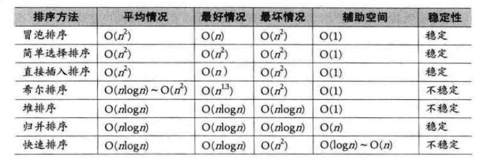

排序
====

概述
----

### 实际意义

1. 如只使用标准库的排序函数，学习排序算法的意义在于：

1. 排序算法常常是我们解决其他问题的第一步

1. 类似的技术也能有效的解决其他类型的问题

1. 有助于提供编写算法的能力，以及解决更加复杂问题

### 排序稳定性

1. 待排序序列可能存在一个或多个相等的关键字，排序结果可能存在不一致的情况

1. 假设ki=kj，如排序前ki在kj前面，排序后ki还在kj前面，则认为排序算法是稳定的；

1. 排序算法是否稳定，是要通过分析后才能得到的

### 内排序和外排序

1. 内排序：在排序的整个过程中，待排序的所有记录全部放置在内存中
1. 外排序：是由于排序的记录个数太多，不能同时放在内存中，整个排序过程需要在内外存多次交互数据才行
1. 排序性能主要受到：
	- 时间性能：在内排序中，主要操作是比较和移动（移动可以通过改变记录的存储方式予以避免）；高效的内排序算法应该具有尽可能少的关键字的比较次数与尽可能少的记录移动数
	- 辅助空间：除了待排序所占用的存储空间外，执行算法所需要的其他存储空间

冒泡排序(Bubble sort)
---------------------

### 最简单的排序实现

1. 冒泡排序：是一种交换排序；思想是，两两比较**相邻**的关键字，如反序则交换位置，直到没有反序的记录为止

1. 最简单的实现思路是，此方式不是严格意义的冒泡排序：

	```javascript
	var a = [9,1,5,8,3,7,4,6,2];
	function sort1(){
	    for(var i = 0 ; i < a.length ;i ++){
	        for(var j =i ; j < a.length;j++){
	            if(a[i] > a[j]){
	                var temp = a[i];
	                a[i] = a[j];
	                a[j] = temp;
	            }
	        }
	    }
	    console.log(a)
	}
	```

1. 注意：严格意义上说，这个不是标准冒泡排序算法，因为不满足"两两相邻元素比较"的冒泡排序思想

1. 对于上述循环：

	- 当i=0时，然后比较9和1，交换，一直比较到最后；将1排在第一位置
	- 当i=1时，比较9和5，交换，然后比较5和3，交换，最后比较3和2，交换
	- 依次类推；这时候12排序好后，3在数组最后
	- 排序好的1，2对未排序的数组并没什么帮助，这个算法效率极低
	- 进行比较的次数为：$9*10/2=45$次

### 冒泡排序

1. 内循环使用从大到小比较，而且是j+1与j的比较，交换位置

	```javascript
	var a = [9,1,5,8,3,7,4,6,2];
	function sort2(){
	    for(var i = 0 ; i < a.length ;i ++){
	        for(var j =(a.length-1 ); j >i ;j--){
	            if(a[j] < a[j-1]){// 关键两两比较相邻元素
	                var temp = a[j];
	                a[j] = a[j-1];
	                a[j-1] = temp
	            }
	        }
	    }
	    console.log(a)
	}
	```

2. 如当i=1时，内循环是从后往前两两相邻比较，如2,6比较，交换位置，24比较交换位置，在将放在数组头的同时，实际上通过循环也将2从之前的9位置挪动到3位置

3. 比较的次数为：$9*8/2=36$次

### 动画演示


### 冒泡排序优化

1. 如数组为\[2,1,3,4,5,6,7,8,9\];只需要交换前两个数字，就完成排序了，冒泡排序还需要多循环很多次，虽然每次循环不交换数组元素

1. 对于上面的例子，i=1时，会交换1,2，当i=2时，就不会交换元素，i=3时，也不交换元素，因此可以添加个flag标识

	```javascript
	function sort2(){
	    var flag = true;
	    for(var i = 0 ; i < a.length && flag;i ++){
	        flag =false;
	        for(var j =(a.length-1 ); j >i ;j--){
	            if(a[j] < a[j-1]){
	                flag = true;
	                var temp = a[j];
	                a[j] = a[j-1];
	                a[j-1] = temp
	            }
	        }
	    }
	    console.log(a)
	}
	```

	

### 时间复杂度分析

1. 比较次数为：$n*(n-1)/2$

1. 因此，时间的复杂度为$O(n^2)$

简单选择排序算法(Simple Selection Sort)
---------------------------------------

### 概念

1. 简单选择排序法（simple selection
    sort）：就是通过n-i次关键字间的比较，从n-i+1个记录中选出关键字最小的记录，并和第i个记录交换
1. 当i=1，循环数组如n次，找到最小的，然后交换第一个和这个最小的元素位置

### 动画演示


### 代码说明

1. 如i=0时，先假设最小的元素就是9；然后循环后面i=1到i=8之间元素；可以比较出数组第1个元素1是最小的，故将a\[0\]与a\[1\]交换

	```javascript
	var a = [9,1,5,8,3,7,4,6,2];
	function sort1(){
	    var min;
	    for(var i = 0 ; i < a.length ;i++){
	        min = i;
	        for(var j = i + 1 ; j<a.length;j++){
	            if(a[min] > a[j]){
	                min = j ;//选择每次最小的
	            }
	        }
	        // min!= i 表示在数组中找到了更小，需要交换元素\
	        if(min != i){
	            var temp ;
	            temp = a[min];
	            a[min] = a[i];
	            a[i] = temp;
	        }
	    }
	    console.log(a)
	}
	```

	

### 复杂度分析

1. 最大的特点是，交换移动数据次数少；并不是每次循环都移动数据

1. 比较次数：n\*(n-1)/2

1. 交换次数：最好为0次，最坏为n-1次

1. 总的时间复杂度依然是O($n^2$)

1. 虽然时间复杂度与冒泡排序一样，但略好于

直接插入排序(Straight Insertion Sort)
-------------------------------------

### 概念

1. 直接插入排序的基本操作是将一个记录插入到已经排好序的有序表中，从而得到一个新的、记录数加1的有序表中
2. 理解：取出一个数，与数组之前的数依次比较，如小于，则继续比较，如不小于则放在当前数组位置

### 动画演示


### 代码说明

1. 对于序列a = [1,5,8,9,3,7,4,6,2]，当i=1时，假设a\[i\]就是最小的，然后循环i=2,i=3时，都无需挪动，直接插入在1后面，保证了有序；

1. 当i=4，a[4]=3时，即开始比较3这个数；判断a\[3\]=9\>a\[4\]=3；故需要挪动这个数

1. 问题是将这个数挪动到哪里，故需要循环前面所有数，插入到指定位置；比较a\[3\]\>4，则a\[3\]挪到a\[4\]位置，a\[2\]=8\>4，将8挪到a\[3\]位置；a\[1\]=5\>4,a\[1\]挪到a\[2\]位置

1. a\[1\]\<4不需要挪位置了，说明a\[2\]应该放入key

1. 直接插入排序关键是将a\[i\]这位置空下，然后比较i之前数，如大于则往后挪动

	```javascript
	var a = [9,1,5,8,3,7,4,6,2];
	sort1();
	function sort1(){
	    for(var i = 1 ; i< a.length ;i ++){
	        if(a[i] < a[i-1]){// 假设a[i]不是最小的
	            var key = a[i] // 保存这个最小值
	            var j = i - 1;
	            while(a[j]> key){
	                a[j +1 ] = a[j]; // 数据后移动
	                j -- ;
	            }
	            a[j+1] = key
	        }
	    }
	    console.log(a)
	}
	```

	

### 复杂度分析

1. **与选择排序算法有点类似，选择排序是在两个空间进行的，等于每次从旧的空间选最小值放在新的空间中去；而插入排序则在同一空间进行**

1. 最好情况，就是拿的序列就是有序的，故不需要交换，故时间复杂度为O(n)

1. 最坏的情况：序列是逆序的，比较次数为$(n-1)*n/2;$移动次数也是$(n-1)*n/2$；故时间复杂度O($n^2$)

希尔排序(Shell Sort)
--------------------

### 概述

1. 第一批突破上面算法时间复杂度为O($n^2$)的算法
1. 是直接插入排序的升级，属于插入排序类
1. 是直接插入排序算法的一种更高效的改进版本
1. 插入排序的缺点是：每次只挪动一个数字
1. 希尔排序相当于分组插入
1. 直接插入排序在记录少有较好的效率，如遇到大量记录，基本思路是将大量数据分组，形成记录少的不同分组；每个分组进行排序，但问题是如\[9,1,5,8,3,7\]分为9,1,5;8,3,7两个分组，分别排序后，并不能合并得到最终排序好的序列；
1. 基本有序：
	- 小的关键字基本在前面，大的关键字基本在后面，不大不小的基本在中间
	- 如\[2,1,3,6,4,7,5,8,9\]算基本有序，\[1,5,9,3,7,8,2,4,6\],因为9在前面，2在倒数第三位，不算基本有序
1. 利用跳跃分割的策略，保证子序列是局部有序的
1. 将相距某个"增量"的记录组成一个子序列

### 代码说明

1. 先将数据按照跳跃式的分组，然后每组进行插入排序，然后再改变增量

1. 思路与直接插入法类似，只是不是每次比较前1个，而是比较前"增量"个

1. 外层do-while循环是用来计算增量的，完全可以不嵌套循环，直接先用个一个时间复杂度为n的循环，计算增量序列

1. 对于如下arr，开始增量为4，当i=8时，即arr[i] =2，此时arr为：

1. 此时判断arr[i]<arr[i-add]=arr[4]；2<9,故需要进行交换，先把a\[8\]保存到key上，判断arr\[4\]大于key交换，有判断a\[0\]大于key，把a\[0\]放到a\[4\]位置上，得到第一次循环结果：

	```javascript
	var arr = [9,1,5,8,3,7,4,6,2];
	sort1(arr);
	function sort1(arr){
	    var add = arr.length;
	    do{
	        add = Math.floor(add/3)+1;
	        for(var i = add ; i< arr.length ;i ++){
	            if(arr[i] < arr[i-add]){// 假设a[i]不是最小的
	                var key = arr[i]; // 保存这个最小值
	                for(var j = i - add ;j>= 0 && key < arr[j];j -= add){
	                    arr[j +add ] = arr[j]; // 数据后移动
	                }
	                arr[j+add] = key
	            }
	        }
	    }while (add>1);
	    console.log(arr)
	}
	```

	

### 算法图示说明

1. 基本图例

2. 

3. 注意：假设增量为4，对于0会与3,9组合，进行直接插入排序

	

### 复杂度分析

1. 在希尔排序开始时增量较大，分组较多，每组的记录数目少，故各组内直接插入较快，后来增量di逐渐缩小，分组数逐渐减少，而各组的记录数目逐渐增多，但由于已经按di-1作为距离排过序，使文件较接近于有序状态，所以新的一趟排序过程也较快，希尔排序的时间复杂度会比O($n^2$)好一些

1. 时间复杂度为O(n^(3/2))（需数学分析，较为复杂）

### 注意

1. 对于希尔排序的增量选择，并没有数学最优解

1. 增量序列的最后一个增量值必须是1才行

1. 由于记录跳跃移动，并不是一个稳定排序方式

1. 算法发明突破了O($n^2$)的限制

堆排序(Heap Sort)
-----------------

### 概念

1. 堆的定义：
	- 是一个完全二叉树（满足完全二叉树的性质）
	- 每个结点的值都大于或等于其左右孩子结点的值，称为最大堆，反之为最小堆
1. 简单选择排序的升级，同属于选择排序类

### 堆排序算法

1. 堆排序是利用堆的排序方法
1. 基本思想是：先构建一个大顶堆或小顶堆；交互顶与末尾元素，然后再将变动的堆形成大顶堆，依次排序

### 算法步骤

#### 第一步

1. 构造初始堆。将给定无序序列构造成一个大顶堆（一般升序采用大顶堆，降序采用小顶堆)

2. 如现在要排序的序列为arr = [4,6,8,5,9]，以构建为如下的完全二叉树，从左到右，从上到下依次构建树

	

3. 从最后一个非叶子结点开始，即结点6，交换6与9，保证最大堆

	

4. 找到第二个非叶节点4，由于[4,9,8]中9元素最大，4和9交换。

	

5. 这时，4,5,6结点不再满足大顶堆的定义，再交换6与4，最终得到无序的大顶堆

	

#### 第二步

1. 将堆顶元素与末尾元素进行交换，使末尾元素最大。然后继续调整堆，再将堆顶元素与末尾元素交换，得到第二大元素。如此反复进行交换、重建、交换。

2. 将9与4进行交换

	

3. 交换后重建树使其满足大顶堆定义

	

4. 再交换5与8结点：

	

### 动画演示


### 代码说明

```javascript
/**
* 从 index 开始检查，调整堆，满足最大堆性质
* 就是把左右孩子与结点，比较哪个大，将最大的放在结点上
* @array
* @index 检查的起始下标
* @heapSize 堆大小
*
**/
function heapAjust(array, index, heapSize) {
    var iMax, iLeft, iRight;
    while (true) {
        iMax = index;// 当前节点序号
        // 左孩子与右孩子的序号
        iLeft = 2 * index + 1;// 完全二叉树，根节点从1开始，数组则从0开始
        iRight = 2 * (index + 1);
        // 左孩子大，则imax为左孩子
        if (iLeft < heapSize && array[index] < array[iLeft]) {
            iMax = iLeft;
        }
        // 右孩子大，则imax为右孩子
        if (iRight < heapSize && array[iMax] < array[iRight]) {
            iMax = iRight;
        }
        // 上述就是选出谁是最大的，如当前结点不是最大的
        if (iMax != index) {
            swap(array, iMax, index);// 最大元素交换到结点上
            index = iMax;
        } else {
            break;
        }
    }
}

function swap(array, i, j) {
    var temp = array[i];
    array[i] = array[j];
    array[j] = temp;
}

```

1. 上述代码只是调整结点与孩子的大小关系，故如给定n个数的序列，如何构建一个最大堆

1. 对于一个数组n，找到最后一个叶子的双亲，然后开始往前循环每个结点调整树结点的位置即可

    ```javascript
    function buildMaxHeap(array, heapSize) {
        var i,
            // 因为heapAjust是以结点开始，故对于n个元素的序列，需要找到n对应的父节点
            // 此处减1是因为数组从0开始
            iParent = Math.floor((heapSize - 1) /2);
        for (i = iParent; i >= 0; i--) {
            heapAjust(array, i, heapSize);
        }
    }
    ```

1. 构建好最大堆后，就是进行排序，排序就是将顶元素与尾元素交换后，再调整为最大堆，依次循环heapSize -1是因为数组关系，因为后面的元素都已经是最大了，故每次循环时，不是将所有结点调整为最大堆

1. 可以认为每次循环，将顶与尾交换，顶这个元素被pop出去了；

    ```javascript
    function heapSort(array, heapSize) {
        // 构建最大堆
        buildMaxHeap(array, heapSize);
        for (var i = heapSize - 1; i > 0; i--) {
            // 交换第一与最后一个元素，再调整堆满足最大堆特性
            swap(array, 0, i);
            heapAjust(array, 0, i);
        }
    }
    ```

    

### 复杂度分析

#### 构建堆

1. 运行的主要时间是消耗在初始化构建堆与重建堆时的反复筛选上
1. 构建堆时，从完全二叉树的最下层的最右边的非终端结点开始构建（即n序列，从叶子结点n的双亲开始）
1. 故近似从n/2开始（某个结点的右孩子与左孩子的计算不同），每次与结点孩子比较，最多是2次比较和互换操作
1. 构建堆的复杂度为O(n)

#### 排序

1. 由于某个结点i到根节点距离为\[log2i]+1，故第i次交换顶元素后重建堆需要$log_2i$
1. 而对于n序列，需要取堆顶元素（即堆顶与尾交换）n-1次
1. 因此，根据完全二叉树的性质，\[log2(n-1),log2(n-2)\...1\]逐步递减，近似为nlogn
1. 堆排序时间复杂度一般认为就是O(nlogn)级
1. 无论最好，最坏和平均时间复杂度均为O(nlogn)
1. 因为记录比较和交换是跳跃的，因此是一种不稳定排序方法
1. 由于初始化堆会进行大量比较，不适合待排序个数较少的情况

归并排序
--------

### 概念

1. 基本思路是：将无序的数组序列，两两合并排序后再合并，最终得到一个有序数组
2. 归并排序：假设初始化序列有n个记录，可以看成n个子序列，每个子序列长度为1，然后两两合并，得到\[n/2\]个长度为2或1的有序子序列，再两两合并，直到得到一个长度为n的有序序列，也称为2路归并排序
3. **实际上是：鉴于堆排序使用完全二叉树排序构建的复杂性，换个方式利用完全二叉树特性**

### 递归实现

1. 递归实现，即是对于一个数组n，自上往下考虑实现

1. 假设将一个数组`a=[8,4,5,7,1,3,6,2]`利用递归方式进行归并排序，即将a分为[8,4,5,7]与[1,3,6,2]，然后再分为[4,8]、[5,7]与[1,3]、[2,6]，再分为[4],[8]...不能再分了，则返回4,8，利用递归得到排序结果，得到

   

1. 如上图中的最后一次合并，要将[4,5,7,8]和[1,2,3,6]两个已经有序的子序列，合并为最终序列[1,2,3,4,5,6,7,8]，来看下实现步骤，（结合下面的代码mergeSort）

   - 不停的循环两个数组，发现小的则push到result中

     

     

1. 递归返回的条件是：即归并算法的定义，子序列长度为1

   ```javascript
   var arr = [9, 1, 5, 8, 3, 7, 4, 6, 2];
   function mergeSort(arr) { //采用自上而下的递归方法\
       var len = arr.length;
       if (len < 2) {
           return arr;
       }
       var middle = Math.floor(len / 2),
           left = arr.slice(0, middle),
           right = arr.slice(middle);
       return merge(mergeSort(left), mergeSort(right));
   }
   function merge(left, right) {
       var result = [];
       // 循环数组，放到result中
       while (left.length && right.length) {
           if (left[0] <= right[0]) {
               result.push(left.shift());
           } else {
               result.push(right.shift());
           }
       }
       // 假设不等长，叫最后元素放在result中
       while (left.length) {
           result.push(left.shift());
       }
       while (right.length) {
           result.push(right.shift());
       }
       return result;
   }
   console.log(mergeSort(arr));
   ```

   

### 非递归实现

1. 非递归实现，即使用迭代的方式，即从下往上归并

1. 假数组`a=[8,4,5,7,1,3,6,2]`，则是8,4合并，5,7合并等第一层合并排序后，再将8,4,5,7进行合并，依次迭代；故需要一个比较8,4返回有序的merge函数，一个循环获取8,4、5,7、1,3、6,2这样数组的循环函数mergepass；还需要一个循环第一层、第二层等的mergeSort函数

1. merge函数：传入函数为arr，返回结果result，i为分组的起始点，s为长度；主要是将数组分为i开始s长度的小数组，即数组1，2为一组，3,4为一组

   ```javascript
   // 将arr从i开始，s个元素，合并排序到result中
   function merge(arr, result ,i,s) {
       var left = arr.slice(i,i+s),
           right = arr.slice(i+s,i+2*s);
       while (left.length && right.length) {
           if (left[0] >= right[0]) {
               result.push(left.shift());
           } else {
               result.push(right.shift());
           }
       }
       // 假设不等长，叫最后元素放在result中
       while (left.length) {
           result.push(left.shift());
       }
       while (right.length) {
           result.push(right.shift());
       }
   }
   ```

1. 对于mergepass，如开始时，s为1，一个一个元素组合，数组0,1；1,2；3,4为一组，然后排序返回

1. 但要注意，需要对最后一个数的处理，如数组长度为9，两两分组，最后会剩一个，需要再合并一次，如图所示

   

   ```javascript
   function mergepass(arr,res, s ) {
       var i = 0;
       // 归并长度为s=2
       while ( i <= arr.length - 2*s +1){
           merge(arr,res,i,s);
           i += 2*s ;
       }
       // 处理如上图落单的情况
       if( i < arr.length){
           merge(arr,res,i,s);
       }
   }
   ```

1. mergeSort

	```javascript
	function mergeSort(arr) {
	    var k = 1;// 合并长度，理解为几个数的合并，开始为1个，然后2个，然后4个
	    while(k < arr.length){
	        var r1 =[];
	        mergepass(arr,r1,k);
	        k = k*2;
	      	arr = r1;
	    }
	    return arr
	}
	```

	


### 复杂度分析

1. 最好，最坏，平均时间复杂度均为O(nlogn)。遍历一趟的时间复杂度是O(n)，归并排序的形式就是一棵二叉树，它需要遍历的次数就是二叉树的深度（logn）

1. 由于归并排序在归并过程中需要与原始记录序列相同数量的存储空间存归并结果以及递归时深度为logn的栈空间，因此数据占用为n+logn，空间复杂度为O(n)

1. 由于归并排序两两比较，不跳跃，是一种稳定的排序算法

1. 归并排序是一种较占用内存，但高效稳定算法

快速排序
--------

### 概述

1. 冒泡排序的升级，通过不断比较和移动交换来实现排序的

1. 实现方式增大了记录的比较和移动的距离，将关键字较大的记录从前面直接移动到后面，关键字小的记录从后面直接移动到前面

1. 减少了总的比较数与移动交换次数

### 快速排序算法

1. 基本思想：通过一趟排序将待排记录分割为独立的两部分，其中一部分记录的关键字均比另一部分的关键字小，则可分别对这两部分记录继续进行排序，以达到整个序列排序的目的

### 简单实现

1. 根据算法思想，先找到数组中一个数（一般取中间）作为轴，然后比较轴左边，右边数，保证左边的比轴小，右边的比轴大

1. 因此，选一个arr的轴，然后循环arr，小的放在left数组，大的放在right数组

1. 将左，右的数组再进行上述操作

1. 通过迭代的方式即可实现

	```javascript
	function quickSort(arr) {
	    if (arr.length <= 1) { return arr; }
	    var key = arr[Math.floor(arr.length/2)];//一般选中间作为枢纽
	    var left = [],right=[];
	    for(var i = 0 ;i < arr.length;i++){
	        if(arr[i] > key){
	            right.push(arr[i])
	        }
	        if(arr[i] < key){
	            left.push(arr[i])
	        }
	    }
	    return quickSort(left).concat([key],quickSort(right))
	}
	```

	

### 复杂度分析

1. 对于类似\[9, 1, 5, 8, 3, 7, 4, 6, 2\]快速排序时可以形成一棵二叉树

1. 最优的情况是每次选的轴都能划分的很均匀，如排序n个关键字，递归树深度为\[log2n\]+1

1. 递归log2n次

1. 时间复杂度为O(nlogn)

1. 最坏的情况是，待排序为正序或逆序，树将是斜树，需要n-1次递归

    - 比较次数为：
    - 最终的时间复杂度为：$o(n^2)$

    

1. 对于空间复杂度

    - 最好情况，递归树深度为log2n，空间复杂度为logn
    - 最坏情况，需要n-1次递归，空间复杂度为O(n)
    - 平均情况为：O(logn)

1. 快速排序比较与交换是跳跃进行的，是一种不稳定排序

### 优化选取轴

1. 假设选取的中间作为开始比较的轴，如是最小的，或最大值，可能第一次遍历后，数组没有怎么变化
1. 显示数列极有可能是基本有序的，固定选取某个位置的关键字作为首个轴变成了不太合理的做法
1. 三数取中法：取3个关键字先进行排序，然后将中间数作为轴，一般取左，右，中间是三个数
1. 对于非常大是数列，还可以9数取中等

### 与归并排序的主要不同

1. 归并排序是先将数组划分后再排序，先会划分一小段将一小段排序，当有序后会排序下一小段，两个都为有序的时候，会将这两个归并

总结
----

### 排序算法


### 性能对比



### 应用

1. 快速排序通常被认为是高效，快速等特点是使用V8引擎的实现Array.prototype.sort()上有超过23个项目的数组。
    对于少于23个项目，V8采用插入排序法

1. 归并排序是快速排序的竞争对手，因为它也是高效，快捷，但排序是稳定的。这就是为什么Mozilla和Safari中使用它实现Array.prototype.sort()
