算法概述
========

概述
----

1.  学习算法原因是他们能节约非常多资源，甚至能够让我们完成一些本完成不了的任务
2.  很多库已经实现了基本算法，为何还要学习？经常需要重现这些基础算法，甚至在全新的环境中，原有实现无法将新环境的优势全部发挥出来

算法效率的度量方法
------------------

### 事后统计法

1. 通过设计好的测试程序和数据，利用计算机计时器对不同算法的运算时间进行比较，从而确定算法的效率高低
2. 统计的时间依赖于计算机硬件与软件环境，有时会遮盖算法本身的优劣
3. 算法测试数据设计困难

### 事前分析估算方法

1. 一个程序的运行时间，依赖于算法的好坏与问题输入规模；

函数渐进增长
------------

1. 输入规模n没有限制的情况下，只要超过一个数值N，这个函数总是大于另一个函数，则称这个函数是渐进增长的
2. 判断一个算法的效率时，函数中的常数与其他次要项常常可以忽略，而更应该关注主项（最高阶项）的阶数
3. $2n^2$与$2n^2+3n+1$，当n无限大时，两个算法实际较为接近

算法时间复杂度
--------------

### 定义

1. 在进行算法分析时，语句总的执行次数T(n)是关于问题规模n的函数，进而分析T(n)随n的变化情况并确定T(n)的数量级；
2. 算法的时间复杂度，也就是算法的时间度量，记作：T(n)=O(f(n))；表示随问题规模n的增大，算法执行时间的增长率和f(n)的增长率相同，称作算法的渐近时间复杂度，简称时间复杂度；其中f(n)是问题规模n的某个函数
3. O()来体现算法时间复杂度的记法，称作大O记法

### 推到大O阶的方法

1. 用常数1取代运行时间中的所有加法常数
2. 只保留最高阶
3. 最高阶去除与之相乘的常数项

### O(1)

1. 对于如下算法运行次数函数为：$f(n)=3$，时间复杂度为O(1); 

	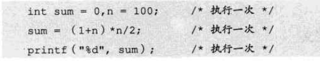

2. 不管常数是几，都记作O(1)

3. 对于分支结构，无循环，执行次数一定的，时间复杂度也为O(1)

### O(logn)

19. 算法是多少个2相乘之后大于n，则退出循环，故2\^x=n,x= log2(n)

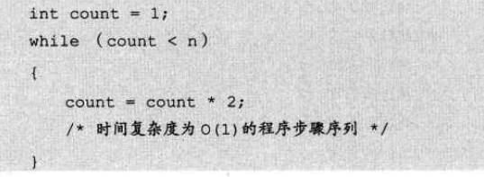{width="5.593051181102362in"
height="2.0518274278215225in"}

常见是时间复杂度关系
--------------------

{width="5.768055555555556in"
height="0.42125546806649167in"}

数据结构概述
============

基本概念与术语
--------------

### 数据元素

20. 是组成数据的、有一定意义的基本单位，在计算机中通常作为整体处理，也被称为记录

21. 比如人类中，人就是数据元素

### 数据项

22. 一个数据元素可以由若干干数据项组成

23. 如人的耳朵，鼻子等为数据项；姓名，出生地等也为数据项，具体哪些数据项，根据系统决定

### 数据结构

24. 相互之间存在的一种或多种特定关系的数据元素的集合

25. 类似于分子结构，表示数据与数据直接关系的集合

### 数据对象

26. 相同性质的数据元素的集合，是数据的子集

27. 根据视点不同将数据结构分为逻辑结构与物理结构

{width="5.768055555555556in"
height="2.0061351706036747in"}

逻辑结构
--------

### 集合结构

28. 各个数据元素平等，他们共同属性是，都属于同一个集合

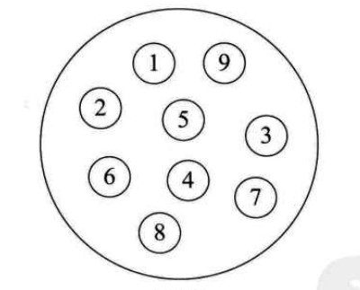{width="1.9977799650043744in"
height="1.6132075678040245in"}

### 线性结构

29. 数据元素是一对一的关系

{width="3.7807775590551183in"
height="2.0726574803149607in"}

### 树形结构

{width="4.832729658792651in"
height="1.8643503937007875in"}

### 图形结构

30. 数据元素是多对多的关系

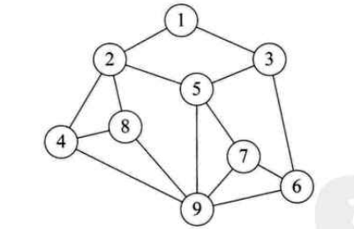{width="4.1765616797900265in"
height="2.697579833770779in"}

物理结构
--------

31. 元素存储在计算机的形式，可以理解为存储结构

32. 顺序存储结构

33. 数据元素存在地址连续的存储单元中，其数据间的逻辑关系与物理关系是一致的

34. 数组就是这样的顺序存储结构

35. 链式存储结构

36. 数据元素存放在任意的存储单元中，这组存储单元可以是连续，也可以是不连续的

抽象数据类型
------------

37. 数据类型

38. 高级语言中，每个变量，表达式都有各自的取值范围；类型是用来说明他们的取值范围和所能进行的操作

39. 因为计算机内存不是无限大的，需要为不同运算开辟不同大小的内存空间，故需要对数据进行分类，分出多个数据类型

线性表
======

概念
----

### 零个或多个数据元素的有限序列

线性表的顺序存储方式
--------------------

### 概述

40. 指的是用一段地址连续的存储单元依次存储线性表的数据元素

41. 可以使用数组来实现顺序存储结构

### 数组长度与线性表长度

42. 数组长度是存放线性表的存储空间长度，一般分配后是不变的；通过程序手段可以改变

43. 线性表长度是：线性表中数据的个数

{width="5.768055555555556in"
height="1.5394838145231846in"}

44. 对于此种存储结构，知道起始地址，则可以推断出任意位置的地址，因此每个线性表的位置的插入与删除数据，对于计算机是一个常数，时间复杂度为O(1)；此存储结构又称为随机存储结构

### 优缺点

45. 对于顺序存储的线性表，插入与删除数据，如插入或删除a\[4\]这个元素，都需要挪动后面全部元素，因此插入与删除的时间复杂度为O(n)

46. 存或读取数据的时间复杂度为O(1)

47. 因此这个结构适合元素个数变化不大的，更多是存取数据的应用

{width="5.768055555555556in"
height="2.896712598425197in"}

线性表的链式存储方式
--------------------

### 链表定义

48. 链表是一种递归的数据结构，它或者为空（null），或者指向一个节点的引用，该节点含有一个泛型的元素或者一个指向另一个链表的引用

### 单链表数据读取

49. 核心思想就是指针后移，要查询i，需要从a1，根据后续指针，找到a2，然后一直到ai，故时间复杂度为O(n)

{width="5.768055555555556in"
height="1.4847397200349957in"}

综述
----

### 优缺点比较

{width="5.768055555555556in"
height="2.5422167541557306in"}

{width="5.768055555555556in"
height="1.037448600174978in"}

### 综述

50. 在结构化存储数据集时，链表是数组的一种重要的替代方式

51. 数组与链表常常称为是顺序存储与链式存储

52. 注意：

53. 单链表，如果在i插入一个元素，同样需要遍历i个元素，时间复杂度是O(n);与顺序结构一直

54. 但如从i元素插入10个元素，对于顺序存储结构，每次都是O(n)，而对于单链表，第一次是O(n)，之后的时间复杂度为O(1)

55. 对于插入或删除数据越频繁的操作，单链表的效率优势越明显

静态链表
--------

### 概述

56. 其实是为了给没有指针的高级语言设计的一种实现单链表能力的方法

57. 使用数组实现单链表能力，也叫游标实现法

### 设计思路

58. 把未使用的数组元素称之为备用链表

59. 需要提前设置数组长度；

{width="5.768055555555556in"
height="1.532807305336833in"}

60. 数组a\[0\].cur表示的空余数组起始游标；每一个数组项，类似于{data:'',cur:''}；data用于存储实际内容，cur用于存储当前项下一个项目所在的数组游标位置

{width="5.768055555555556in"
height="2.076900699912511in"}

### 插入操作

61. 如要在乙丁间插入，丙这个元素，即在i=3处插入

62. 因为不是顺序存储，不需要挪动元素，根据a\[0\].cur知道，当前空的游标为7，故将丙放到7这个位置上，并将a\[0\].cur=8

63. a\[2\].cur= 7
    ,a\[7\].cur=3；实际是，通过cur表示当前元素后一个元素是数组哪一项，但数组元素未移动，数组只是用于放置元素而已

{width="5.768055555555556in"
height="1.4400109361329834in"}

### 删除操作

64. 对于原数组，删除甲这个元素

65. 甲元素删除后，a\[1\]空出来，因此a\[1\]为备用链表起始元素，故a\[0\].cur=1指向a\[1\]

66. a\[1\].cur = 8 这个8为之前a\[0\].cur的值

{width="5.768055555555556in"
height="1.4395833333333334in"}

{width="5.768055555555556in"
height="0.9179483814523185in"}

### 优缺点

{width="5.768055555555556in"
height="2.664387576552931in"}

循环链表
--------

67. 为了解决单向链表，只能从头元素遍历链表的缺陷；

68. 将单链表的终端节点的指针指向头节点，使整个单链表形成一个环，这种头尾相连的单链表称为单循环链表，简称循环链表

69. 主要解决：如何从链表中第一个节点出发，访问链表的全部节点（单链表无法知道当前节点上一个节点是谁）

双向链表
--------

70. 为了解决单向链表无法反向遍历链表的缺陷，或不能查找当前节点的前一个节点的缺陷

71. 单向链表有next指针，因此查找下一个节点的时间复杂度为O(1)；但查找前一个节点，需要遍历整个链表，时间复杂度为O(n)

72. 为每个节点增加一个prior指针，这样可以反向遍历查找，付出的代价是插入和删除节点时，需要更改两个指针变量，空间换时间

小结
----

73. 分类

{width="5.768055555555556in"
height="1.5802066929133858in"}

栈与队列
========

栈
--

### 概述

74. 栈是后进先出(Last In First Out)的线性表，简称LIFO结构

75. 首先它是线性表，只是特殊形式的线性表而已

### 栈顺序存储实现方式

76. 小应用------Dijkstra的双栈算术表达式

77. 获取字符串表示的算术表达式的值，比如求"(1 + ((2+3)\*(4\*5)))"

78. 算法思路：

数字就放入操作数栈 

操作符就放入符号栈 

忽略左括号，遇到右括号，拿出所需要操作符和操作数进行计算，在把结果压入操作数栈。 

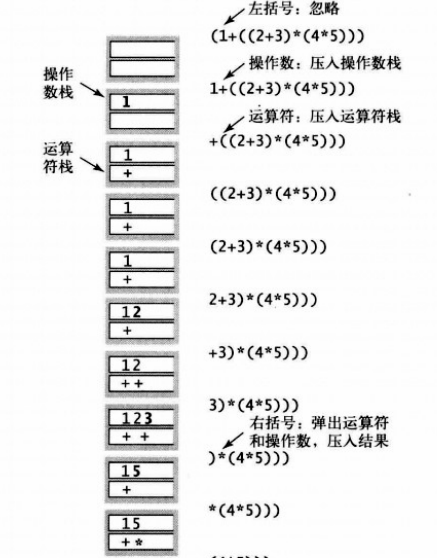{width="3.1547812773403323in"
height="4.028301618547681in"}

79. Java实现变长stack

80. 思路是，在pop与push时，判断Stack长度，如果stack到达最大N，则重新构造一个2\*N的数组，将之前数据拷贝到新数组，然后再新增元素

81. 如，pop后，发现数组空元素过多，则将数组缩短，避免空间浪费

82. 主要缺点是：push和pop方法会调用resize遍历整个数组，因此这项操作和栈的大小成正比

83. 使用链表进行改进

public class ResizeArrayStack\<T\> {\
private int N = 0;\
private T\[\] arr = (T\[\])new Object\[1\];\
\
private void resize(int max){\
T\[\] newArr = (T\[\])new Object\[max\];\
for(int i = 0 ; i\<N;i++){\
newArr\[i\] = arr\[i\];\
}\
arr = newArr;\
}\
public void push(T item){\
if(N == arr.length){\
resize(2\*N);\
}\
arr\[N++\] = item;\
}\
public T pop(){\
T t = arr\[\--N\];\
a\[N\] = null;//避免对象游离\
if(N \> 0 && N == arr.length){\
resize(N/2);\
}\
return t;\
}\
}

### 栈链表存储实现方式

84. Java举例说明：

85. Node类，需要具有储存内容的Item，以及下一个Node的实例变量

{width="2.6246719160104988in"
height="1.1352744969378827in"}

86. 构建Node实例，分别为其赋值，并赋next节点；third节点的next为空，相当于空链表

{width="2.9579636920384953in"
height="0.739491469816273in"}

{width="2.1872265966754156in"
height="0.7603215223097113in"}

{width="2.2184733158355208in"
height="0.5103532370953631in"}

87. 这样的列表对于表头插入节点，表头删除节点，表尾插入节点都比较容易操作，但是在指定位置删除或添加节点，就比较困难，需要遍历整个链表；如要删除尾部节点，需要知道N-1节点是谁，将N-1的node指向，由原来的N指向为Null，故需要循环整个链表

88. 实现任意插入与删除节点的标准解决方案是双向链表

89. 下压堆栈（链表实现）

90. 即不再使用数组作为内部数据结构

public class Stack\<T\> {\
private int N = 0;\
private Node first;\
private class Node{\
T item;\
Node next;\
}\
public void push(T item){\
Node newNode = new Node();\
newNode.item = item;\
newNode.next = first;\
N++;\
\
}\
public T pop(){\
T item = first.item;\
first.next = null;\
N\--;\
return item;\
}\
}

队列
----

### 定义

91. 是一种先入先出（First In First Out）的线性表，简称FIFO

92. 因为队列也是线性表，因此同样存在顺序存储与链式存储两种方式

### 循环队列

93. 队列顺序存储的不足

94. 如队列有n个元素，需要开辟大于n的数组，如a\[0\]为队头，添加元素在队尾，时间复杂度为O(1)

95. 但如出队一个元素，需要挪动全部剩余元素，时间复杂度为O(n)

96. 为了使出队的时间复杂度也为O(1)，可以不挪动元素，出队之后，让a\[1\]称为队首元素

{width="5.768055555555556in"
height="1.117561242344707in"}

97. 不挪动元素队列的缺点

98. 如数组长度为5，但当数组中有3个元素时，队首在a\[2\]处，此时再添加元素，会出现数组越界，但实际0,1位置还是空闲的，这种情况称之为"假溢出"

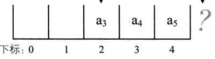{width="4.520269028871391in"
height="1.2394280402449693in"}

### 循环队列定义

99. 把队列的头尾相连的顺序存储结构称之为循环队列

100. 循环队列要注意的几点：

101. 如将队首指针设为rear，队尾设置为front，那么空队列时，rear=front，但当循环队列满时也是rear=front

102. 可以通过增加一个标志位flag，来判断是否为空队列或满队列

103. 还可以将满队列中间空一个位，当front与rear相差一个位置时，则为满队列

104. 还要考虑，rear与front不知谁大谁小，如相差一个位置，可能是满队列，也可能整整相差一圈

字符串
======

概述
----

105. 定义：

106. 串（string）：是由零或多个字符组成的有限序列，又名字符串

107. 所谓序列，说明串相邻字符之间具有前驱和后继的关系

108. 串的抽象数据类型

109. 串的逻辑结构与线性表很相似，不同之处是串针对的字符，即字符集

110. 串的操作与线性表差别也很大；线性表更关注单个元素的操作，如查找一个元素，插入或删除元素；串更多的是找子串位置，替换子串等操作

111. 串的存储方式

112. 顺序存储

113. 链式存储：与线性表区别是：并不是每一个节点存储一个字符，这样会浪费很多空间；一般一个节点存储一个字符串，但存储多少比较合适，需要根据实际分析

114. 链式存储在连接串与串操作有一定方便外，总的来说不如顺序存储灵活，性能好

串的比较
--------

### 编码方式

115. 常用编码集是标准的ASCII编码；7位二进制数表示一个字符，总共128个

116. 后来一些特殊的符号出现，使用扩展ASCII编码；8位二进制数，总共256个

117. 包含中文等多国符号，Unicode编码，16位二进制数；前256与AscII一致；

### 串如何比较

118. 通过组成串的字符之间的编码来进行的

119. 字符的编码指的是字符集中字符的序号

朴素的模式匹配算法
------------------

### 模式匹配

120. 子串的定位操作通常称为模式匹配；串中比较重要的操作

121. 如要在goodgoogle中查询google的位置，需要循环外面的goodgoogle，再循环google，不停比较每一个位置是否一致，来决定是否匹配

{width="5.768055555555556in"
height="1.5877012248468942in"}

### 缺陷

122. 如n为主串长度，m为匹配子串长度，时间复杂度为O((n-m+1)\*m)

123. 更糟糕的是字符串会被处理为二进制形式，进行匹配，可能主串为00000000000000000000000001,匹配的为0001，循环到最后才能匹配到

KMP模式匹配算法
---------------

### 算法原理

124. 一个基本事实是，当空格与D不匹配时，你其实知道前面六个字符是\"ABCDAB\"。KMP算法的想法是，设法利用这个已知信息，不要把\"搜索位置\"移回已经比较过的位置，继续把它向后移，这样就提高了效率。

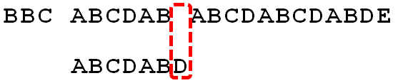{width="5.768055555555556in"
height="1.2112018810148732in"}

125. 怎么做到这一点呢？可以针对搜索词，算出一张《部分匹配表》（Partial
    Match
    Table）。这张表是如何产生的，后面再介绍，这里只要会用就可以了。

{width="5.768055555555556in"
height="1.628274278215223in"}

126. 已知空格与D不匹配时，前面六个字符\"ABCDAB\"是匹配的。查表可知，最后一个匹配字符B对应的\"部分匹配值\"为2，因此按照下面的公式算出向后移动的位数：

127. 移动位数 = 已匹配的字符数 - 对应的部分匹配值

128. 因为 6 - 2 等于4，所以将搜索词向后移动4位。

129. 因为空格与Ｃ不匹配，搜索词还要继续往后移。这时，已匹配的字符数为2（\"AB\"），对应的\"部分匹配值\"为0。所以，移动位数
    = 2 - 0，结果为 2，于是将搜索词向后移2位。

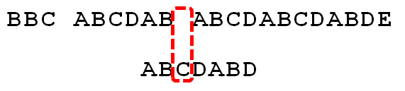{width="5.768055555555556in"
height="1.3027471566054243in"}

130. 因为空格与A不匹配，继续后移一位。

{width="5.768055555555556in"
height="1.344838145231846in"}

131. 逐位比较，直到发现C与D不匹配。于是，移动位数 = 6 -
    2，继续将搜索词向后移动4位。

{width="5.768055555555556in"
height="1.300767716535433in"}

132. 逐位比较，直到搜索词的最后一位，发现完全匹配，于是搜索完成。

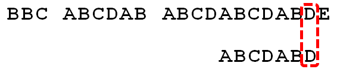{width="5.768055555555556in"
height="1.1817443132108487in"}

### 部分匹配值获取

133. \"部分匹配值\"就是\"前缀\"和\"后缀\"的最长的共有元素的长度。以\"ABCDABD\"为例

134. \"A\"的前缀和后缀都为空集，共有元素的长度为0；

135. \"AB\"的前缀为\[A\]，后缀为\[B\]，共有元素的长度为0；

136. \"ABC\"的前缀为\[A, AB\]，后缀为\[BC, C\]，共有元素的长度0；

137. \"ABCD\"的前缀为\[A, AB, ABC\]，后缀为\[BCD, CD,
    D\]，共有元素的长度为0；

138. \"ABCDA\"的前缀为\[A, AB, ABC, ABCD\]，后缀为\[BCDA, CDA, DA,
    A\]，共有元素为\"A\"，长度为1；

139. \"ABCDAB\"的前缀为\[A, AB, ABC, ABCD, ABCDA\]，后缀为\[BCDAB, CDAB,
    DAB, AB, B\]，共有元素为\"AB\"，长度为2；

140. \"ABCDABD\"的前缀为\[A, AB, ABC, ABCD, ABCDA,
    ABCDAB\]，后缀为\[BCDABD, CDABD, DABD, ABD, BD,
    D\]，共有元素的长度为0。

{width="5.768055555555556in"
height="1.6896926946631672in"}

### Next数组

141. 部分匹配值可能比较好理解，但不容易计算机实现（可能）；

142. 构造next数组，j表示要匹配的字符串挪动的位置

{width="5.768055555555556in"
height="0.8952504374453193in"}

143. T=abcabx

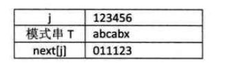{width="3.812024278215223in"
height="0.9582141294838146in"}

144. j=1时，根据上述公式，next\[1\] = 0

145. j=2时，j由1到j-1串只有字符a，属于其他情况，故next\[2\]=1

146. j=3时，字符串为ab，属于其他情况，next\[3\] = 1

147. j=4时，字符串为abc，next\[4\] = 1

148. j=5时，字符串为abca，前缀字符a与后缀字符a相等，故next\[5\] = 2

149. j=6时，字符串为abcab，next\[6\] = 3

150. next值使用

151. 匹配字符串为abcabx，主串为abcabcabc，如下，开始时，直到主串匹配到i=6，j=6时，才发现不匹配，现在需要挪动子串

{width="4.968128827646544in"
height="1.7601968503937009in"}

152. 朴素的模式匹配是将匹配字符串向后挪动1位，再匹配；这样是不必要的

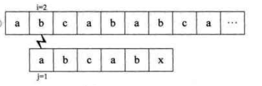{width="4.530683508311461in"
height="1.4998129921259842in"}

153. KMP算法则是根据next数组，来判断移动位置数，根据数组可以得到j=6时，next\[6\]
    = 3，因此需要在匹配字符串j=3开始匹配；即不再回溯主串

{width="4.7702373140857395in"
height="1.6872889326334208in"}

154. 主串为aaaabcde与匹配串aaaaax

155. 匹配串的next数组为012345

156. 开始匹配到主串i=5时，发现匹配不对，读取next数组；

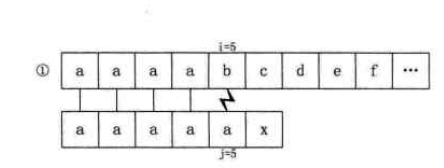{width="4.624422572178478in"
height="1.7497812773403325in"}

157. 此时next\[5\]=
    4，因此，需要将子串挪动到j=4，判断是否匹配；不匹配，再判断j=3；依次类推

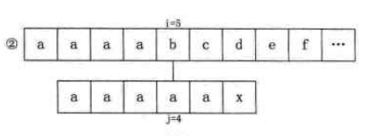{width="4.489022309711286in"
height="1.5831353893263342in"}

158. 直到j=1判断不对，再挪动i=7再匹配子串

{width="4.374453193350831in"
height="1.416489501312336in"}

改进的KMP模式匹配算法
---------------------

### 普通KMP算法的缺点

159. 对于主串为aaaabcde与匹配串aaaaax；这样的匹配中间有些过程是没有用的；如i=5时不匹配，根据next数组得知，当前j=4；但由于匹配串前4个都是a，i=5不匹配，前面i=4，i=3等都不匹配，没必要进行循环

### 新next推导

160. T=ababaaaba，next为KMP，nextval为改进的KMP

{width="3.655792869641295in"
height="1.260259186351706in"}

161. 计算出next数组为011234223

162. j=1时， nextVal\[1\] = 0

163. j=2时，由于b这个字符，需要next值为1，但next为1时，是a字符，不相等，保留原有next值，nextVal\[2\]=1

164. j=3时，此时字符为a，next为1，next为1时，字符为a，相等，使用之前的next值，因此nextVal\[3\]
    =0

165. j=4时，nextVal\[4\] = 1

166. j=5时，nextVal\[5\] =0

167. j=6时，此时字符a，nexxt值为4，next值为4时，实际字符为b，故保留原有next值，nextVal\[6\]
    = 4

168. 

树
==

概念
----

### 定义

169. **树是一对多的数据结构**

170. 树是n(N\>=0)个节点的有限集合；n=0时称为空树；

171. 在任意一个非空树中：

172. 有且仅有一个特定的称为根的节点

173. 当n\>1时，其余节点可分为m(m\>0)
    个互不相交的有限集T1，T2。。。Tn，其中每一个集合本身又是一个树，并且称为根的子树；如下结构则不符合树的定义

{width="3.45790135608049in"
height="2.8225645231846017in"}

### 结点与度

174. 树的结点包含一个数据元素及若干个指向其子树的分支

175. 度

176. 结点拥有的子树数称为结点的度

177. 叶子结点（终端结点）

178. 度为0的结点

179. 分支节点

180. 除了根结点以外的结点

181. 又称内部节点，非终端结点

182. 树的度

183. 树内结点度的最大值

{width="5.768055555555556in"
height="3.6377471566054242in"}

### 结点间关系

184. 结点子树的根称为该结点的孩子，相应的，该结点称为孩子的双亲；如下，B这个树的根结点为B这个结点，B是A的孩子，A是B的双亲

185. 兄弟：同一个双亲的孩子之间称为兄弟

186. 祖先：结点祖先是从根到该结点所经分支的所有结点；如H的祖先是DBA

187. 子孙：以某结点为根的子树中任一个结点都是子孙；B的子孙是：DGHI

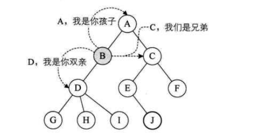{width="5.6659590988626425in"
height="2.8538101487314087in"}

### 结点的层次与树的深度

{width="5.768055555555556in"
height="3.203406605424322in"}

### 有序树与无序树

188. 如将树中结点的各个子树看成从左到右是有次序的，不能互换的，则称该树为有序树

### 森林

189. M棵互不相交树的集合，如上，BC两颗树可以理解为森林

### 线性表与树对比

{width="5.768055555555556in"
height="1.9347014435695538in"}

### 树的抽象数据类型

190. 相对于线性表，树的操作就完全不同了

191. 比如树操作：是否为空树，查询某个结点值；结点是否为叶子结点；某个结点的度；树的度；查询某个结点的兄弟，祖先，子孙等；类似于DOM树的操作了

树的存储结构
------------

### 概述

192. 无论按照何种顺序将树的结点存储在数组中，都无法根据存储位置直接反应出树的逻辑关系

193. 简单的顺序存储无法满足树的实现需要

194. 通过利用顺序存储与链式存储的特点，可以实现树的存储

### 双亲表示法

195. 思路是：每个结点不一定有孩子，但都有双亲

196. 假设用一组连续的空间存储树的结点，每个数组项存放的是当前数据data与双亲结点parent；

197. 由于根结点无双亲，假设他的双亲为-1

198. 优势是：查找parent的时间复杂度为O(1)；但查找结点的孩子，需要遍历整个树

{width="5.561805555555556in"
height="3.0308716097987753in"}

{width="3.5099781277340334in"
height="2.99962489063867in"}

199. 为了遍历孩子方便，可以在每个数据项增加一个第一个孩子的索引项

{width="3.968254593175853in"
height="2.9683792650918637in"}

200. 增加孩子域后，查找兄弟域还是不容易查找，故可以增加一个兄弟域

{width="4.45777668416448in"
height="2.8954713473315836in"}

201. 但并不是域越多越好，需要根据具体的运算来判断一个存储结构设计的是否合理，是否方便

### 孩子表示法

202. 思路：每个结点有多个指针域，其中每个指针指向一棵树的根节点，我们把这种方法叫做多重链表表示法；但主要问题是，每棵树的度不同

203. 方案一：每个结点度为树的度

204. 树的度为3，因此，每个结点的指针域为3个

{width="3.7924529746281714in"
height="2.0666732283464566in"}

{width="5.768055555555556in"
height="2.1536745406824145in"}

205. 主要问题是：当树结点度相差很大时，造成空间浪费；但如果相差不大，则成为了优点

206. 方案2：按需分配空间，每个节点的指针域与度相同；数组增加一个表明树的度的域

{width="3.272405949256343in"
height="1.7452832458442695in"}

207. 问题：由于各个结点的链表不同结构，加上维护度的数值，运算消耗了，但空间节省了

208. 方案3：孩子表示法

209. 把每个结点的孩子结点排列起来，以单链表作为存储结构，n个结点有n个链表

{width="5.768055555555556in"
height="3.755912073490814in"}

210. 优势：查找某个结点的子结点，某个结点兄弟结点，直接查找链表就可以；遍历整个树也比较方便，直接遍历数组即可

211. 比如：查找E的子节点；直接根据数组4，的指向得到子节点为9；但查找兄弟结点是，查找如类似a的子节点的兄弟节点，直接遍历a的链表即可

212. 劣势：无法知道某个结点的双亲结点（因为单列表的问题）；同时给定一个结点，如B，查找其兄弟结点无法查找

213. 改进办法：

214. 根据双亲表示法的启发，可以在数组提供一个双亲的表示列

{width="5.768055555555556in"
height="3.5255905511811023in"}

### 孩子兄弟表示法

215. 思路：指针域为一个孩子和一个兄弟

{width="3.7924529746281714in"
height="2.0666732283464566in"}

216. 结点结构为：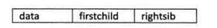{width="3.7495319335083113in"
    height="0.49993766404199474in"}

217. A结点有一个孩子B，没有兄弟

218. G结点没孩子，只有兄弟；依次为H，I

219. 同样具有无法找到双亲的缺点

220. 最大优势：将复杂树转换为二叉树，可以使用二叉树的算法；

{width="5.768055555555556in"
height="3.0122069116360457in"}

二叉树
------

### 概念

221. 定义

222. 二叉树是n(n\>=0)个结点的有限集合，该集合或者为空集（称为空二叉树），或者由一个根结点和两颗互不相交的、分别称为根结点的左子树与右子树的二叉树组成

{width="3.7495319335083113in"
height="3.4787325021872264in"}

223. 特点

224. 每个结点最多有两棵树，所以二叉树结点的度小于等于2；没有子树或者一颗子树也可以称为二叉树

225. 左子树与右子树是有顺序的

226. 某个结点只有一棵树，也区分它是左子树还是右子树；如下为不同的二叉树

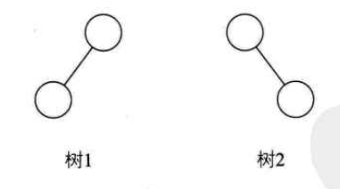{width="2.490566491688539in"
height="1.3858267716535433in"}

### 特殊二叉树

227. 斜树

228. 所有结点只有左子树的二叉树叫左斜树；只有右子树的二叉树叫右斜树；两者统称斜树

229. 斜树特点：每层只有一个结点；结点个数与二叉树深度相同

230. 线性表可以理解为树的一种极其特殊的形式

231. 满二叉树

232. 一颗二叉树，如果所有分支结点都存在左二叉树与右二叉树，并且所有叶子都在同一层上；

{width="2.3773589238845143in"
height="1.0925962379702536in"}

233. 特点：

> 叶子只能出现在最下一层
>
> 非叶子结点的度一定是2
>
> 在相同深度的二叉树中，满二叉树结点个数最多，叶子数最多

234. 完全二叉树

235. 满二叉树一定为完全二叉树；完全二叉树不一定是满二叉树

236. 按层序编号；此树在10,11位置空缺；故树的编号不是连续的，因此不是完全二叉树

{width="4.593175853018373in"
height="2.2184733158355208in"}

237. 特点：

> 叶子结点只能出现在下两层
>
> 最下层的叶子结点一定集中于左部连续位置
>
> 倒数第二层，若有叶子结点一定是右部连续
>
> 如结点度为1，该结点只有左孩子
>
> 同样结点树的二叉树，完全二叉树深度最小

### 性质

238. 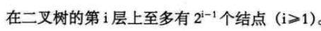{width="4.728576115485565in"
    height="0.45827646544181977in"}

239. 可以根据满二叉树来考虑；第一层1个，第二层最多2，第三层最多4，第四层最多8个

240. {width="4.791068460192476in"
    height="0.4374453193350831in"}

241. 表示的是k层，有二叉树最多有多少个节点

242. K=1，最多1个，2\^1-1

243. K=2，最多2+1=3个，2\^2-1

244. K=3，最多4+2+1 = 7个，2\^3-1

245. 对于任意一颗二叉树T，如果其终端结点数为n0；度为2的结点数为n2，则n0=1+n2

246. 假设结点数为1的结点为n1；因为二叉树，结点度为0,1,2这3种，故结点总是T=n0+n1+n2

{width="3.5in" height="1.6892136920384953in"}

247. 如上树，换个角度考虑；二叉树中的孩子总数：0度没有孩子，1度一个孩子，2度2个孩子，根不是任何结点的孩子，因此二叉树从孩子角度可以表示为：n1+2\*n2+1;

248. 故得到结果：n0 = n2+1

249. {width="5.155605861767279in"
    height="0.44786089238845145in"}（{width="0.4374453193350831in"
    height="0.4374453193350831in"}表示不大于x的整数）

250. 深度为k的满二叉树结点个数为：n = 2\^k -1 ;因此n结点的满二叉树深度k
    = log2(n+1)
    
    {width="5.768055555555556in"
    height="1.071496062992126in"}

251. 

{width="5.768055555555556in"
height="2.216428258967629in"}

252. {width="3.537735126859143in"
    height="1.754828302712161in"}

253. 针对第一条：i=1时是根节点；无双亲；如i=7，双亲为7/2 取整为3；

254. 针对第二条：如i=6,2\*6\>10(10为树的结点数)，无左孩子，i=6为叶子结点；如i=2，或i=5,2\*i\<10；故2\*i为左孩

255. 针对第三条：比如结点5：2\*5+1=11\>10，所以无右孩；结点3：2\*3+1\<10；右孩子为7

二叉树的存储结构
----------------

### 顺序存储

256. 虽然树使用顺序结构存储较为困难，但由于二叉树是特殊的树，使用顺序结构依然可以实现

257. 完全二叉树可以使用顺序存储，而且可以使逻辑结构与顺序存储结构一致

258. 普通二叉树树根据完全二叉树的标号，也可以使用顺序存储；数组中的\^项表示无数据

    {width="5.768055555555556in"
    height="2.950120297462817in"}

{width="5.768055555555556in"
height="1.1833114610673665in"}

259. 但存在一个问题是：如果是深度为k的右斜树，那么会浪费很多存储空间；

260. **因此，顺序存储一般只用于完全二叉树**

### 二叉链表

261. 二叉树每个结点最多有两个孩子，所以设计为一个数据域和两个指针域；称这样的链表为二叉链表

{width="5.768055555555556in"
height="2.628337707786527in"}

遍历二叉树方法
--------------

### 前序遍历

262. 从根结点开始，前序遍历左子树，然后前序遍历右子树，如下遍历顺序是：ABDGHCEFI

263. 前序表示的是，先访问结点，然后左子树，然后右子树；

{width="3.047169728783902in"
height="2.705886920384952in"}

### 中序遍历

264. 口诀：左根右；如下遍历顺序为：GDHBAEICF

265. 结点的访问在左子树与右子树中间；访问A后，开始访问A的右子树C的最左子树，应该是E的左子树（红色方块处），但不存在结点，故认为访问了，访问了左子树，应访问结点，故访问E，然后是右子树I

{width="4.962264873140858in"
height="3.6474792213473317in"}

266. 中序遍历可以使用投影法，判断遍历顺序，如下的二叉树，使用中序遍历的顺序是DJGBHEAFIC

{width="5.051452318460193in"
height="4.020331364829397in"}

### 后序遍历

267. 结点的遍历，在左子树与右子树之后；顺序为GHDBIEFCA

268. 对于树D，应该先遍历GH最后是D；对于A应先遍历左子树B，然后右子树C；

{width="4.245283245844269in"
height="3.4315190288713913in"}

### 层次遍历

269. 从上层到下层，同层从左到右遍历

270. 顺序为：ABCDEFGHI

{width="4.5410990813648295in"
height="3.4370702099737533in"}

### 推导遍历结果

271. 如前序遍历序列为ABCDEF，中序为CBAEDF，后序排列应该为什么呢？

272. 主要思路是：前序是根左右，中序是左根右，后序是左右根

273. 根据口诀，知道A是根，根据中序，可以知道，cb为A左子树，EDF为右子树的；故后序排列应该为(CB)(EDF)A；括号中顺序未确定

274. 根据前序BC，与中序CB，可以知道，B是C的双亲，C是B的左孩；故后序应该是CB，因为无后孩

275. 根据前序DEF，中序EDF，知道D是EF的双亲，EF分别为左右孩子；故后序应该为EFD

276. 最终的后序排列为CBEFDA

277. **注意：知道后序与前序是无法推导出唯一的中序的**

线索二叉树
----------

### 原理

278. 普通二查链表，会存在多个空指针域的情况；如叶子结点的指针域都是空

279. 线索二叉树的思路是按照某种遍历顺序，将这些空指针改为前驱和后继；这种前驱和后继的指针称为线索，加上线索的二叉链表称为线索链表，相应的二叉树称为线索二叉树

280. 对二叉树以某种次序遍历使其变成线索二叉树的过程叫做线索化

281. 线索化的实质是：将二叉链表中的空指针改为向前驱或后继的线索

### 举例

282. 对于HIJFG,前后指针域都为null；E的后指针域为null

283. 比如使用中序遍历，遍历顺序为：HDIBEAFCG，在遍历时，为空域增加前驱与后继；

284. H无前驱，后继为D，I的前驱后继分别为D，B依次类推

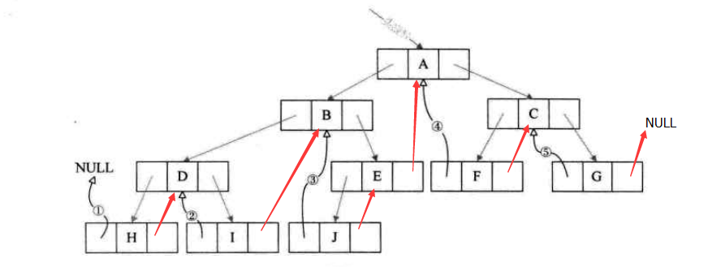{width="5.768055555555556in"
height="2.136984908136483in"}

285. 但这种方式存在一个问题：比如E的后指针域，指向的是A，并不知道A到底是E的孩子，还是E的后继

286. 鉴于这个问题，为结点增加一个0,1标志位，表示当前指针域是孩子还是后继

287. 因为只存0,1布尔类型，要比存指针的指针域占用更少的空间

{width="5.728451443569554in"
height="0.5624300087489064in"}

### 优势

288. 线索二叉树，充分利用了空指针域的空间，又保证了一次遍历可以终身受用的前去后继信息

289. 如二叉树需要经常遍历或查找节点时需要某种遍历序列的前驱或后继，使用线索二叉链表存储方式是非常不错的选择

树、森林与二叉树的转换
----------------------

### 树转换为二叉树

290. 加线：所有兄弟加一条线

291. 去线：除了第一个孩子，去掉其他兄弟与双亲的线

292. 层次调整：使结构更加清晰，如A的第一孩子是B，B的兄弟是CD，那么CD是B的孩子

293. **兄弟是第一孩子的右孩子**

{width="5.768055555555556in"
height="4.111742125984252in"}

### 森林转换为二叉树

294. 将每颗树转换为二叉树

295. 第一棵树不动，之后的每一棵树都看做是前一棵树的右孩子

{width="5.768055555555556in"
height="1.869945319335083in"}

{width="4.45777668416448in"
height="2.99962489063867in"}

### 二叉树转换为森林或树

296. 主要是判断根节点是否有右子树，如有则是森林

297. 树与森林转换为二叉树，主要是将树或森林复杂的存储问题找到简单的解决办法

赫夫曼树及其应用
----------------

### 赫夫曼树

298. 赫夫曼编码是最基本的编码方法，是现在先进变得基础

299. 赫夫曼编码在编码时使用了特殊的二叉树称之为赫夫曼树

300. 引例：成绩不同分为优良中等合格与不合格；但一份好试卷，应该让大部分人落在70以上

301. 如普通的if-else判断：要经过3次以上的判断才能得到70分以上结果

{width="5.768055555555556in"
height="3.405422134733158in"}

302. 如对判断进行改进：效率就会高一些

{width="5.768055555555556in"
height="2.159015748031496in"}

### 赫夫曼树定义与原理

303. 路径长度：从树中一个结点到另一个结点之间的分支构成两个结点之间的路径，路径上分支数目称为路径长度；如a树，根到D的路径长度为4，b树，根到D的路径长度为2

304. 树的路径长度为从树根到每一个结点的路径长度之和；a树，树的路径长度为：1+1+2+2+3+3+4+4=20；b树的路径长度为：1+1+2+2+2+2+3+3
    =16

305. 其中，路径上的数值表示权重，根据上述成绩的例子；总共有5中情况，分为ABCDE，每种情况所占的比例写在了路径上

306. 带权路径长度WPL最小的二叉树称作赫夫曼树

307. 根据赫夫曼树定义：计算ab两棵树的WPL值

308. A树：5\*1+15\*2+40\*3+30\*4+10\*4=315

309. B树：5\*3+15\*3+40\*2+30\*2+10\*2 = 220

310. 这个结果意味着，如有1w学生需要计算；b树判断2.2万次，a树判断3.15w次；差了三分之一

{width="5.768055555555556in"
height="2.980830052493438in"}

### 构造赫夫曼树

311. 先把有权值的叶子结点按从小到大排列：A5,E10,B15,D30,C40

312. 取头两个最小权值的作为一个新结点N的子结点，较小的为左孩子

{width="2.7392410323709537in"
height="1.5414741907261593in"}

313. 计算新结点N1的权重，N15,放入之前的序列，排序N15，B15，D30，C40

314. 然后重复上述步骤

{width="3.6766240157480317in"
height="2.333041338582677in"}

315. 得到最终的赫夫曼树

316. 此树WPL最小为205

317. 但是实际上，并不是说最优的二叉树就是运算最快的；如此图，由于每次都要进行两种判断（a\<80&&a\>=70）总体性能不一定比上面b树好

{width="3.270424321959755in"
height="3.6245472440944884in"}

### 赫夫曼编码

318. 主要是为了解决当时远距离通信数据传输问题

319. 如要传输ABCDEF，对于传输需要使用二进制编码，可以使用如下常见的编码形式

{width="5.768055555555556in"
height="0.7029822834645669in"}

320. 但考虑到，如中文的"的 了 在
    有"这些字出现频率要高很多，假设只有这6个字母，一篇文章权重分别为27,8,15,15,30，5；合并起来正好是100%；可以使用赫夫曼树来规划他们

{width="2.754983595800525in"
height="2.009433508311461in"}

321. 将权重的赫夫曼树，转换为0,1的赫夫曼树，二叉树中权重大的为1，权重小的为0

{width="2.6037740594925634in"
height="2.0126465441819774in"}

322. 这样，根据0，1的赫夫曼树得到编码；因为不同字母不在使用相同位数，故编码字符会减少

{width="5.768055555555556in"
height="0.7657360017497813in"}

323. **注意一个问题**：如设计长短不等的编码，必须是任一字符的编码都不是另一个字符编码的前缀，比如，A的编码为01，B的编码为011，这样在解码时，如遇到011，到底是解码为A呢？还是B呢？但上表并不存在这样的问题

324. 如现在发送BAD：得到的编码是：1001 01 00

325. 在接收时，要使用相同的赫夫曼树来解码；从10010100的头开始，从赫夫曼树的根开始，1001是B；B就是叶子结点，然后再从根开始查找，只要查到元素就再从根出发

326. 规定赫夫曼树左分支代表0，右分支代表1，如上方式编码，称为赫夫曼编码

图
==

图概述
------

### 与线性表、树的区别

327. 数据元素的称呼

328. 线性表：元素

329. 树：结点

330. 图：顶点

331. 没有数据元素

332. 线性表：空表

333. 树：空树

334. **图：不允许空，图必须是有穷非空**

335. 相邻元素之间关系

336. 线性表：线性关系

337. 树：层次关系

338. 图：顶点与顶点之间的逻辑关系用边表示；边集可以是空

各种图定义
----------

### 无向边与无向图

339. 若顶点V1与V2之间没有方向，则这条边称为无向边，使用无向对偶(vi,vj)表示

340. 任意两条边都是无向边的图称为无向图

{width="3.61413167104112in"
height="2.4892727471566056in"}

### 有向边与有向图

341. 若从顶点v1到顶点v2有方向，则称为有向边，也称为弧，使用有向对偶\<vi,vj\>表示

342. 图任意两条边为有向边，则称为有向图

343. 如下图顶点A到顶点D的有向边表示为：\<A,D\>;写成\<D,A\>是错误的

{width="3.54122375328084in"
height="2.4892727471566056in"}

### 简单图

344. 不存在顶点到自身的边，且同一条边不重复出现，则称为简单图

345. 如下非简单图

{width="5.768055555555556in"
height="2.27250656167979in"}

### 无向完全图

346. 在无向图中，如任意两个顶点之间都存在边，则称为无向完全图

347. 含有n个顶点的无向完全图有n\*(n-1)/2条边；4个顶点与任意3个都有边为4\*3，但每个顶点之间边计算重复一次

{width="4.0619925634295715in"
height="2.791317804024497in"}

### 有相完全图

348. 如任意两个顶点之间都存在方向互为相反的两条弧，则称为有向完全图

349. 含有n个顶点的有向完全图有n\*(n-1)条边；因为，弧是分方向的

{width="4.364037620297463in"
height="2.4892727471566056in"}

### 稀疏图

350. 有很少条边或弧的图称为稀疏图，反之称为稠密图

351. 这个是个相对概念，如去玩有50w人，感觉是稠密；但第二天看新闻，最多时候是200w，那50w人时候就是稀疏

### 网

352. 有些图的边具有相关数字，这种与图的边相关的数称为权

353. 权可能表示一个顶点到另一个顶点的消耗或路程

354. 这种带权的图通常称为网

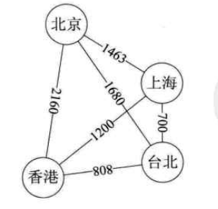{width="3.218347550306212in"
height="3.0933639545056866in"}

### 子图

355. 有向图与无向图都有子图

{width="5.768055555555556in"
height="1.4259919072615923in"}

图顶点与边间关系
----------------

### 无向图顶点度

356. {width="4.895222003499563in"
    height="0.27079943132108486in"}，则称顶点v与v1互为邻接点，即v与v1相邻接

357. 边(v,v1)依附于顶点v与v1，或顶点(v,v1)与顶点v，v1相关联

358. 顶点v的度是v相关联边的数目，记作TD(v)

359. 图的边是各顶点度数和的一半，{width="2.60384186351706in"
    height="0.5520144356955381in"}

360. 如，AB为邻接点；边(A,B)依附于顶点A和B；顶点A的度为3，图的边为5，

{width="2.3226268591426074in"
height="1.8747659667541556in"}

### 有向图顶点度

361. {width="4.259884076990376in"
    height="0.32287620297462816in"}，则称顶点v邻接**到**顶点v1，顶点v1邻接**自**顶点v

362. 弧\<v,v1\>和顶点v,v1相关联

363. 以顶点v为头的弧的数称为v的入度，记作ID(v);

364. 以顶点v为尾的弧的数称为v的出度，记作OD(v)

365. 顶点度为TD(v) = ID(v) +OD(v)

366. 如A的入度为2，出度为1，顶点A的度为3；有向弧4条，各顶点出度和为4，入度和为4

{width="2.520518372703412in"
height="1.8331047681539807in"}

### 路径

367. 顶点v到v1的路径是一个顶点序列

368. 如下，B到D有4条不同路径；BAD；BCD；BCAD；BACD

{width="2.9163024934383204in"
height="2.0205807086614174in"}

369. 如图是有向图，则路径也是有向的

370. 如下，B到D，则只有BAD与BCAD

{width="2.99962489063867in"
height="2.2080577427821524in"}

371. 树中根结点到任意一个结点的路径是唯一的，图顶点到顶点之间的路径却是不唯一的

### 路径长度

372. 路径长度是路径上边或弧的数目

373. 如上面无向图B到D的路径有，BAD；BCD；BCAD；BACD；路径长度分别为2,2,3,3,

### 回路与环

374. 第一个顶点与最后一个顶点相同的路径称为环或回路

375. 简单路径：序列中顶点不重复出现的路径

376. 简单回路或简单环：除第一个顶点与最后一个顶点之外其余顶点不重复出现的的回路

377. 如左图B到D的路径是：BCDAB；只有B重复出现，因此是简单环

378. 右图：B到D的路径是：BCDACB，顶点C重复出现，不是简单环

{width="5.768055555555556in"
height="2.042853237095363in"}

连通图相关定语
--------------

### 连通图

379. 如顶点v到顶点v1有路径，称v与v1是连通的

380. 图中任意两个顶点都是连通的，则称图G是连通图

381. 左图为非连通图；右图为连通图

{width="5.768055555555556in"
height="2.197736220472441in"}

### 连通分量

382. 无向图中的极大连通子图称为连通分量，概念强调：

383. 要是子图

384. 子图要是连通的

385. 连通子图含义极大顶点数

386. 具有极大点数的连通子图包含依附于这些顶点的所有边

387. 如上右图为左图的连通分量

388. 但如下图，则不是上左图的连通分量；因为不具有极大顶点数

{width="2.6246719160104988in"
height="2.864225721784777in"}

### 强连通图

389. 如每一对vi与vj，从vi到vj和从vj到vi都存在路径，称为强连通图

390. 有向图中的极大强连通子图称作有向图的强连通分量

{width="1.5660378390201224in"
height="1.728202099737533in"}

### 生成树

391. 一个连通图的生成树是：一个极小连通图，他含义图全部n个顶点，但只有足以构成一棵树的n-1条边

392. 如图n个顶点小于n-1条边，则是非连通图；

393. N-1条边并不一定是生成树

394. 左图为一个图；右图则为其生成树

{width="5.768055555555556in"
height="2.580938320209974in"}

### 有向树

395. 如有向图恰有一个顶点的入度为0，其他顶点的入度均为1，则是一颗有向树

396. 入度为0的为根，其余顶点入度为1，说明树的非根结点的双亲只有一个

### 生成森林

397. 一个有向图的生成森林：由若干棵有向树组成，含有图中全部顶点，但足以构成若干棵不想交的有向树的弧

398. 图2，图3是图1有向图的生成森林

{width="5.768055555555556in"
height="1.7731430446194225in"}

图的存储结构
------------

### 概述

399. 任意两个顶点之间都可能存在联系，因为无法以数据元素在内存中的物理位置来表示元素之间的关系

400. 图在逻辑上，哪个顶点都可以作为第一顶点，任意顶点也不存在次序关系，因此不可能使用简单顺序结构来表示；

401. 使用多重链表的方式，根据树的多重链表存储方式的讨论，如顶点度相差比较大，按顶点度数存储会造成浪费，如使用每个顶点度数设计存储结构，会带来操作不便

### 邻接矩阵

402. 考虑到顶点与边为两个部分，顶点可以用1维数组，边，即顶点与顶点关系，可以用二维数组存储

403. 图的邻接矩阵存储方式是用两个数组表示图：一个用一维数组存储图中的顶点信息，一个二维数组（称为邻接矩阵）存储图中的边或弧的信息

404. 无向图例子

405. 如下无向图，边数组，行为v0,v1,v2,v3；列为v0,v1,v2,v3，0表示无，1表示有

406. 对角线为0：表示不存在自身到自身的边

407. 无向图的邻接矩阵是对称矩阵；因为对于无向图V0到v1的边存在，v1到v0的边也一定存在

408. 根据邻接矩阵，可以清楚的看出哪两个顶点无边（值为0的）

409. 顶点的度：行或列之和

410. Vi的所有邻接点：行或列扫描一遍

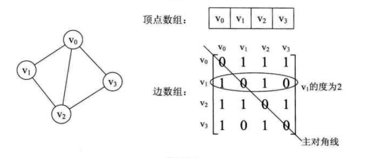{width="5.768055555555556in"
height="2.4948173665791775in"}

411. 有向图例子

412. 邻接数组的表示方法与无向图一致

413. 有向图的邻接矩阵是不对称的；因为v1到v2有弧，并不一定v2到v1有弧

414. 根据邻接矩阵判断出度与入度：行为出度，列为入度

{width="5.768055555555556in"
height="2.427389545056868in"}

415. 邻接矩阵存储网（含权的）

416. 无关的边使用无穷符号：因为权重可能是0，正数甚至是负数

417. 每个位置存储的数值为vi到vj的权重

{width="5.768055555555556in"
height="2.9895089676290465in"}

### 邻接表

418. 邻接矩阵存在的问题：如对于边相对于顶点较少的图，邻接矩阵会有大量的0，浪费存储空间

419. 数组与链表相结合的存储方式称为邻接表

420. 顶点用一个一维数组存储，每个数组元素由data与指向邻接点的指针组成

421. 每个顶点的邻接点会构成一个链表

422. 无向图的邻接表

423. 如想知道某个顶点度，则直接遍历链表

424. 如要判断vi与vj是否有边，则直接遍历i的链表是否有j值

{width="5.768055555555556in"
height="1.662321741032371in"}

425. 有向图的邻接表

426. 顶点以弧尾来存储边表，这样容易计算每个顶点的出度

{width="5.768055555555556in"
height="2.146998031496063in"}

427. 如想求入度方便，可以使用弧头来存储边表，这种方式建立的邻接表称为：有向图的逆邻接表

428. 网的邻接表

429. 为边表结点定义一个数据域

{width="5.768055555555556in"
height="1.9740901137357831in"}

### 十字链表

430. 邻接表的缺陷是：需要遍历整个链表才能知道入度；而使用逆邻接表，则需要遍历才能得到出度

431. 十字链表是将邻接表与逆邻接表结合起来使用

432. 顶点表结构多了一个firstin与firstout，firstin表示入边表头指针，firstout表示出边表头指针；

433. 而边表则分别表示，弧起始顶点，弧终止顶点，终点相同的下一条边，起点相同的下一条边

434. 比如v1的出指针有v0与v2；把边表头指针认为是v0，故边表元素应该是1，0，headlink，taillink；taillink则指向下一个，即v2，1,2，headlink，taillink；因为v1只有2个出顶点；故边链表只有两个

435. 先将所有出指针写好，然后考虑入指针情况；v0的入指针有v1与v2；那么v0的firstin指向v1边表头元素，这个头元素的headlink指向v2边表头元素

{width="5.768055555555556in"
height="3.2118186789151357in"}

436. 十字链表只是结构较为复杂，创建图算法的时间复杂度与邻接表是相同的

### 邻接多重表

437. 普通的邻接表关注重点是顶点，但如需要对边进行操作，如记录访问过的边，或删除某个边

438. 比如，要删除v0-v2的边，需要对邻接表进行2次删除操作

{width="5.768055555555556in"
height="1.434002624671916in"}

439. 重新定义边表结点结构

440. Ivex，jvex分别是边的两个顶点在顶点表的下标，ilink，jlink分别为ivex，jvex顶点的下一条表

{width="4.593175853018373in"
height="0.5103532370953631in"}

441. 对于如下左图，构建邻接多重表

442. 首先，构建顶点表，v0，v1，v2，v3

443. 其次，有几条表，构建几个边表，如图总共有5条边，故有5个边表结构

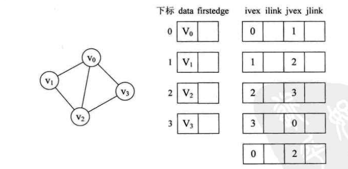{width="5.768055555555556in"
height="2.8092563429571302in"}

444. 接下来为顶点表与边表进行连线

445. 顶点表的firstedge指向边表一个ivex与其下标相同的边表，得到1,2,3,4这4步，对于V0的firstedge也可以连接到0,\^,2\^这个结构

446. 先连接ilink，如v0边表，ivex为0，则ilink是0的下一条边，v0顶点有3条边，v0-v1，v0-v2，v0-v3；如将其指向v0-v3这条边，则是图中5；

447. 依次，将v3的ilink指向v2-v3这条；v2的ilink指向v2-v1；v1的ilink指向v1-v0

448. 总之左图有5条边，右图有10条连线

449. 如想删除v0与v2这条边，直接将图中6,9改为null即可

{width="5.768055555555556in"
height="3.2859219160104987in"}

### 边集数组

450. 由两个数组构成：一个是存储顶点的信息的数组，一个是存边的信息，边数数组由一条边的起始点下标，终点下标，以及权值组成

{width="5.768055555555556in"
height="2.0789031058617673in"}

图的遍历
--------

### 深度优先遍历

451. 深度优先遍历，又称深度优先搜索，简称DFS

452. 对于如下左图的搜索思路是：先从一个顶点出发，如A，有两个选择AF，先选择最右的搜索，即到B；B有3个选择CIG，最右的到C；依次类推

453. 直到F，发现最右的是A标记过了，则查询第二右边元素，即G；G有3个可选项BDH；BD都标记过，则走H，H有DE选择，则也都标记过；则开始回退；G的元素都标记过；再回退到F，E；回退到D时，发现I元素没标记过，则走I，然后I的所有连接元素BCD都标记过，则再回退；直到搜索完

{width="5.768055555555556in"
height="3.405422134733158in"}

454. 深度优先遍历其实是一个递归过程，有点类似于树的前序遍历

455. 深度优先遍历是：从图的某个顶点v开始，访问此顶点，然后从v的未访问邻接点出发深度优先遍历图，直到图中所有和v的路径相同的顶点都被访问到

456. 对于非连通图，只需对连通分量分别进行深度优先搜索；若图中尚有顶点未被访问，则另选图中一个未访问的顶点开始，重复上述过程

### 广度优先遍历

457. 广度优先遍历又称广度优先搜索，检测BFS

458. 广度优先遍历类似于树的层序遍历

459. 广度优先遍历要结合邻接表更容易理解

460. 遍历顺序是

461. 如从顶点0开始遍历，先遍历顶点0的全部邻接表，然后标记

462. 然后从顶点0的邻接表第一个顶点开始；

463. 从顶点2开始，再遍历顶点2的邻接表；然后遍历1的邻接表，然后是5的邻接表

464. 再从2的邻接表开始，发现0,1都遍历过了，则遍历3的邻接表，遍历4的邻接表

465. 再从3的邻接表遍历，发现3的邻接表5，4,2都遍历过了；4的邻接表3,2也遍历过了

466. 遍历结束

{width="4.780652887139108in"
height="2.3226268591426074in"}

最小生成树
----------

### 概述

467. 把构造连通网的最小代价生成树称为最小生成树

468. 假设一个镇子有7个村子，要架设电网，数字表示村子与存在的距离，无数字的可能是不能假设电网的，可能是高山或湖泊，如何用最小代价完成？

{width="5.768055555555556in"
height="4.339394138232721in"}

### 普利姆（Prim）算法

469. 从任意顶点出发，如从D出发，顶点ABEF与D相连，则选最小的边高亮

470. 普利姆算法是以顶点为起点，逐步找各个顶点上最小权值的边来构建最小生成树

471. A到D的距离为5，最近；故AD高亮

{width="3.2924529746281714in"
height="2.3938877952755906in"}

472. 查询与A或D顶点相连的顶点有，BEF，这里面与A或D最近的边高亮

473. DF被高亮，因为其中DF为6，最小；再查询A或D或F相连顶点，GEB，其中最短的；依次类推

{width="2.713646106736658in"
height="2.047169728783902in"}

474. 直到最后剩余一个顶点G，到F是11，到E是9，故EG被选中

{width="2.1981135170603676in"
height="1.563611111111111in"}

### 克鲁斯卡尔(Kruskal)算法

475. 从图的边考虑如何生成最小生成树

476. 如下网图，先针对网生成边集数组，并按照权值从大到小

{width="2.9267180664916888in"
height="3.4683169291338585in"}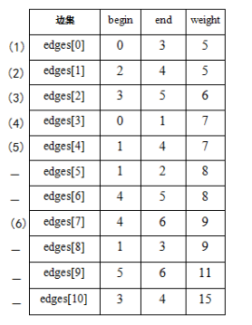{width="2.8954713473315836in"
height="3.7391163604549433in"}

477. 先将图的边全部去掉

{width="2.5725951443569555in"
height="2.749656605424322in"}

478. 然后根据边集数组从权值由小到大依次连接图，但要保证不能出现环

479. 如对于edge\[5\]是连接1，2的边，此时1,2,4顶点构成了一个环，故不连接edge\[5\]

480. 依次类推形成最小生成树

{width="1.7169816272965879in"
height="1.90167760279965in"}

最短路径
--------

### 概述

481. 对于非网图：由于没有权值，所谓最短路径就是两顶点之间经过边数最少的路径；

482. 网图最短路径是：两顶点之间经过的边上权值之和最少的路径，并且我们称路径上第一个顶点叫源点，最后一个顶点是终点

483. 非网图，完全可以理解为权值为1的网图

### 迪杰斯特拉算法（Dijkstra）

484. 如下，以A点为起点，查询A到各个顶点的最短距离，使用迪杰斯特拉算法

485. 将S集合作为最终最短路径集合，B(6)表示b点到A点的距离

486. A起始，到A点距离为A(0),加到S集合中：s=\[A(0)\];到B为B(6),到C为C(3)；因此将C(3)加入S集合中：S=\[A(0),C(3)\]

487. 此时，从C为起始，与之相邻的有BDE，分别得到BDE到A的距离为：B(5),D(6),E(7)；则B最短，下一个起点为B，但要考虑第三步中B到A的距离B-A为6，A-C-B为5；因此S集合为S=\[A(0),C(3),B(5)\]

488. 此时，从B为起始，只有D一个顶点与之相连；D与A的距离为D(10)；比A-C-D要长，故第四步D(6)添加到S集合中，S=\[A(0),C(3),B(5),D(6)\];

489. 此时，从D起始，到F为9，到E为8；但4步中A-C-E为7，故将E(7)添加到集合中S=\[A(0),C(3),B(5),D(6),E(7)\];

490. 此时，从E开始，到F距离为12，故将F(9)添加到S数组

491. 最终得到的最短路径S为\[A(0),C(3),B(5),D(6),E(7),F(9)\];

492. 如需要B点到其他顶点的最短距离，需要再遍历一遍；此算法得到的是A到任意顶点的最短距离

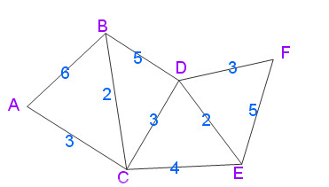{width="3.8641010498687662in"
height="2.197642169728784in"}

### 佛洛依德算法（Floyd）

493. 对于如下图使用Floyd算法求最短路径

{width="5.768055555555556in"
height="3.209148075240595in"}

494. 先构造这个图的邻接矩阵，不相连的使用无穷符号表示

{width="5.768055555555556in"
height="2.21909886264217in"}

495. Floyd算法的思路是：对于v1-v2的距离，比他近的一定需要中转，比如v1-v3-v2比v1-v2短，甚至是v1-v3-v5-v2是最短的；先以v1为中转比较e\[i\]\[1\]
    +e\[1\]\[j\] \< e\[i\]\[j\]则更新值

496. 如e\[2\]\[1\] + e\[1\]\[3\] = 12+无穷；而e\[2\]\[3\]=10 ;不更新值

497. 这样看下来，e\[2\]\[1\]+e\[1\]\[7\]=26,而e\[2\]\[7\]=无穷，故更新e\[2\]\[7\]值

{width="5.768055555555556in"
height="2.094258530183727in"}

{width="5.768055555555556in"
height="2.0915879265091863in"}

498. 对于更新后的矩阵，考虑以v1,v2为中转点的最短路径，即：

499. 通过比较，更新矩阵值结果为

{width="5.768055555555556in"
height="2.0662193788276464in"}

{width="5.768055555555556in"
height="2.0662193788276464in"}

500. 通过上述方式比较可以得到最终最短路径

### Dijkstra与Floyd算法比较

501. Floyd计算所有顶点到所有顶点最短距离的程序上更简洁

502. Dijkstra在计算某个顶点到所有顶点最短距离时，时间复杂度为n\^2

503. 都可以应用于有向图

拓扑排序
--------

### 拓扑排序介绍

504. 主要是解决：工程上能否顺序进行的问题

505. 在一个表示工程的有向图中，用顶点表示活动，用弧表示活动之间的优先关系，这样的有向图为顶点表示活动的网，称为AOV网；

506. AOV网不能有回路，如下电影制作，一般活动都不会有返工（回路），而且是有先后顺序的，不能人员到位了，资金没到位

{width="5.768055555555556in"
height="2.9521227034120736in"}

507. 拓扑序列概念：一个具有n个顶点的有向图，V中的顶点序列为v1,v2,v3.....vn，满足从顶点vi到vj有一条路径，则在顶点序列中顶点vi必须在vj之前，则我们称这样的顶点序列为拓扑序列

508. 拓扑排序：对一个有向图构造拓扑序列的过程

509. 构造全部顶点输出，表示不存在回路的AOV网

510. 构造结果少一个或更多顶点，表示存在回路的AOV网

511. 不存在回路的AOV网实际意义更大

### 拓扑排序

512. 拓扑排序的基本思路是：从AOV网中选择一个入度为0的顶点输出，然后删除此顶点，并删除以此顶点为尾的弧，继续这个过程，直到全部顶点输出或AOV网不存在入度为0的顶点

513. 考虑到拓扑排序需要删除顶点，使用邻接表的存储结构更为方便

514. 对于如下图，因为需要对入度进行操作，因此设计邻接表的顶点数组为，in表示入度数：

{width="3.3745778652668417in"
height="0.41661417322834643in"}

{width="5.561805555555556in"
height="3.103778433945757in"}

515. 根据图得到邻接表如下：

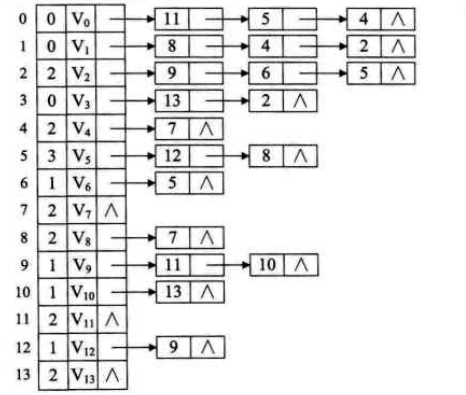{width="4.853560804899388in"
height="4.114069335083115in"}

516. 首先选择任意一个入度为0的顶点开始拓扑排序，可以使用栈结构来存储入度为0的顶点，如设计栈S=\[v3,v1,v0\],从V3开始，S弹出v3；遍历v3的邻接表，对13与2这两个顶点入度减1；并将V3计入排序结果

{width="3.5094346019247595in"
height="1.3133464566929134in"}

517. 再弹出v1，遍历邻接表；此时v2的入度为0，将v2压入栈s中；依次类推

{width="5.768055555555556in"
height="1.9447156605424323in"}

518. 得到最终的拓扑序列为：3-1-2-6-0-4-5-8-7-12-9-10-13-11

关键路径
--------

### 概述

519. 解决工程需要最短时间问题：如对于一个组装汽车，只有缩短关键步骤的时间，才能缩短整个工程时间，比如发动机安装2天，车轮1天，再怎么缩短车轮安装也无法缩短汽车组装时间

520. 如要对一个流程图获得最短时间，必须分析他们的拓扑关系，从中找到最关键的流程，整个流程的时间就是最短时间

### AOE网

521. 在一个表示工程的带权有向图中，用顶点表示事件，用有向边表示活动，边上的权值表活动的持续时间，这种有向图的边表示的活动的网，称为AOE网

### AOE与AOV

522. AOV网是顶点表示的活动的网，他只描述活动之间的制约关系

523. AOE网是边表示活动的网，边上权值活动持续的时间

### 关键活动

524. 把路径各个活动所持续的时间之和称为路径长度

525. 从源点到汇点具有最大长度的路径叫做关键路径

526. 在关键路径上的活动叫关键活动

527. 只有缩短关键路径上的活动时间才能减少整个工期长度

### 关键路径算法

528. 如下图，计算关键路径

{width="5.768055555555556in"
height="1.9300284339457567in"}

529. 计算每个顶点的最早开始时间

530. 最早开始时间是到达各顶点的最早时间（按最大计）

531. V1是源点，最早开始时间是0，v2，v3，v4分别是6，4,2

532. 对于V5而言，V2到V5所花费时间是6+1=7，而V3到V5所花费时间是4+1=5。我们要按最大计，也就是V5最早时间是max{7,5}=7，按最大计是因为只有活动a4和a5同时完成了，才能到达V5状态。V3到V5需要5分钟，但是此时a4活动尚未完成（7分钟），所以都不能算到达V5，故而要按最大计。

533. 得到最短时间表

{width="2.583010717410324in"
height="3.135025153105862in"}

534. 计算每个顶点的最晚时间（按最小计算）

535. 最晚时间是，顶点超过这个时间后，会影响整个工程的进度

536. 可以从后往前推，V9是18；对于V7-v9时间是2，故v7最晚应该16开始，否则就会影响v9的时间

537. V7最晚是16，v8最晚是14，对于v5-v7需要9，v5-v8需要7；因此v5从v7计是7，从v8计是5；因此，v5最晚应是7

538. 依次计算最晚时间：

{width="3.99950021872266in"
height="3.0933639545056866in"}

539. 求关键路径

540. 对于a1：到v2的时间，最早时间与最晚时间都是6，故a1为关键路径

{width="5.041036745406824in"
height="1.531058617672791in"}

541. 对于a2，即v1到v3的时间最早是4，最晚是6，即在v3可以\[0,2\]区间内任意时间完成即可；由于a2时间不确定，故不是关键活动

{width="4.009915791776028in"
height="1.7185356517935257in"}

542. 根据上述计算方式，得到最终的

543. 蓝色的为关键路径的点

544. 根据关键路径点，得到关键路径

{width="4.124484908136483in"
height="3.0933639545056866in"}

{width="5.768055555555556in"
height="1.6656594488188976in"}

查找
====

查找概述
--------

### 静态查找表

545. 只作查找操作的查找表

546. 主要操作有：

547. 查询某个特定数据元素是否在查找表中

548. 检索某个特定数据元素和各种属性

### 动态查找表

549. 在查找过程的同时，插入查找表中不存在的数据元素，或者从查找表中删除已经存在的某个数据元素

### 存储结构划分

550. 逻辑上查找基于的数据结构是集合，集合中的记录并没有本质关系

551. 为了提高查找性能，可以将改变数据元素之间的关系，存储时存为树，线性表等结构

552. 如对于静态表，多是查找，可以用线性表组织数据结构，使用顺序查找，或者将数据按主键排序，可以使用折中查找等高效的查找方法

顺序表查找
----------

### 顺序查找

553. 又称线性查找，是最基本的查找技术，就是从头到尾一个个查找

554. 类似如下代码：

{width="3.291255468066492in"
height="2.1351498250218723in"}

### 顺序表查找优化

555. 上面的循环，需要比较i与n大小，还要判断i不要超过数组界限

556. 实际上，可以这样进行优化：

557. 直接将拷贝过来的数组最后一项设置为key，如不相等，则往前循环，直到相当为止；

558. 注意：要为a\[0\]赋值为key；并没看出优化了什么？？？？？？？？？？？

{width="5.768055555555556in"
height="2.703108048993876in"}

### 优缺点

559. 算法简单

560. 时间复杂度为O(n),当数据量很大时，查找效率低下

有序表查找
----------

### 折半查找

561. 折半查找，又称二分查找；前提是**线性表中的记录是关键码有序的，线性表必须是顺序存储**

562. 主要思想是：取中间作为比较对象，如要查找是key比中间小，则在左半区选中间位置查找，不断重复此过程查找

563. 二分查找的时间复杂

564. 如参数是a={0,1,16,24,35,47,59,62,73,88,99},要查找key=62，使用二分查找，先将其转为二叉树

{width="4.754716754155731in"
height="1.8661165791776029in"}

565. 根据图示，如开始查找时不是47，则只需查找整个数组的一半，工作量减少了一半

566. 对于完全二叉树，n结点的完全二叉树的深度为\[log~2~n\]
    +1；虽然图不是完全二叉树，但查找最坏的情况是\[log~2~n\] +1

567. 因此，二分查找的时间复杂度为O(log~2~n)

568. 优缺点

569. 二分查找必须是有序，顺序存储，最好是排序后不再变化

570. 如频繁插值或删除值，维护排序需要很大工作量，不建议使用

### 插值查找

571. 是对二分查找的改变，二分查找使用折半方式查找，那为何不是1/4,1/3这样查找呢？

572. 二分查找的数组下标计算公式为：low为数组开始下标，high为结束下标；如a=\[1,2,3,4,5\]，使用二分查找4，则先查找mid
    = 0+ (4-0)/2 = 2，即a\[2\]=3小于4；再将low改为3进行查找

{width="4.832729658792651in"
height="0.9373829833770778in"}

573. 插值查找是更改1/2这个系数为：{width="1.4789818460192476in"
    height="0.6561679790026247in"}，得到mid计算公式为：

{width="5.051452318460193in"
height="0.8957217847769029in"}

574. 优缺点

575. 时间复杂度也是O(log~2~n)；主要优势是针对表长较大，关键字均匀分布的，性能比二分查找好

576. 如数组分布类似a=\[0,1,2,2000,2001...,999998,999999\],这样极端不均匀的数据，用插值查找未必很合适

### 斐波那契查找

577. 先构建一个斐波那契数列

    {width="5.768055555555556in"
    height="0.8992563429571303in"}

578. 要查找的数组为：查找其中的59

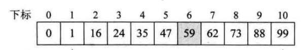{width="5.768055555555556in"
height="0.9433169291338582in"}

579. 由于要查找数组长度为11，根据斐波那契数列可以得到F(6)\<11\<F(7)；故选择F(7)=13；

580. 将数组补齐为斐波那契数组长度13

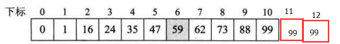{width="5.768055555555556in"
height="0.7523840769903762in"}

581. 由于斐波那契前两个数值为5,8，将数组分为8,5两个部分；mid值为F(k-1) =
    F(6) =
    8;即比较数组8位置与59的大小，73小于59；故选择前面一部分继续比较

{width="5.768055555555556in"
height="1.3792596237970254in"}

582. 舍弃后面数据，使用前面部分，再根据斐波那契数列将8拆分为5和3两段数组；即比较F(5)=5位置上的数据，5上数据为47小于59；因此选择后面3部分数据

{width="5.768055555555556in"
height="1.6783442694663167in"}

583. 此时，low坐标起始为6，high为7；由于使用的是3这部分，即key大于上面的5和3数组中间值47；故选用F(k-2)
    = F(3) = 2；则需要判断a\[6+2-1\] = a\[7\] = 62\>59这个值

{width="5.768055555555556in"
height="1.0140824584426946in"}

584. 最后，F(3-1) = F(2) = 1;a\[6+1-1\] = a\[6\] = 59查询到值

### 三种有序表查找算法比较

585. 时间复杂度都是O(log~2~n)

586. 平均性能，斐波那契查找优于折半查找；但如key=1，性能要比折半查找差

587. 二分查找使用除法运算，插值查找使用四则运算，斐波那契查找使用加减运算，理论上斐波那契查找会更快

588. **3个查找方法只是在每次查找的分割点选择的不同**

线性索引查找
------------

### 概述

589. 对于海量数据，如日志等，都是根据时间进行先后顺序存储的，如要全部排序需要时间代价会非常高

590. 数据结构的最终目的是提高数据的处理速度，索引则是为了加快查找速度而设计的一种数据结构

591. 索引就是把一个关键字与它对应的记录相关联的过程

592. 索引技术是组织大型数据库以及磁盘文件的重要技术

593. 所谓线性索引就是将索引项集合组织为线性结构，也称索引表

### 稠密索引

594. 稠密索引：把数据集的每个记录对应一个索引项

{width="5.768055555555556in"
height="3.8726345144356955in"}

595. 对于稠密索引，索引项一定是按照关键字有序的

596. 因为索引项是有序的，可以使用二分查找，插值查找等方法加快查找

597. 但主要问题是：如数据很大，则每一项都需要建立索引项，占用内存很大

### 分块索引

598. 针对稠密索引的缺点，不是每一个数据都进行索引，而是减少索引数，将数据集分成多个块，块间是有序的，块内是无序的

599. 一般分块索引的索引项结构分为：

600. 最大关键码，即块内的关键码都小于此

601. 块内记录数，便于循环

602. 指向块的数据元素指针，用于对记录遍历

603. 因为块间是有序的，如要查询63，发现57\<63\<96，故数据在\[2\]块中，再在块中进行顺序查找

604. 块间可以使用有序表查找方法，块内使用顺序存储；速度比稠密索引慢，但存储的索引比稠密索引小

{width="5.768055555555556in"
height="5.31075021872266in"}

### 倒序索引

605. 如有两篇文章，将文章里面的单词抽出来按单词表排列，是有序的

606. 如查询
    book，则直接查询发挥文章编号1，2；如没有这个单词表，需要将单词在文章内容中逐步查找，会很慢

{width="3.0725328083989503in"
height="2.905886920384952in"}

607. 索引项的通用结构是：

608. 次关键字，如上面的英文单词

609. 记录号表，如上面文章编号

610. 其中，记录号表存储具有相同次关键字的所有记录的记录号，这种索引方式称为倒序索引

611. 这种方式不是由记录来确定属性值，而是由属性值确定记录的位置，因而称为倒序索引

612. 倒序查找非常快：基本等于生成索引表后，查找时不用读取记录，直接可以得到结果；因为如book，指向的位置是1,1只是一个地址，并不是内容，故很快；

二叉排序树
----------

### 概述

613. 对于普通的顺序存储结构，如添加元素，可以在数组末尾添加，如删除元素，可以将删除元素与末尾元素对换，对于插入和删除操作，顺序结构的效率是可以接受的

614. 但是，这样无序的顺序存储结构，查找将是相当复杂的

### 概念

615. 二查排序树，又称二查查找树：它或是一颗空树，或者具有如下性质：

616. 如左子树不空，左子树所有值都小于它的根值

617. 如右子树不空，右子树所有值都大于它的根值

618. 它的左右子树，分别为二叉排序树

619. 左子树结点一定比其双亲小，右子树结点一定比其双亲大

620. 构建一颗二叉排序树的目的，其并不是为了排序，而是为了提高查找和插入删除关键字的速度

### 举例

621. 如对集合{62,88,58,47,35,73,51,99,37,93}做查找，打算在创建此集合时就是用二叉树结构，并且还是排序好的二叉树

622. 62作为根，88大于62作为右子树；58小于62作为左子树；47小于58作为58的左子树，35小于47作为47的左子树；依次类推

623. 对于这课树，进行中序遍历时，会得到一个有序序列，通常称为二查排序树

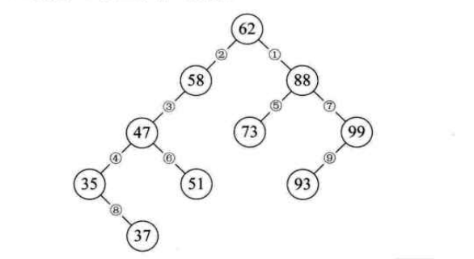{width="5.768055555555556in"
height="3.1597462817147854in"}

### 二查排序树删除操作

624. 如是叶子结点，直接删除即可

625. 如某个结点只有左子树，或只有右子树，那删除后，直接让孩子到删除位置即可

{width="5.603774059492563in"
height="4.297524059492563in"}

626. 如某个结点既有左子树又有右子树，最直接的想法是，把47删除，然后把47的左子树放在47位置，然后47右子树再调用二查排序树的插入方法；但这样可能会对树的结构发生变化，增加树的高度等

{width="4.353623140857393in"
height="3.3537478127734035in"}

627. 如对二叉树进行中序遍历，得到遍历集合，删除47，可以用37或48，来代替这个结点

{width="5.093113517060368in"
height="0.34370734908136485in"}

{width="5.768055555555556in"
height="3.105003280839895in"}

{width="4.68691491688539in"
height="3.8016087051618546in"}

### 总结

628. 二叉排序树是用链接的方式存储，保持了插入与删除操作不用移动元素的优点

629. 查找的比较的次数最多是树的深度

630. 但对于极端情况，如{35,37,47,51,58,62,73,88,93,99}，是一个极端的右斜树，查找99结点需要查找10次，但如将数据排列为{62,88,58,47,35,73,51,99,37,93}这样的数组，形成的二查树如下，则查找99只需要2次

631. 我们希望二叉排序树与完全二叉树相同，时间复杂度为log~2~n;

632. 但上述极端右斜树形式，相当于顺序查找了

{width="3.8641010498687662in"
height="2.7809022309711287in"}

平衡二叉树（AVL树）
-------------------

### 概述

633. **解决普通二叉排序树，极端不平衡导致查找时间复杂度提示的问题**

634. 所谓平衡二叉树是：在二叉排序树构建过程中保证它的平衡性，如不平衡，马上处理

635. 在频繁查找的同时，需要插入和删除操作，需要构建一颗二叉排序树；为保证查找高效，避免极端的右斜树等情况，使用平衡二叉树是比较理想的动态查找表算法

### 平衡二叉树概念

636. 是一种二叉排序树，其中每个结点的左子树和右子树的高度差至多为1

637. **注意是二查排序树，因此要满足二查排序树的性质**

638. 是高度平衡的二叉排序树

### 平衡因子BF

639. 将二叉树上结点的左子树深度减去右子树深度的值称为平衡因子BF

640. 平衡二叉树所有结点的平衡因子只可能是0，-1和1

641. 不是平衡二叉树，因为59在58左子树，不符合二叉排序树

{width="3.4683169291338585in"
height="1.8643503937007875in"}

642. 不是二查平衡树，58结点左子树深度为2，右子树深度为0

{width="3.697455161854768in"
height="2.0726574803149607in"}

### 最小不平衡子树

643. 距离插入结点最近的，且平衡因子的绝对值大于1的结点为根的子树，称之为最小不平衡子树

644. 当插入新结点37时，距离它最近的平衡因子绝对值超过1的结点为58，从58开始以下的子树为最小不平衡子树

{width="5.6659590988626425in"
height="3.135025153105862in"}

### 平衡二叉树实现原理

645. 每当插入一个结点时，先检查是否因插入而破坏树的平衡性，若是找出最小不平衡子树；调整最小不平衡子树中各个结点的关系，进行相应的旋转

646. 如对于数组a=\[3,2,1,4,5,6,7,10,9,8\];按照二叉排序树规则排列3,2,1得到

647. 数字标号表示当前结点的BF值

648. 由于3的BF值为2，不满足平衡二叉树的要求，顺时针旋转树，调整结点关系为右图

{width="4.343207567804025in"
height="2.0518274278215225in"}

649. 再插入4

{width="2.468441601049869in"
height="1.8643503937007875in"}

650. 插入5时：2,3结点的BF值为-2；旋转3,4,5结点，因为值为负，故逆时针旋转

{width="5.613882327209099in"
height="2.7392410323709537in"}

651. 接着插入6时：2结点的BF为-2，需要逆时针旋转结点2；但问题是本来3是4的左孩子，但为了满足二叉树的要求，将结点3作为2结点的右孩子

{width="5.771867891513561in"
height="2.2075470253718286in"}

652. 再插入结点7，结点5的BF为-2，进行逆时针旋转

{width="5.768055555555556in"
height="2.0441885389326333in"}

653. 再插入10,9，得到如下结构，7的度超过2，应逆时针旋转7，但旋转后不符合二叉排序树规则；

654. 发生这个问题的根本原因是7的BF为-2，10的BF为1；

655. 先将9,10结点进行右旋，再将7,9,10左旋

{width="4.645252624671916in"
height="3.103778433945757in"}

{width="3.707869641294838in"
height="2.3434569116360455in"}

656. 最后插入结点8，6的BF为-2,9的平衡因子为1，需要先旋转9，再旋转6

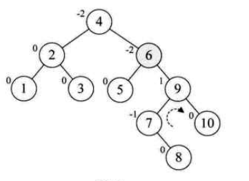{width="3.7599464129483815in"
height="2.7392410323709537in"}

{width="3.8745155293088365in"
height="2.385119203849519in"}

{width="3.728700787401575in"
height="2.2184733158355208in"}

多路查找树（B树）
-----------------

### 概述

657. 之前的方法都是从内存角度考虑问题，但内存不是无限大，需要读取硬盘，如查询一个文件，设计的算法需要读取硬盘几万次，还是几十次，速度是相差很大的

658. **多路查找树是每一个结点不在只存储一个元素**

659. 一个结点只存一个元素，在元素非常多时，树的度会非常大，或高度非常高，这会造成内存读取硬盘次数非常多，时间效率到达瓶颈；需要打破一个结点只存一个元素的限制

### 概念

660. 多路查找树：其每一个结点的孩子数可以多于两个，且每个结点处可以存储多个元素

### 2-3树

661. 2-3树是这样一颗多路查找树：

662. 其中每个结点都具有两个孩子（称为2结点），或三个孩子（3结点）

663. 2结点包含1个元素和2孩子（或没有）；**不能是一个孩子**

664. 3结点包含2个元素和3个孩子；**必须是3个孩子或没有孩子**

665. 2-3树的所有叶子都在同一层上

666. 最复杂的是新结点的插入与已有结点删除

{width="5.768055555555556in"
height="2.365971128608924in"}

667. 结点插入实现

668. 插入数字3，将1转换为2结点

{width="5.768055555555556in"
height="1.130913167104112in"}

669. 插入数字5，需要插入在6,7这个位置，但为了满足2-3树要求，将4转换为3结点

{width="5.768055555555556in"
height="1.1629571303587052in"}

670. 插入数字11，遍历发现应该插入9,10位置，但9,10为3结点，父12，14为3结点，再父8是2结点，因此转换8为3结点

{width="5.768055555555556in"
height="1.195670384951881in"}

671. 插入数据2，因为13,46,812都是3结点，因此需要将根再拆为2结点

{width="5.768055555555556in"
height="1.3191754155730533in"}

672. 自己想的：如插入2，直接将数据插入应该插入的地方，如2比4小，在13中间；但123这个结点不满足2-3树要求，将其转换为2结点树，将2元素放在4,6这个节点位置，不满足再转换，得到最终结果

{width="5.768055555555556in"
height="3.040246062992126in"}

673. 2-3树的删除实现

674. 删除元素9，因为是叶子结点，3结点变为2结点满足2-3树性质，树不用改变

{width="5.768055555555556in"
height="1.2964774715660543in"}

675. 删除1结点，4结点不满足2-3树要求，故按照自己理解，可以将6,7合并到4结点，即4,6,7，为了满足2-3树要求，变成如右图形式；实际是对4这个结点进行旋转

{width="5.768055555555556in"
height="1.2984798775153106in"}

676. 删除结点4，6结点孩子只有7一个，无法形成2-3树结构，将8挪动到7位置，9挪动到8位置

{width="5.768055555555556in"
height="1.1249048556430445in"}

677. 删除10结点

{width="5.768055555555556in"
height="1.7926541994750655in"}

678. 删除8结点，因为如下是满二叉树，删除任意结点都不能使树满足2-3树，故需要减少层数

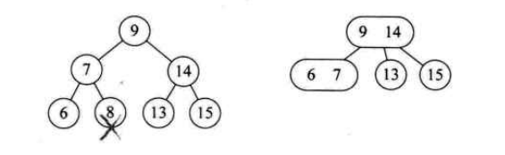{width="5.768055555555556in"
height="1.7760958005249343in"}

679. **对于非叶子结点的删除，使用中序遍历后，用前驱或后继补位即可**

680. 如删除结点4

{width="5.768055555555556in"
height="1.2584241032370953in"}

681. **注意：2-3树插入与删除的情况众多，掌握规律**

### 2-3-4树

682. 相比于2-3树，只是多了一个4结点，包含3个元素与4个孩子（或没有孩子）

683. 删除与插入与2-3树类似

### B树

684. 概念

685. B树是一种平衡的多路查找树，2-3树，2-3-4树是都是B树的特例

686. B-tree，翻译为B-树，中间的-是连接符，不是减号

687. 结点最大的孩子数目称为B树的阶

688. B树的产生

689. 先考虑一个问题：数据库索引为何使用树存储，树查询效率高，可以有序；

690. 为何索引不使用二叉树？？？

691. 二叉树虽然效率最高，但要考虑磁盘IO问题

692. 如数据索引存储在磁盘上，数据量比较大时，索引可能就是几个G，不可能全部加到内存中，只能逐一加载每个磁盘页；磁盘页对应于索引树的结点

    {width="5.768055555555556in"
    height="3.94617782152231in"}

693. 如使用二叉树查找，如树高度为4，查找10这个数，对于如下的情况，没查询一个结点都要访问一次硬盘，如查询9，需要访问一次，直到10，总共访问了4次；

{width="5.768055555555556in"
height="3.024890638670166in"}

694. **为了减少访问磁盘次数，B树的是将原本'瘦高'的二叉树结构，转换为'矮胖'结构**

695. **B树的数据结构就是为内外存的数据交互准备的**

696. 通过这种方式，在有限内存中，每次访问磁盘获得最大数量的数据

697. 主要应用：

698. 文件系统以及部分数据库索引，比如MongoDB

699. B树具有的属性：

700. 如根结点不是叶子结点，则最少有两棵子树

701. 每个非根的分支结点都有k-1个元素与k个孩子，其中{width="1.5102274715660542in"
    height="0.45827646544181977in"}

702. 每个叶子结点n都有k-1个元素，{width="1.5102274715660542in"
    height="0.45827646544181977in"}

703. 所有叶子结点都在同一层次

704. 所有分支结点都包含下列信息数据{width="2.812148950131234in"
    height="0.39578412073490815in"}；n表示当前结点关键字总数，K表示具体的关键字，A是指向孩子的指针

705. **K的大小取决于磁盘页的大小**

706. 举例：用上面的数据，构建B树

{width="5.768055555555556in"
height="2.1857195975503063in"}

707. 如查询5，第一次IO得到9，然后内存比较；第二次IO得到(2,6)；第三次IO得到(3,5)；3次IO查询得到结果

708. B树最坏的查找次数是多少呢？？

709. 第一层最少1个结点。第二层2个结点（根据定义）

710. 因为非根的分支结点至少有\[m/2\]棵子树，这样k+1层至少有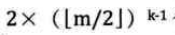{width="1.8226891951006123in"
    height="0.36453740157480313in"}个结点

711. 若m阶B树有n个关键字，则叶子结点应该有n+1个，故

{width="2.405949256342957in"
height="0.38536854768153983in"}即：

{width="2.7392410323709537in"
height="0.9686286089238845in"}

### B+树

712. 特征1：

713. 每个父结点的元素都出现在子节点中，是子节点最大或最小的元素

714. 如根节点8，15会出现在孩子中；8作为左子树第一节点的最大值；15作为右子树第一节点的最大值

715. 根据这个特征，根节点的最大值则是整个B树的最大值

716. 由于父结点元素都在子节点中，所以所有叶子节点包含了全部元素信息

717. 特征2：

718. 每个叶子节点带有指向下一节点的指针，形成一个有序链表

{width="5.768055555555556in"
height="2.3606299212598425in"}

719. 卫星数据：

720. 索引元素所指向的数据记录，比如数据库的某一行；B树中，无论中间节点还是叶子结点都带有卫星数据（就是每个节点都带有数据）

{width="5.768055555555556in"
height="2.8272823709536308in"}

721. B+树卫星数据都在叶子结点上

{width="5.768055555555556in"
height="2.728477690288714in"}

722. B+树卫星数据在叶子结点的设计优势：

723. **因为B+树中间结点无卫星数据，在相同大小磁盘页可以容纳更多的节点元素；因此在相同数据情况下，B+树比B树更矮胖，查询IO更少**

724. B+树查询更稳定，都是查询到叶子结点，性能稳定；而B树，最好在根节点，最差在叶子结点

725. 上面两条也是在单元素查找时，虽然硬盘IO相同，B+树比B树的优势

726. 范围查找的优势

727. 如要查找3到11元素，对于B树结构，中序遍历：找到3，然后（26），然后（8），然后（9），然后（11）；很繁琐，而且每次查询不同结点都要访问IO

{width="5.768055555555556in"
height="2.3853313648293963in"}

728. 对于如下B+树，得到（3,5）后，直接通过链表方式，获取（6,8），（9,11）

{width="5.768055555555556in"
height="2.1443285214348204in"}

729. B+树优势总结

730. IO次数少

731. 查询性能稳定

732. 范围查询简便

散列表查找（哈希表）概述
------------------------

### 定义

733. 散列技术是在记录的存储位置和它的关键字之间建立一个确定的对应关系f，使得每个关键字key对应一个存储位置

734. 对应关系f称为散列函数，又称哈希（Hash）函数

735. 采用散列技术将记录存储在一块连续的存储空间中，这块连续的存储空间称为散列表或哈希表

736. 散列技术即是一种存储方法，也是一种查找方法

737. 散列技术是面向查找的存储结构

### 散列表查找步骤

738. 存储时，通过散列函数计算记录的散列地址，并按散列地址存储该记录

739. 查找时，通过同样的散列函数计算记录的散列地址，按地址直接访问该记录

740. 设计一个简单、均匀、存储利用率高的散列函数是散列技术中最关键的问题

741. 理想状况下，设计的散列函数是每一个key有不同的地址，如key1！=key2，地址应该也是不同的，但实际是总会有相同的情况；这种情况称之为冲突，如何处理冲突是散列技术一个重要课题

### 散列函数的构造方法

742. 什么才算好的散列函数

743. 计算简单：如为了保证key不重复，需要大量计算，查找，降低了效率；应该设计的散列函数计算时间应该小于其他查找技术的比较时间

744. 散列地址均匀分布：这是减少冲突最好的办法，提供了存储利用率，并提高了处理冲突的效率

745. 下面介绍一些散列函数构造方法，都是将原有数字通过某种规律变为另一个数字而已

746. 直接定址法

747. 取关键字的某个线性函数值作为散列地址

748. 如要统计80年代后出生人数，可以使用f(key) = key-1980

749. 优点：简单，均匀，不发生冲突；适合查找表较小且连续的情况

750. 缺点：需要知道关键字的分布

751. 数字分析法

752. 如手机号，前3位表示运营商，中间4位为地区，后4位为用户号；如为一个公司的职员构建散列函数，使用后四位不错

753. 只是抽取关键字的一部分构建散列函数

754. 如单单的抽取会造成冲突，可以将抽取的数字进行移位，求和等

755. 平方取中法

756. 假设关键字为1234，平方为1522756，取中则是227

757. 适合不知道关键字分布的，位数不是很大情况

758. 折叠法

759. 如对于数9876543210，分为987,654，321，0这4组数，然后求和得到1920，再取后3位作为散列地址

760. 除留余数法

761. 最常用的构建散列函数方法

{width="3.707869641294838in"
height="0.4061996937882765in"}

762. 随机数法

763. 选择一个随机数，取关键字的随机函数值为它的散列地址

764. 适合处理关键字长度不等

765. 总结：采用不同散列函数的依据

766. 计算散列地址所需时间

767. 关键字的长度

768. 散列表的大小

769. 关键字的分布情况

770. **散列函数的构造方法，就是通过某种方式为key生成散列地址，保证冲突最少**

### 处理散列冲突的办法

771. 开放定址法

772. 所谓开放定址法：是一旦发生了冲突，就去寻找下一个空的散列地址，只要散列表足够大，空的散列地址总能找到，并将记录存入

773. 假如使用取余法，计算{width="3.8016087051618546in"
    height="0.32287620297462816in"}

{width="5.768055555555556in"
height="0.7166513560804899in"}

774. 当计算key=37时，与25位置冲突，则利用公式，将数存在2这个位置

{width="3.6037160979877516in"
height="0.37495297462817145in"}

775. 当计算48时，与0位置冲突，则需要依次计算(f(48)+1)
    mod12重复了，(f(48)+2) mod12重复了，直到(f(48)+6) mod12才能存入

{width="5.768055555555556in"
height="0.7503816710411199in"}

776. 这种解决冲突的开放定址法称为：线性探测法

777. 48,37这种本来都不是同义词却争夺一个地址的情况，称这种现象为堆积

778. 开放定址法在散列表未填满时，总能找到不发生冲突的地址

779. 再散列函数法

780. 如某种方式，比如取余法发生冲突，再使用其他散列函数如折叠，平方取中等，直到找到不冲突的地址

781. 优点是关键字不聚集；缺点是增加了计算成本

782. 链地址法

783. 对于冲突的地址，直接形成一个链表

784. 遍历链表会消耗时间

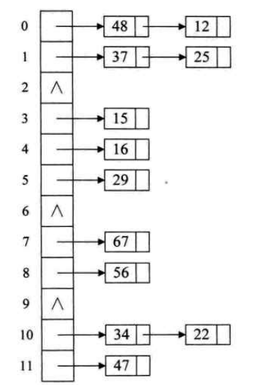{width="2.202898075240595in"
height="3.3043482064741907in"}

785. 公共溢出区法

786. 将有冲突的，放在一个溢出区表中

787. 查询时，如37计算后在基本表中未找到，则去查询溢出表

排序
====

概述
----

### 实际意义

788. 如只使用标准库的排序函数，学习排序算法的意义在于：

789. 排序算法常常是我们解决其他问题的第一步

790. 类似的技术也能有效的解决其他类型的问题

791. 有助于提供编写算法的能力，以及解决更加复杂问题

### 排序稳定性

792. 待排序序列可能存在一个或多个相等的关键字，排序结果可能存在不一致的情况

793. 假设ki=kj，如排序前ki在kj前面，排序后ki还在kj前面，则认为排序算法是稳定的；

794. 排序算法是否稳定，是要通过分析后才能得到的

### 内排序和外排序

795. 内排序：在排序的整个过程中，待排序的所有记录全部放置在内存中

796. 外排序：是由于排序的记录个数太多，不能同时放在内存中，整个排序过程需要在内外存多次交互数据才行

797. 排序性能主要受到：

798. 时间性能：在内排序中，主要操作是比较和移动（移动可以通过改变记录的存储方式予以避免）；高效的内排序算法应该具有尽可能少的关键字的比较次数与尽可能少的记录移动数

799. 辅助空间：除了待排序所占用的存储空间外，执行算法所需要的其他存储空间

冒泡排序(Bubble sort)
---------------------

### 最简单的排序实现

800. 冒泡排序：是一种交换排序；思想是，两两比较相邻的关键字，如反序则交换位置，直到没有反序的记录为止

801. 对于冒泡排序，最简单的实现思路是：

var a = \[9,1,5,8,3,7,4,6,2\];\
function sort1(){\
for(var i = 0 ; i \< a.length ;i ++){\
for(var j =i ; j \< a.length;j++){\
if(a\[i\] \> a\[j\]){\
var temp = a\[i\];\
a\[i\] = a\[j\];\
a\[j\] = temp\
}\
}\
}\
console.log(a)\
}

802. 注意：严格意义上说，这个不是标准冒泡排序算法，因为不满足"两两相邻元素比较"的冒泡排序思想

803. 对于上述循环：

804. 当i=0时，然后比较9和1，交换，一直比较到最后；将1排在第一位置

805. 当i=1时，比较9和5，交换，然后比较5和3，交换，最后比较3和2，交换

806. 依次类推；这时候12排序好后，3在数组最后

807. 排序好的1，2对未排序的数组并没什么帮助，这个算法效率极低

{width="5.768055555555556in"
height="3.0729582239720035in"}

808. 进行比较的次数为：9\*10/2=45次

### 冒泡排序

809. 内循环使用从大到小比较，而且是j+1与j的比较，交换位置

var a = \[9,1,5,8,3,7,4,6,2\];\
function sort2(){\
for(var i = 0 ; i \< a.length ;i ++){\
for(var j =(a.length-1 ); j \>i ;j\--){\
if(a\[j\] \< a\[j-1\]){\
var temp = a\[j\];\
a\[j\] = a\[j-1\];\
a\[j-1\] = temp\
}\
}\
}\
console.log(a)\
}

810. 如当i=1时，内循环是从后往前两两相邻比较，如2,6比较，交换位置，24比较交换位置，在将放在数组头的同时，实际上通过循环也将2从之前的9位置挪动到3位置

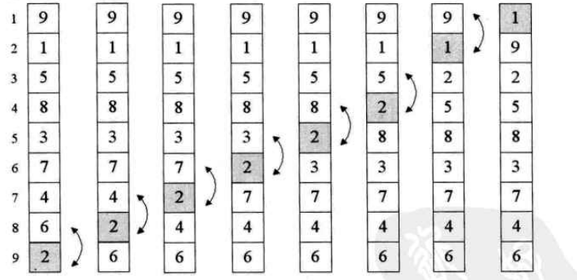{width="5.768055555555556in"
height="2.8045833333333334in"}

811. 比较的次数为：9\*8/2-36次

812. 数组为9，i=1，两两比较8，i=2，比较7次。。。直到1次

### 冒泡排序优化

813. 如数组为\[2,1,3,4,5,6,7,8,9\];只需要交换前两个数字，就完成排序了，冒泡排序还需要多循环很多次，虽然每次循环不交换数组元素

814. 对于上面的例子，i=1时，会交换1,2，当i=2时，就不会交换元素，i=3时，也不交换元素，因此可以添加个flag标识

function sort2(){\
var flag = true;\
for(var i = 0 ; i \< a.length && flag;i ++){\
flag =false;\
for(var j =(a.length-1 ); j \>i ;j\--){\
if(a\[j\] \< a\[j-1\]){\
flag = true;\
var temp = a\[j\];\
a\[j\] = a\[j-1\];\
a\[j-1\] = temp\
}\
}\
}\
console.log(a)\
}

### 时间复杂度分析

815. 比较次数为：n\*(n-1)/2

816. 因此，时间的复杂度为O(n^2^)

简单选择排序算法(Simple Selection Sort)
---------------------------------------

### 概念

817. 简单选择排序法（simple selection
    sort）：就是通过n-i次关键字间的比较，从n-i+1个记录中选出关键字最小的记录，并和第i个记录交换

818. 当i=1，循环数组如n次，找到最小的，然后交换第一个和这个最小的元素位置

### 代码说明

819. 如i=0时，先假设最小的元素就是9；然后循环后面i=1到i=8之间元素；可以比较出数组第1个元素1是最小的，故将a\[0\]与a\[1\]交换

var a = \[9,1,5,8,3,7,4,6,2\];\
function sort1(){\
var min;\
for(var i = 0 ; i \< a.length ;i++){\
min = i;\
for(var j = i + 1 ; j\<a.length;j++){\
if(a\[min\] \> a\[j\]){\
min = j ;//选择每次最小的\
}\
}\
// min!= i 表示在数组中找到了更小，需要交换元素\
if(min != i){\
var temp ;\
temp = a\[min\];\
a\[min\] = a\[i\];\
a\[i\] = temp;\
}\
}\
console.log(a)\
}

### 复杂度分析

820. 最大的特点是，交换移动数据次数少；并不是每次循环都移动数据

821. 比较次数：n\*(n-1)/2

822. 交换次数：最好为0次，最坏为n-1次

823. 总的时间复杂度依然是O(n^2^)

824. 虽然时间复杂度与冒泡排序一样，但略好于

直接插入排序(Straight Insertion Sort)
-------------------------------------

### 概念

825. 直接插入排序的基本操作是将一个记录插入到已经排好序的有序表中，从而得到一个新的、记录数加1的有序表中

### 代码说明

826. 当i=1时，假设a\[i\]就是最小的，然后循环，将值插入到指定位置

827. 如，当前排序为\[1,5,8,9,3,7,4,6,2\],当i=4时，即开始比较3这个数；判断a\[3\]=9\>a\[4\]=3；故需要挪动这个数

828. 问题是挪动到哪里，故需要循环前面所有数，插入到指定位置；比较a\[3\]\>4，则a\[3\]挪到a\[4\]位置，a\[2\]=8\>4，将8挪到a\[3\]位置；a\[1\]=5\>4,a\[1\]挪到a\[2\]位置

829. a\[1\]\<4不需要挪位置了，说明a\[2\]应该放入key

830. 直接插入排序关键是将a\[i\]这位置空下，然后比较i之前数，如大于则往后挪动

var a = \[9,1,5,8,3,7,4,6,2\];\
sort1();\
function sort1(){\
for(var i = 1 ; i\< a.length ;i ++){\
if(a\[i\] \< a\[i-1\]){// 假设a\[i\]不是最小的\
var key = a\[i\] // 保存这个最小值\
var j = i - 1;\
while(a\[j\]\> key){\
a\[j +1 \] = a\[j\]; // 数据后移动\
j \-- ;\
}\
a\[j+1\] = key\
}\
}\
console.log(a)\
}

### 复杂度分析

831. **与选择排序算法有点类似，选择排序是在两个空间进行的，等于每次从旧的空间选最小值放在新的空间中去；而插入排序则在同一空间进行**

832. 最好情况，就是拿的序列就是有序的，故不需要交换，故时间复杂度为O(n)

833. 最坏的情况：序列是逆序的，比较次数为(n-1)\*n/2
    ;移动次数也是(n-1)\*n/2；故时间复杂度O(n^2^)

希尔排序(Shell Sort)
--------------------

### 概述

834. 第一批突破上面算法时间复杂度为O(n^2^)的算法

835. 是直接插入排序的升级，属于插入排序类

836. **是直接插入排序算法的一种更高效的改进版本**

837. 直接插入排序在记录少有较好的效率，如遇到大量记录，基本思路是将大量数据分组，形成记录少的不同分组；每个分组进行排序，但问题是如\[9,1,5,8,3,7\]分为9,1,5;8,3,7两个分组，分别排序后，并不能合并得到最终排序好的序列；

838. **插入排序的缺点是：每次只挪动一个数字**

839. 希尔排序相当于分组插入

840. 基本有序：

841. 小的关键字基本在前面，大的关键字基本在后面，不大不小的基本在中间

842. 如\[2,1,3,6,4,7,5,8,9\]算基本有序，\[1,5,9,3,7,8,2,4,6\],因为9在前面，2在倒数第三位，不算基本有序

843. 利用跳跃分割的策略，保证子序列是局部有序的

844. 将相距某个"增量"的记录组成一个子序列

### 代码说明

845. 先将数据按照跳跃式的分组，然后每组进行插入排序，然后再改变增量

846. 思路与直接插入法类似，只是不是每次比较前1个，而是比较前"增量"个

847. 外层do-while循环是用来计算增量的，完全可以不嵌套循环，直接先用个一个时间复杂度为n的循环，计算增量序列

848. 对于如下arr，开始增量为4，当i=8时，即arr\[i\] =2，此时arr为：

{width="3.3641633858267714in"
height="0.39578412073490815in"}

849. 此时判断arr\[i\] \<
    arr\[i-add\]=arr\[4\]；2\<9,故需要进行交换，先把a\[8\]保存到key上，判断arr\[4\]大于key交换，有判断a\[0\]大于key，把a\[0\]放到a\[4\]位置上，得到第一次循环结果：

{width="4.103653762029746in"
height="0.5103532370953631in"}

var arr = \[9,1,5,8,3,7,4,6,2\];\
sort1(arr);\
function sort1(arr){\
var add = arr.length;\
do{\
add = Math.floor(add/3)+1;\
for(var i = add ; i\< arr.length ;i ++){\
if(arr\[i\] \< arr\[i-add\]){// 假设a\[i\]不是最小的\
var key = arr\[i\]; // 保存这个最小值\
for(var j = i - add ;j\>= 0 && key \< arr\[j\];j -= add){\
arr\[j +add \] = arr\[j\]; // 数据后移动\
}\
arr\[j+add\] = key\
}\
}\
\
\
}while (add\>1);\
console.log(arr)\
}

### 算法图示说明

850. 基本图例

{width="5.768055555555556in"
height="3.7979713473315835in"}

{width="5.768055555555556in"
height="4.062340332458443in"}

851. 注意：假设增量为4，对于0会与3,9组合，进行直接插入排序

{width="4.2494695975503065in"
height="1.8331047681539807in"}

### 复杂度分析

852. 在希尔排序开始时增量较大，分组较多，每组的记录数目少，故各组内直接插入较快，后来增量di逐渐缩小，分组数逐渐减少，而各组的记录数目逐渐增多，但由于已经按di-1作为距离排过序，使文件较接近于有序状态，所以新的一趟排序过程也较快，希尔排序的时间复杂度会比o(n\^2)好一些

853. 时间复杂度为O(n^3/2^)（需数学分析，较为复杂）

### 注意

854. 对于希尔排序的增量选择，并没有数学最优解

855. 增量序列的最后一个增量值必须是1才行

856. 由于记录跳跃移动，并不是一个稳定排序方式

857. 算法发明突破了O(n^2^)的限制

堆排序(Heap Sort)
-----------------

### 概念

858. 堆的定义：

859. 是一个完全二叉树（满足完全二叉树的性质）

860. 每个结点的值都大于或等于其左右孩子结点的值，称为最大堆，反之为最小堆

861. 大顶堆或小顶堆如使用层序遍历存在数组中，会满足二叉树的性质5

{width="5.768055555555556in"
height="2.2159722222222222in"}

862. 简单选择排序的升级，同属于选择排序类

### 堆排序算法

863. 堆排序是利用堆的排序方法

864. 基本思想是：先构建一个大顶堆或小顶堆；交互顶与末尾元素，然后再将变动的堆形成大顶堆，依次排序

### 代码说明

865. 算法的思想是先将无序的队列构建一个大顶堆（以大顶堆举例）

866. 如现在要排序的序列为46859；实际上可以构建为如下的完全二叉树

867. 根据算法定义，给定一个结点index，应该是左右孩子中最大的，故如不是最大的，就将左右孩子中的最大交互到index位置上

868. 如index为1，故9,5,6中，右孩子9最大，交换到index位置上

869. 对于交换结点循环（或称之为递归），由于index=1时，6与9交换了位置，故应该考虑index=4以及它的孩子是否大小关系发生改变，3位置没有变动，不需要考虑结点3与孩子的大小关系

870. {width="5.768055555555556in"
    height="2.480130139982502in"}

/\*\*\
\* 从 index 开始检查，调整堆，满足最大堆性质\
\* 就是把左右孩子与结点，比较哪个大，将最大的放在结点上\
\* \@array\
\* \@index 检查的起始下标\
\* \@heapSize 堆大小\
\*\
\*\*/\
function heapAjust(array, index, heapSize) {\
var iMax, iLeft, iRight;\
while (true) {\
iMax = index;// 当前节点序号\
// 左孩子与右孩子的序号\
iLeft = 2 \* index + 1;// 完全二叉树，根节点从1开始，数组则从0开始\
iRight = 2 \* (index + 1);\
// 左孩子大，则imax为左孩子\
if (iLeft \< heapSize && array\[index\] \< array\[iLeft\]) {\
iMax = iLeft;\
}\
// 右孩子大，则imax为右孩子\
if (iRight \< heapSize && array\[iMax\] \< array\[iRight\]) {\
iMax = iRight;\
}\
// 上述就是选出谁是最大的，如当前结点不是最大的\
if (iMax != index) {\
swap(array, iMax, index);// 最大元素交换到结点上\
index = iMax;\
} else {\
break;\
}\
}\
}

function swap(array, i, j) {\
var temp = array\[i\];\
array\[i\] = array\[j\];\
array\[j\] = temp;\
}

871. 上述代码只是调整结点与孩子的大小关系，故如给定n个数的序列，如何构建一个最大堆

872. 对于一个数组n，找到最后一个叶子的双亲，然后开始往前循环每个结点调整树结点的位置即可

function buildMaxHeap(array, heapSize) {\
var i,\
//
因为heapAjust是以结点开始，故对于n个元素的序列，需要找到n对应的父节点\
// 此处减1是因为数组从0开始\
iParent = Math.floor((heapSize - 1) / 2);\
\
for (i = iParent; i \>= 0; i\--) {\
heapAjust(array, i, heapSize);\
}\
}

873. 构建好最大堆后，就是进行排序，排序就是将顶元素与尾元素交换后，再调整为最大堆，依次循环

874. heapSize --
    1是因为数组关系，因为后面的元素都已经是最大了，故每次循环时，不是将所有结点调整为最大堆

875. 可以认为每次循环，将顶与尾交换，顶这个元素被pop出去了；

function heapSort(array, heapSize) {\
// 构建最大堆\
buildMaxHeap(array, heapSize);\
for (var i = heapSize - 1; i \> 0; i\--) {\
// 交换第一与最后一个元素，再调整堆满足最大堆特性\
swap(array, 0, i);\
heapAjust(array, 0, i);\
}\
}

### 复杂度分析

876. 运行的主要时间是消耗在初始化构建堆与重建堆时的反复筛选上

877. 构建堆时，从完全二叉树的最下层的最右边的非终端结点开始构建（即n序列，从叶子结点n的双亲开始）

878. 故近似从n/2开始（某个结点的右孩子与左孩子的计算不同），每次与结点孩子比较，最多是2次比较和互换操作

879. 构建堆的复杂度为O(n)

880. 正式排序时

881. 由于某个结点i到根节点距离为\[log2i\]+1，故第i次交换顶元素后重建堆需要log~2~i

882. 而对于n序列，需要取堆顶元素（即堆顶与尾交换）n-1次

883. 因此，根据完全二叉树的性质，\[log2(n-1),log2(n-2)\...1\]逐步递减，近似为nlogn

884. 堆排序时间复杂度一般认为就是O(nlogn)级

885. 无论最好，最坏和平均时间复杂度均为O(nlogn)

886. 因为记录比较和交换是跳跃的，因此是一种不稳定排序方法

887. 由于初始化堆会进行大量比较，不适合待排序个数较少的情况

归并排序
--------

### 概念

888. 基本思路是：将无序的数组序列，两两合并排序后再合并，最终得到一个有序数组

{width="5.768055555555556in"
height="3.3827241907261594in"}

889. 归并排序：假设初始化序列有n个记录，可以看成n个子序列，每个子序列长度为1，然后两两合并，得到\[n/2\]个长度为2或1的有序子序列，再两两合并，直到得到一个长度为n的有序序列，也称为2路归并排序

890. **实际上是：鉴于堆排序使用完全二叉树排序构建的复杂性，换个方式利用完全二叉树特性**

### 递归实现

891. 归并排序思路很简单，就是两两合并，然后排序，再合并

892. 但对于一个n数组，可以自上往下考虑，即递归实现

893. Merge函数主要就是给left一个数组，right一个数组，将两个数组利用一次循环，排序为大数组result

894. 递归mergeSort，就是将数组n拆分为n/2两部分，然后merge左右两个数组，但左右两个数组必须也是mergerSort拆分过的

895. 递归返回的条件是：即归并算法的定义，子序列长度为1

var arr = \[9, 1, 5, 8, 3, 7, 4, 6, 2\];\
function mergeSort(arr) { //采用自上而下的递归方法\
var len = arr.length;\
if (len \< 2) {\
return arr;\
}\
var middle = Math.floor(len / 2),\
left = arr.slice(0, middle),\
right = arr.slice(middle);\
return merge(mergeSort(left), mergeSort(right));\
}\
function merge(left, right) {\
var result = \[\];\
// 循环数组，放到result中\
while (left.length && right.length) {\
if (left\[0\] \<= right\[0\]) {\
result.push(left.shift());\
} else {\
result.push(right.shift());\
}\
}\
// 假设不等长，叫最后元素放在result中\
while (left.length) {\
result.push(left.shift());\
}\
while (right.length) {\
result.push(right.shift());\
}\
return result;\
}\
console.log(mergeSort(arr));

### 非递归实现

896. 非递归实现，即使用迭代的方式，即从下往上归并

897. 先更改下merge函数，之前的merge函数是，归并left与right

898. 其实不更改merge，在merge调用外处理分组也是可以的

899. 传入函数为arr，返回结果result，i为分组的起始点，s为长度

// 将arr从i开始，s个元素，合并排序到result中\
function merge(arr, result ,i,s) {\
var left = arr.slice(i,i+s),\
right = arr.slice(i+s,i+2\*s);\
while (left.length && right.length) {\
if (left\[0\] \<= right\[0\]) {\
result.push(left.shift());\
} else {\
result.push(right.shift());\
}\
}\
// 假设不等长，叫最后元素放在result中\
while (left.length) {\
result.push(left.shift());\
}\
while (right.length) {\
result.push(right.shift());\
}\
}

900. 迭代方式的归并，其实是从下先设s为2，数组0,1；1,2；3,4为一组，然后排序返回

901. 关键是最后一个数的处理，如数组总共9个，但两两分组，最后剩一个20；需要将这20也合并一次

{width="5.768055555555556in"
height="1.3178401137357831in"}

function mergepass(arr,res, s ) {\
var i = 0;\
// 归并长度为s=2\
while ( i \<= arr.length - 2\*s +1){\
merge(arr,res,i,s);\
i += 2\*s ;\
}\
if( i \< arr.length){\
merge(arr,res,i,s);\
}\
}

902. 最终的sort函数

903. 就是合并长度s为1,2,4,8,16.。。。。但应该注意的是arr合并后的结果为r1，第二次再合并用的数组为r1了

function mergeSort(arr) {\
var k = 1;\
while(k \< arr.length){\
var r1 =\[\],r2 =\[\];\
mergepass(arr,r1,k);\
k = k\*2;\
mergepass(r1,r2,k);\
arr = r2;\
k = k\*2;\
}\
return arr\
}

### 复杂度分析

904. 总的时间复杂度是O(logn)

905. 由于归并排序在归并过程中需要与原始记录序列相同数量的存储空间存归并结果以及递归时深度为log~2~n的栈空间，因此空间复杂度为O(n+logn)

906. 由于归并排序两两比较，不跳跃，是一种稳定的排序算法

907. 归并排序是一种较占用内存，但高效稳定算法

快速排序
--------

### 概述

908. 冒泡排序的升级，通过不断比较和移动交换来实现排序的

909. 实现方式增大了记录的比较和移动的距离，将关键字较大的记录从前面直接移动到后面，关键字小的记录从后面直接移动到前面

910. 减少了总的比较数与移动交换次数

### 快速排序算法

911. 基本思想：通过一趟排序将待排记录分割为独立的两部分，其中一部分记录的关键字均比另一部分的关键字小，则可分别对这两部分记录继续进行排序，以达到整个序列排序的目的

### 简单实现

912. 根据算法思想，先找到数组中一个数（一般取中间）作为轴，然后比较轴左边，右边数，保证左边的比轴小，右边的比轴大

913. 因此，选一个arr的轴，然后循环arr，小的放在left数组，大的放在right数组

914. 将左，右的数组再进行上述操作

915. 通过迭代的方式即可实现

function quickSort(arr) {\
if (arr.length \<= 1) { return arr; }\
var key = arr\[Math.floor(arr.length/2)\];//一般选中间作为枢纽\
var left = \[\],right=\[\];\
for(var i = 0 ;i \< arr.length;i++){\
if(arr\[i\] \> key){\
right.push(arr\[i\])\
}\
if(arr\[i\] \< key){\
left.push(arr\[i\])\
}\
}\
return quickSort(left).concat(\[key\],quickSort(right))\
}

### 复杂度分析

916. 对于类似\[9, 1, 5, 8, 3, 7, 4, 6, 2\]快速排序时可以形成一棵二叉树

917. 最优的情况是每次选的轴都能划分的很均匀，如排序n个关键字，递归树深度为\[log2n\]+1

918. 递归log2n次

919. 时间复杂度为O(nlogn)

920. 最坏的情况是，待排序为正序或逆序，树将是斜树，需要n-1次递归

921. 比较次数为：{width="3.6037160979877516in"
    height="0.635336832895888in"}

922. 最终的时间复杂度为：o(n^2^)

{width="4.082823709536308in"
height="2.697579833770779in"}

923. 对于空间复杂度

924. 最好情况，递归树深度为log2n，空间复杂度为logn

925. 最坏情况，需要n-1次递归，空间复杂度为O(n)

926. 平均情况为：O(logn)

927. 快速排序比较与交换是跳跃进行的，是一种不稳定排序

### 优化选取轴

928. 假设选取的中间作为开始比较的轴，如是最小的，或最大值，可能第一次遍历后，数组没有怎么变化

929. 显示数列极有可能是基本有序的，固定选取某个位置的关键字作为首个轴变成了不太合理的做法

930. 三数取中法：取3个关键字先进行排序，然后将中间数作为轴，一般取左，右，中间是三个数

931. 对于非常大是数列，还可以9数取中等

总结
----

### 排序算法

{width="5.768055555555556in"
height="1.7130588363954506in"}

### 性能对比

{width="5.768055555555556in"
height="1.8986515748031496in"}

### 应用

932. 快速排序通常被认为是高效，快速等特点是使用V8引擎的实现Array.prototype.sort()上有超过23个项目的数组。
    对于少于23个项目，V8采用插入排序法

933. 归并排序是快速排序的竞争对手，因为它也是高效，快捷，但有被稳定的好处。这就是为什么Mozilla和Safari中使用它实现Array.prototype.sort()
