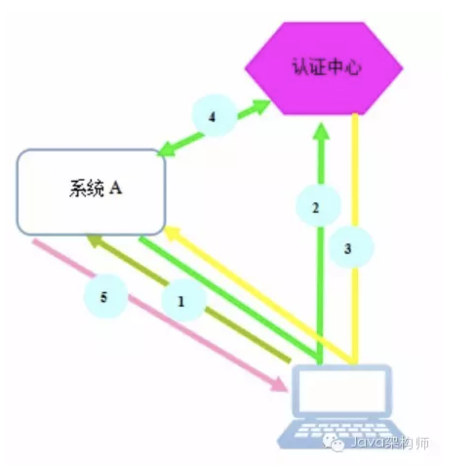

# 概述

## 基础

1. Token隔离
   - token代表了用户的身份信息，应用系统通过token能够获取用户的身份，为了安全考虑，接入单点登录的多应用系统需要做到token的隔离，即任何一个系统泄漏了token都不应该影响其他的系统。

## 常用方案

### 单一域名

1. 如所有的业务系统都共享xxx.abc.com这个域名，则可以将token的cookie存到.abc.com这个根域名下，
2. 这样在任一系统登录后，在访问其他业务系统就不需要重新登录了，因为其他业务系统也是xxx.abc.com，浏览器会把根域名的cookie带到每个请求中，即可实现单点登录功能。
3. 优点是实现简单，前端的接入成本更低，但是有以下几个缺点：
   - 限制了业务系统使用域名的自由
   - token都是种到根域名下，能访问所有业务的资源，无法做到token的隔离

### 多域名

1. 业内常用CAS（Central Authentication Service）是实现SSO单点登录的框架，来解决单点登录的问题

## 单点登录

1. 
2. 可以把认证中心想象为 账号中台，主要来控制账号的单点登录鉴权
3. 主要步骤
   - 用户从浏览器访问系统A
   - 系统A检测没有有效的局部会话，跳转到帐号中台的全局会话认证接口
   - 帐号中台验证用户没有有效的全局会话，跳转到业务指定的登录页面（重定向），而不是统一的登录页面，这个和CAS是不一样的。
   - 用户输入用户名密码后，发起登录，帐号中心验证成功后，创建全局会话，并生成authToken令牌，跳转到系统A的局部会话验证接口（这里可能会开发一个sdk，类似filter的机制，对请求进行过滤）
   - i本地验证authToken令牌有效后，创建局部会话，此后用户即可访问系统A的资源
   - 用户访问系统B
   - 系统B检测没有有效的局部会话，跳转到帐号中台的全局会话认证接口
   - 帐号中台验证用户具备有效的全局会话，生成authToken令牌，跳转到系统B的局部会话验证接口(此接口已经集成到infra-passport-sdk, 无需业务实现)
   - sdk本地验证authToken令牌有效后，创建局部会话，此后用户即可访问系统B的资源
4. 如何检测局部会话？
   - 局部会话是通过将token以cookie的形式保存在浏览器端，每个系统都会使用sdk，通过请求拦截器的方式，会校验请求cookie里的token是否合法，即局部会话是否合法，同时每个系统的token都是由不同的秘钥加密生成，因此不同系统的局部会话是隔离的，保证了各系统的安全性。
5. 如何检测全局会话？
   - 全局会话是也是将token以cookie的形式保存在浏览器端，由于认证中心（帐号中台）的域名是123.xxxxx.com，用户登录成功后创建的全局会话的cookie会存在123.xxxxx.com域名下，所有系统在跳转到帐号中台进行全局会话的验证时，浏览器都能把全局会话的cookie带到请求里，从而实现了所有系统共享全局会话的功能。
6. 令牌authToken是什么？
   - 令牌authToken是帐号中台为了解决跨域种cookie的一个凭证，如果账号中台的域名为xxx.abc.com，而系统b是xxxx.com，浏览器是不允许跨域名种cookie，即帐号中台无法设置xxxx.com下的cookie，而只能颁发一个令牌authToken，通过系统B内的局部会话验证接口后，在同域的情况下设置cookie， 从而完成系统B的局部会话的建立。

