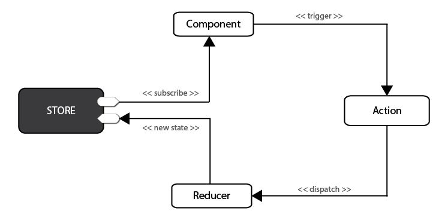

# 什么是flux

1. 两者的设计思想差不多

# Redux

## 概述

1. Redux是一个流行的JavaScript框架，为应用程序提供一个可预测的状态容器。

2. Redux基于简化版本的Flux框架，Redux严格限制了数据只能在一个方向上流动。

   

3. 在Redux中，所有的数据（比如state）被保存在一个被称为`store`的容器中 → 在一个应用程序中只能有一个。`store`本质上是一个状态树，保存了所有对象的状态。

4. 任何UI组件都可以直接从`store`访问特定对象的状态。要通过本地或远程组件更改状态，需要分发一个`action`。**分发**在这里意味着将可执行信息发送到`store`。

5. 当一个`store`接收到一个`action`，它将把这个`action`代理给相关的`reducer`。

6. `reducer`是一个纯函数，它可以查看之前的状态，执行一个`action`并且返回一个新的状态。

## 何时需要用

1. 从组件的角度来看，如果某个组件的状态需要共享、某个状态需要在任何地方都可以拿到、一个组件需要改变全局状态、一个组件需要改变另一个组件状态（实际上前面说四者所提到的都是组件间的通信）都是需要redux的。 

