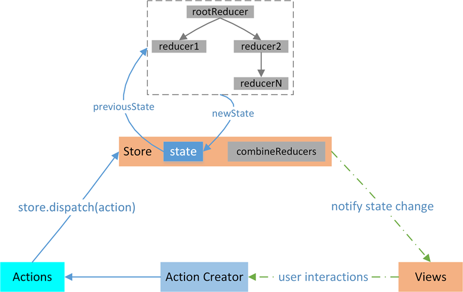

# 什么是flux

1. 两者的设计思想差不多
2. 


# Redux

## 概述

1. redux是js的可预测状态容器，可以保证在不同运行环境（client、server或native）下表现一致性

2. Redux是一个流行的JavaScript框架，为应用程序提供一个可预测的状态容器，为了解决大型应用中组件状态管理混乱的问题

3. Redux基于简化版本的Flux框架，Redux严格限制了数据只能在一个方向上流动。

4. Redux 和 React 之间没有关系。Redux 支持 React、Angular、Ember、jQuery 甚至纯 JavaScript

	

## 何时需要用

1. 从组件的角度来看，如果某个组件的状态需要共享、某个状态需要在任何地方都可以拿到、一个组件需要改变全局状态、一个组件需要改变另一个组件状态（实际上前面说四者所提到的都是组件间的通信）都是需要redux的。 

## 流程分析



1. 通过combineReducers组合多个reducer
2. 通过createStore(reducers)构建全局唯一是状态存储store
3. store通过dispatch(action)派发一个action
4. store会调用reducers更新状态（dispatch内部功能）

## Action

1. Action对象仅仅是描述了行为的相关信息
2. Action 是把数据传入 store 的惟一途径，所以任何数据，无论来自 UI 事件，网络回调或者是其它资源如 WebSockets，最终都应该以 action 的形式被 dispatch

## Reducer

1. `reducer`是一个纯函数，可以表示为`(previousState, action) => newState`
2. 它可以查看之前的状态，执行一个`action`并且返回一个新的状态。
3. 要点是返回全新的state对象，而不是更改oldState对象返回


### combineReducers(reducers)

1. 应用越来越复杂时，考虑拆分reducer为单独函数，便于管理state的一部分

3. 这个函数为了避免新手犯一些常见错误，必须要遵守如下规则

	- 未匹配的action，必须将state原封不动返回，即代码中switch要有default：state
	- 永远不能返回undefined，避免错误扩散

4. 由于仅是一个合并reducer的函数，故combianeReducers({hello:a,say:b})，实际就是返回一个foo函数

5. 当store.dispatch时，调用这个foo函数，循环遍历hello，say对应的a，b函数获取新的状态

5. 涉及的问题

	- 只能处理普通对象的reducer，需要使用`redux-immutable`这样的第三方个包才能合并immutable的reducer
	- 不能处理有数据共享的reducer，如reducerA需要reducerB的返回状态，可以使用`reduce-reducers`简化此类问题

	

	

## Store

1. Store存储着应用的的全部state，改变store内部state的唯一办法是调用`store.dispatch(action)`
2. store不是一个类，仅仅是一个具有一些方法的对象，通过`createStore(reducer)`创建

### createStore

1. `createStore(reducer, [preloadedState], enhancer)`

	- 创建一个store，存放应用中所以的state，一个应用有且只有一个store，故多个reducer使用combineReducers

2. 例如：

	```javascript
	const store = createStore(helloReducer)
	function helloReducer(state =1 , action){
	    switch (action.type) {
	      case 'a':
	      default:
	        return state
	    }
	}
	```

	- store的状态由reducer决定，是一个对象
	- key是reducer这个函数的函数名，value则是reducer的返回结果
	- 由上例可以得出，store = {helloReducer：1}
	- 注意：返回undefined值会报错
	- state不仅可以使用普通对象还可以是Immutable类实现的
	
3. 注意函数内部会调用`dispatch({type:'@@redux/INIT+random()'})`为store tree设置初始化的state

### getState()

1. `store.getState`：返回当前state树

### dispatch(action)

1. 分发 action。这是更新 state惟一途径。

2. 将使用当前 getState() 的结果和传入的 action 以同步方式的调用 store 的 reduce 函数

3. 调用dispatch会循环调用reducer函数（源码分析）

	- 一是调用reducers（combineReducers的返回函数），这个过程中会设置`isDispathing = true`，对更改的store tree进行加锁，不允许本次变更完之前，进行下次store变更，这样写法也决定了只能是同步
- 二是循环调用listeners(由subscribe创建的)
	
	

### subscribe(listener)

1. 添加一个变化监听器，当dispatch action时会执行
2. 一个底层api，多少情况下不会调用

## 举例分析

1. 需要实现点击一个按钮，文本的数值+1，点击另一个按钮，文件数值-1

	```html
	<span id="value">0</span>
	        <button id="btn1">增加1</button>
	        <button id="btn2">减少1</button>
	```

	```javascript
	function addReducer(state = 0,action){
	    switch (action.type) {
	        case 'ADD':
	            return state + 1;
	        default:
	            return state;
	    }
	}
	function minReducer(state = 0,action){
	    switch (action.type) {
	        case 'MIN':
	            return state - 1;
	        default:
	            return state;
	    }
	}
	const store = Redux.createStore(Redux.combineReducers({addReducer,minReducer}))
	// 数据变化后，要做什么事情
	store.subscribe(()=>{
	    document.getElementById('value').innerHTML  = store.getState().addReducer + store.getState().minReducer;
	})
	// 按钮点击事件
	document.getElementById('btn1').addEventListener('click',()=>{
	    store.dispatch({type:'ADD'})
	});
	document.getElementById('btn2').addEventListener('click',()=>{
	    store.dispatch({type:'MIN'})
	})
	```

	

# React-Redux

1. 提供了两个重要功能模块Provider和connect，这两个模块保证了react和redux之间的通信

## Provider

1. Provider是一个react组件，主要就是将React context进行封装，接收store参数，然后传递给孙子组件

2. provider功能主要分为：

	- 在原应用组件上包裹一层，使原来整个应用成为Provider的子组件
	- 接收Redux的store作为props，通过context对象传递给子孙组件上的connect

3. 调用方式：

	```jsx
	import React from 'react'
	import { render } from 'react-dom'
	import { Provider } from 'react-redux'
	import { createStore } from 'redux'
	
	let store = createStore(reducers)
	
	render(
	  <Provider store={store}>
	    <App />
	  </Provider>,
	  document.getElementById('root')
	)
	```

## connect

1. `connect([mapStateToProps], [mapDispatchToProps], [mergeProps], [options])`
	- [`mapStateToProps(state, [ownProps]): stateProps`]：
		- 如定义这个参数，只要Redux改变，这个函数就会被调用，如省略，则不监听redux
		- 必须返回一个纯对象；
	- [`mapDispatchToProps(dispatch, [ownProps]): dispatchProps`]：定义的属性会合并到组件的props上

## bindActionCreators

1. 作用是将单个或多个ActionCreator转化为dispatch(action)的函数集合形式。
2. 开发者不用再手动dispatch(actionCreator(type))，而是可以直接调用方法。

