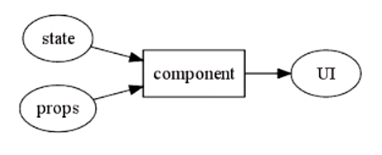

V16.7.0

# 概述

## 特点

1. 声明式：在数据改变时 React 也可以高效地更新渲染界面。
2. 组件化：无需再用模版代码，通过使用JavaScript编写的组件你可以更好地传递数据，将应用状态和DOM拆分开来。
3. 灵活：可以用在react native中

## 背景

1. 复杂或频繁的DOM操作通常是性能瓶颈产生的原因，如何进行高性能的复杂DOM操作通常是衡量一个前端开发人员技能的重要指标
2. React，利用虚拟DOM技术，只将每次更新的差异更新到浏览器上，不需要考虑两次数据之间的UI变化
3. 组件化的思考方式则是带来了UI功能模块之间的分离，mvc是从技术角度对ui实现解耦合，组件化是从功能角度

# JSX

## 概述

1. JSX就是Javascript和XML结合的一种格式，一种 JavaScript 的语法扩展

2. 在编译之后呢，JSX 其实会被转化为普通的 JavaScript 对象。

3. JSX 乍看起来可能比较像是模版语言，但事实上它完全是在 JavaScript 内部实现的。

	```jsx
	const element = <h1>hello</h1>;
	ReactDOM.render(
	    element,
	    document.getElementById("root")
	);
	```

## 使用表达式

1. 在 JSX 当中的表达式要包含在大括号里

2. 如注释、对象、数组、函数，如要在jsx中使用，都需要利用大括号

	```jsx
	const arr= [1,2,3,4,5];
	const user = {
	    name : 'rextao',
	    hello(){
	        return this.name;
	    }
	}
	const element = (
	    <div>
	        <h1>Hello,RexTao!</h1>
	        {/*这是注释*/}
	        {arr} {/*数组*/}
	        {user.hello}{/*对象方法*/}
	        {isShow ? "RexTao" : "EveryOne"}{/*三目运算符*/}
	        {user}{/*ERROR: Objects are not valid as a React child*/}
	    </div>
	);
	```

3. 对象本身不可作为花括号内容，会报错

4. if与for循环并不是js表达式，故不能用于大括号中

## JSX属性

1. 用引号定义字符串为值的属性

	```jsx
	const element = <div tabIndex="0"></div>;
	```

2. 用大括号定义js表达式为值的属性

	```jsx
	const element = ;
	```

3. 注意：

	- 用了大括号就不要外加引号，否则jsx会把引号内容当做字符串
	- jsx更接近js而不是html，故使用驼峰标记法命名属性名称

## 防注入攻击

1. React DOM 在渲染之前默认会过滤所有传入的值。
2. 可以确保你的应用不会被注入攻击。
3. 所有的内容在渲染之前都被转换成了字符串

## jsx代表objects

1. Babel 转译器会把 JSX 转换成一个名为 `React.createElement()` 的方法调用。

2. 本质上来讲，JSX 只是为 `React.createElement(component, props, ...children)` 方法提供的语法糖

3. 下面两种代码是完全相同的

	```jsx
	// 方式1
	const element = (
	  <h1 className="greeting">
	    Hello, world!
	  </h1>
	);
	// 方式2
	const element = React.createElement(
	  'h1',
	  {className: 'greeting'},
	  'Hello, world!'
	);
	```

4. `React.createElement()` 这个方法首先会进行一些避免bug的检查，之后会返回一个类似下面例子的对象：

	```jsx
	// 注意: 以下示例是简化过的（不代表在 React 源码中是这样）
	const element = {
	  type: 'h1',
	  props: {
	    className: 'greeting',
	    children: 'Hello, world'
	  }
	};
	```

## React必须在作用域中

1. 解释为何每个模块开头需要引用`import React from 'react';`
2. 由于 JSX 编译成`React.createElement`方法的调用，所以在你的 JSX 代码中，`React`库必须也始终在作用域中。

# 组件

## 概述

1. 组件把UI分割成独立的、可重用的碎片，并对每一块进行孤立的思考。

2. 从概念上讲，组件类似JavaScript函数。他们接受任意输入，并返回React元素显示在屏幕上

3. 最重要的两个属性是state和props，通过这个两个属性对component进行控制，然后更新UI

	

## 函数组件（ES5方式）

1. 该函数是一个有效的React组件，它接收一个单一的“props”对象并返回了一个React元素。

	```jsx
	function hello(props) {
	    return <h1>Hello!!props.name</h1>
	}
	```

	

## 类组件（ES6方式）

### 利用es6语法

```jsx
class Welcome extends React.Component {
  render() {
    return <h1>Hello, {this.props.name}</h1>;
  }
}
```

### 组件外部可用

```jsx
// welcome.js
export default class Welcome extends React.Component {
    render() {
        return <h1>Hello, {this.props.name}</h1>;
    }
}
// main.js
import Welcome from "./componet/welcome";
class Index extends React.Component{
    render(){
        return(
            <Welcome/>
        )
    }
}
```


## 注意

1. 组件名称必须以大写字母开头。

	- React 会将小写开头的标签名认为是 HTML 原生标签

2. 组件的返回值只能有一个根元素。

	```jsx
	// 此方式是不可以的
	function Hello(props) {
	    return (
	            <h1>Hello,{props.name}!!</h1>
	            <h1>Hello,{props.name}!!</h1>
	    )
	}
	// 需要如下形式：
	function Hello(props) {
	    return (
	            <div>
	                <h1>Hello,{props.name}!!</h1>
	                <h1>Hello,{props.name}!!</h1>
	            </div>
	    )
	}
	
	```

## 条件渲染

### 根据props（函数方式）

```jsx
// 组件1
function A() {
  return <h1>hello~aaaaaaa!</h1>;
}
// 组件2
function B() {
  return <h1>hello~bbbb.</h1>;
}
// 条件渲染
function Hello(props){
    if(props.name === 'a'){
        return <A></A>
    }else{
        return <B></B>
    }
}
ReactDOM.render(
    <Hello name = 'a'></Hello>,
    document.getElementById("root")
);
```

### 根据state(ES6方式)

```jsx
// 其他与es5方式一样
class Hello extends React.Component {
    constructor(props) {    
        super(props)
        this.state = {name: 'b'};
    }
    render(){
        if(this.state.name === 'a'){
            return <A></A>
        }else{
            return <B></B>
        }
    }
}
```

### &&运算符

```jsx
const arr = [1,2];
function A() {
    return <h1>hello~aaaaaaa!</h1>;
}

ReactDOM.render(
    <div>
        {arr.length > 1 && <A/>}
    </div> 
    ,document.getElementById("root")
);
```

### 三目运算符

```jsx
ReactDOM.render(
  <div>
    {arr.length > 1 ? <A/> : <h1>oh~my god</h1>}
  </div> 
  ,document.getElementById("root")
)
```

### 综述

1. 通过props、state、&&、三目运算符都可以实现react的条件渲染

## 阻止组件渲染

1. 某些条件，可能不需要渲染，则直接return null即可；

	```jsx
	function A(props) {
	    if(!props.name){
	        return null;
	    }
	    return <h1>hello~aaaaaaa!</h1>;
	}
	```

	

# props与State

## props

### 概述

1. 当React遇到的元素是用户自定义的组件，它会将JSX属性作为单个对象传递给该组件，这个对象称之为“props”。
2. 所有的React组件必须像纯函数那样使用它们的props。


# 生命周期


## 调用次序

### 创建阶段

1. constructor()
2. static getDerivedStateFromProps()
3. render()
4. componentDidMount()

### 更新

1. static getDerivedStateFromProps()
2. shouldComponentUpdate()
3. render()
4. getSnapshotBeforeUpdate()
5. componentDidUpdate()

### 卸载

1. componentWillUnmount()

## getDerivedStateFromProps

1. `static getDerivedStateFromProps(nextProps, prevState)`
2. 不管原因是什么，都会在每次渲染前触发此方法
3. 返回一个对象来更新 state，如果返回 null 则不更新任何内容
4. 

## getSnapshotBeforeUpdate()

1.  `componentDidUpdate(prevProps, prevState, snapshot)`
2. 在最近一次渲染输出（提交到 DOM 节点）之前调用
3. 此生命周期的任何返回值将作为参数传递componentDidUpdate()。

## 删除render之前的钩子函数原因

1. 因为如果要开启async rendering，在render函数之前的所有函数，都有可能被执行多次。

	

# 事件处理

## 概述

1. React的事件系统和浏览器事件系统相比，主要增加了两个特性：事件代理、和事件自动绑定。

## 与普通DOM的区别

1. React事件绑定属性的命名采用驼峰式写法，而不是小写

2. 如果采用 JSX 的语法你需要传入一个函数作为事件处理函数，而不是一个字符串(DOM元素的写法)

	```jsx
	// 传统方式
	<button onclick="activateLasers()">
	  Activate Lasers
	</button>
	// react方式
	<button onClick={activateLasers}>
	  Activate Lasers
	</button>
	```

	

## 事件代理

1. 区别于浏览器事件处理方式，React并未将事件处理函数与对应的DOM节点直接关联，而是在顶层使用了一个全局事件监听器监听所有的事件；
2. React会在内部维护一个映射表记录事件与组件事件处理函数的对应关系；当某个事件触发时，React根据这个内部映射表将事件分派给指定的事件处理函数；当映射表中没有事件处理函数时，React不做任何操作；
3. 当一个组件安装或者卸载时，相应的事件处理函数会自动被添加到事件监听器的内部映射表中或从表中删除。

## 组件内事件

1. 组件内定义事件响应函数，控制当前组件的内容进行变化

### 代码

```jsx
class BodyIndex extends  React.Component{
    constructor(){
        super();
        this.state ={
            name : "这是content的：rextao"
        };
        this.changeUserInfo = this.changeUserInfo.bind(this);
    }
    changeUserInfo(){
        this.setState({name:"hello!rextao...hahahah"})
    }
    render(){
        return (
            <div>
                <h1>{this.state.name}</h1>
                <input type="button" value="点击" onClick={this.changeUserInfo}/>
            </div>
        )
    }
}

```


### 注意

1. jsx回调函数中是this，默认是不会绑定的，如果你忘记绑定 `this.handleClick` 并把它传入 `onClick`, 当你调用这个函数的时候 `this` 的值会是 `undefined`

2. 可以通过实验性的属性初始化语法解决，即直接使用箭头函数定义handleClick

	```jsx
	class LoggingButton extends React.Component {
	  handleClick = () => {
	    console.log('this is:', this);
	  }
	  render() {
	    return (
	      <button onClick={(e) => this.handleClick(e)}>
	        Click me
	      </button>
	    );
	  }
	}
	```

	- 此语法在Create React App 默认开启

3. 利用箭头函数，主要问题是每次渲染时，都会创建不同的回调函数，可能会造成子组件重新渲染，不推荐

	```jsx
	class LoggingButton extends React.Component {
	  handleClick() {
	    console.log('this is:', this);
	  }
	  render() {
	    return (
	      <button onClick={(e) => this.handleClick(e)}>
	        Click me
	      </button>
	    );
	  }
	}
	```

	

# React Fiber

## react的局限性

1. 当React决定要加载或者更新组件树时，会做很多事，比如调用各个组件的生命周期函数，计算和比对Virtual DOM，最后更新DOM树，这整个过程是同步进行的
2. 假如更新一个组件需要1毫秒，如果有200个组件要更新，就是200ms，这时更新占用着浏览器线程，用户在input输入时，会出现卡顿情况
3. 而React Fiber就是要改变现状

## Fiber的方式

1. 破解JavaScript中同步操作时间过长的方法其实很简单——分片
2. React Fiber把更新过程碎片化，每执行完一段更新过程，就把控制权交还给React负责任务协调的模块，看看有没有其他紧急任务要做，如果没有就继续去更新，如果有紧急任务，那就去做紧急任务。
3. 维护每一个分片的数据结构，就是Fiber。

## 为什么叫Fiber呢？

1. 在进程（Process）和线程（Thread）的概念，还有一个概念叫做Fiber，英文含义就是“纤维”，意指比Thread更细的线，也就是比线程(Thread)控制得更精密的并发处理机制。

## Fiber对现有代码的影响

1. React Fiber一个更新过程被分为两个阶段(Phase)：第一个阶段Reconciliation Phase和第二阶段Commit Phase。
2. 在第一阶段Reconciliation Phase，React Fiber会找出需要更新哪些DOM，这个阶段是可以被打断的；但是到了第二阶段Commit Phase，那就一鼓作气把DOM更新完，绝不会被打断。