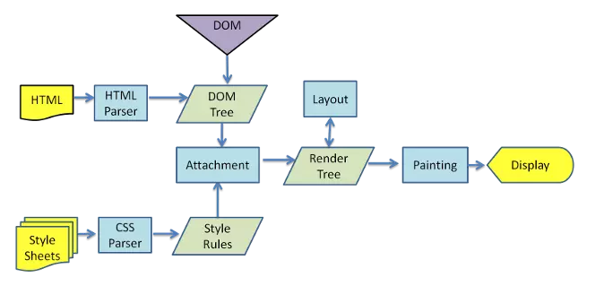
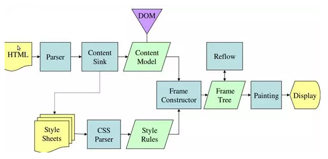

# 概述

1. 浏览器内核又可以分为两部分：渲染引擎（Layout Engine或Rendering Engine）和JS引擎。
2. 由于JS引擎越来越独立，内核就倾向于只指渲染引擎。 

# 浏览器构成

1. 浏览器通常由如下七个部分组成

   

2. **用户界面（User Interface）：** 包括地址栏、前进/后退按钮、书签菜单等。除了浏览器主窗口显示请求的页面外，其他显示的各个部分都属于用户界面。

3. **浏览器引擎（Browser engine）：** 是浏览器中各个部分之间相互通信的核心。

4. **呈现（渲染）引擎（Rendering engine）：** 负责显示请求的内容，并将内容排版到浏览器中显示成有样式的界面。如果请求的内容是 HTML，它就负责解析 HTML 和 CSS 内容，并将解析后的内容显示在屏幕上，也叫排版引擎

5. **网络功能模块（Networking）：** 用于网络调用

6. **用户界面后端（UI Backend）：** 用于绘制基本的窗口小部件，比如组合框和窗口。在底层使用操作系统的用户界面方法。

7. **JavaScript 解释器（Javascript Interpreter）：** 用于解析和执行 JavaScript 代码。

8. **数据存储（Data Persistence）：** 持久层。例如 Cookie、localStorage。

# 渲染引擎

## 介绍

### Trident(IE内核)  

1. IE内核，代表产品Internet Explorer，是微软开发的一种排版引擎
2. 国内很多的双核浏览器其中之一就是Trident，美名其曰“兼容模式” 

### Gecko（Firefox） 

1. Netscape、Firefox的网页排版引擎

### Webkit（Safari）  

1. 苹果公司自己的内核，代表作品Safari和Chrome
2. 特点在于源码结构清晰、渲染速度极快。
3. 缺点是对网页代码的兼容性不高，导致一些编写不标准的网页无法正常显示 

### Presto（Opera）  

1. Presto内核代表作品Opera 
2. 在13年之后，Opera宣布加入谷歌阵营，弃用了Presto 

### Blink（Chrome）

1. 现在Chrome内核是Blink。
2. Blink其实是webkit的分支，大部分国产浏览器最新版都采用Blink内核。 

## 渲染流程

### webkit渲染过程

### Gecko渲染过程

### 渲染基本流程

1. HTML解析文件，生成DOM Tree，解析CSS文件生成CSSOM Tree
2. 将Dom Tree和CSSOM Tree结合，生成Render Tree(渲染树)
3. 根据Render Tree渲染绘制，将像素渲染到屏幕上。

### css加载阻塞dom渲染

1. 根据流程可知，dom与css解析是两个并行过程，故css不会阻塞dom解析
2. 但由于render tree依赖于dom tree与cssdom tree，故需要css加载完，才能生成
3. 故css加载会阻塞dom渲染

