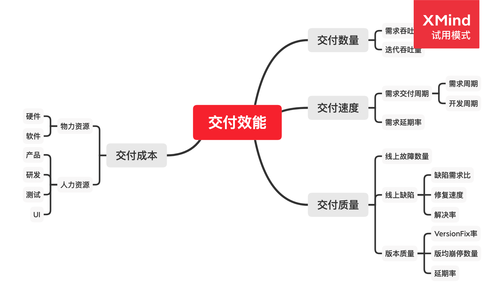
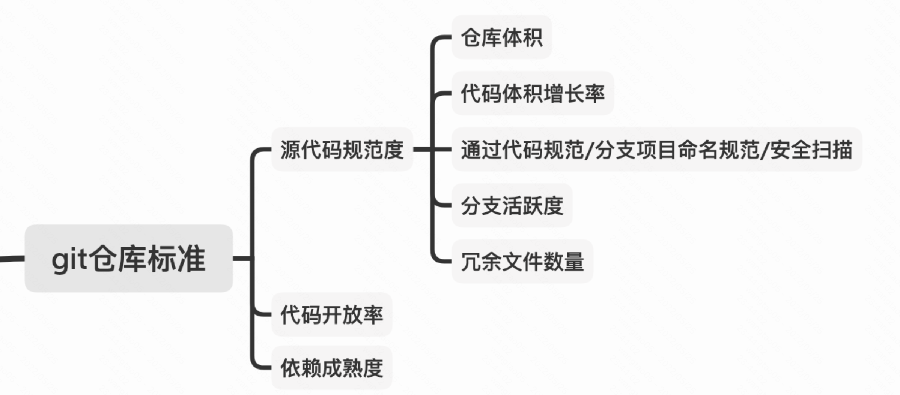
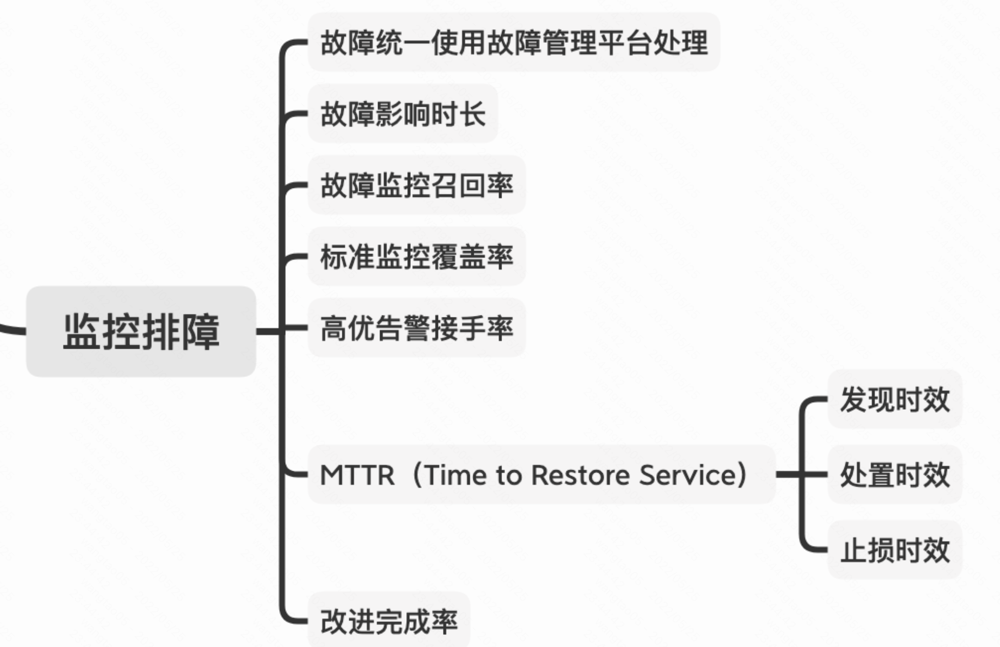

交付

团队效能=人数x人效x工具提效倍数

工程能力	

前端提效

1. 单点提效
   - 组件库、工具库、脚手架与构建工具、开发框架
   - 低代码平台
2. 链路提效
   - 前端到设计：D2C
   - 前端到后端：Faas
   - 前端到产品：P2C

Code Review

1. https://mp.weixin.qq.com/s/EvQzG5esLfWAWbqflkU0WA
   - why，步骤，how

