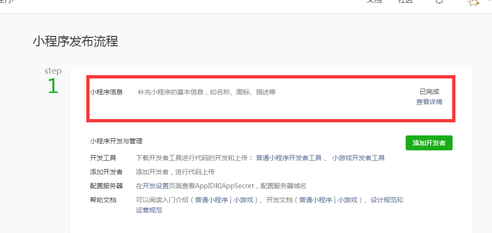
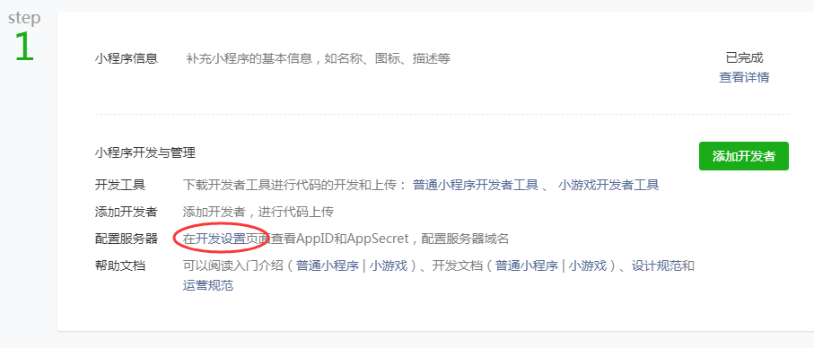
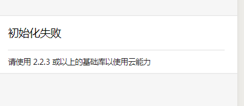
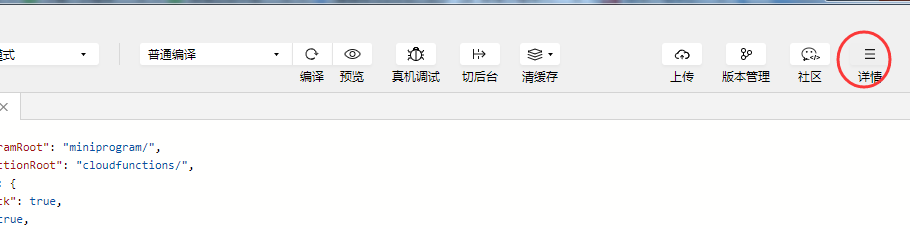
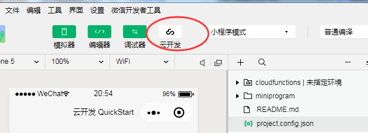
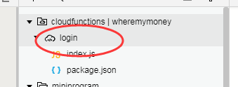

# 从零开始玩小程序

## 自动构建项目可以使用

1. 先下载小程序开发软件https://developers.weixin.qq.com/miniprogram/dev/devtools/download.html
2. 注册个账号，把小程序基本信息填写了
3. 找到AppId，在启动桌面版开发环境时候要填写
4. 新建小程序-云开发，新建完，直接报错
5. 选择详情，将调试基础库改为最高版本
6. 点击云开发，先开通云开发
7. 注意点击login文件夹右键-上传并部署后，cloudfuntions右键更多设置，会看到当前文件夹已经部署到云上
8. 可以测试下样例提供的点击获取openid、上传图片、前端操作数据库功能

## 