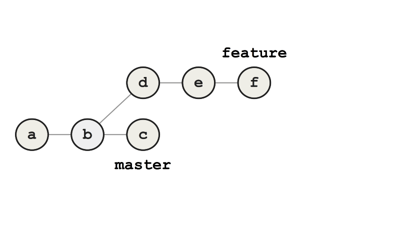
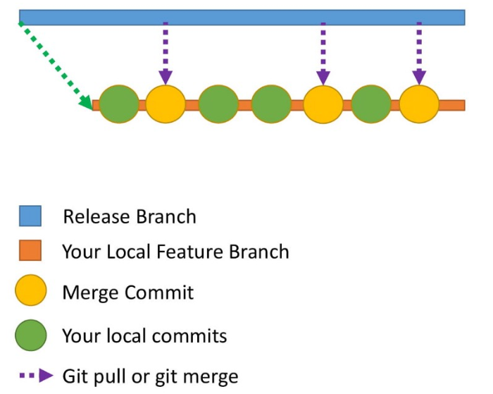

# How to become a Git expert

## 概述

1. https://medium.freecodecamp.org/how-to-become-a-git-expert-e7c38bf54826
2. 20181002


# Git

## 介绍

1. git是开源分布式版本控制系统 
2. 控制系统：这意味着git是一个内容跟踪器，git可以存储内容，由于其其他特性多用于存储代码
3. 分布式：代码并不仅仅在存在中央服务器，开发者电脑都会存有代码的全部复制版，

## 为何需要版本控制

1. 开发代码是并行的，需要有软件解决代码冲突、合并等
2. 需求经常发生变化，版本控制系统允许开发者revert代码或访问某个老版本
3. 代码库的某些项目需要并行运行，这时候git的分支就很有用了


## 缓冲区（add）和commit

1. commit是将代码提交到本地仓库，在commit之前，代码会在缓冲区（staging area）中
2. Staging
   - `git add demo.txt`：缓存demo这个文件
   - `git add file1 file2 file3 `：缓存file1，file2，file3
   - `git add .`：项目中的文件夹与文件全部缓存
3. commit
   - `git commit -m "Initial Commit"`：提交并写上注释
4. log
   - `git log `：显示提交历史
5. status
   - `git status `：查看哪些文件修改了

## 分支

### 概述

1. 分支：是指向Git存储库中最新提交的指针。 

## rebase 与merger

### merger

1. 如图所示，我们有一个分支feature需要合并到master上，需要提交一个g，代表合并之后的

### rebase

1. rebase命令，先将feature指向master的最新节点c，然后在c后添加d，如有冲突提示用户处理冲突，一直添加完全部feature内容
2. 相比merge主要的好处是提交历史是线性的，而不是发散的

## 问题处理

### 如commit错了，如何处理

1. 提交时，提交信息写错，需要重写

   - `git commit --amend -m “New commit message”`

2. 如需要提交一组文件，但少提交了一个

   - 可以再提交一次，但是提交历史会比较混乱

   - --no-edit：表示提交信息不变

     ```
     git add file6 
     git commit --amend --no-edit
     ```

3. 注意：--amend只用于本地仓库，用于远程仓库会有很多问题

### 提交历史混乱，如何处理

1. 如预期一个模块需要10天，这期间会有很多其他人commit的内容，需要不断的pull
2. 那么本地的提交历史会变成这样：
3. 使用rebase可以解决这个问题


## 


