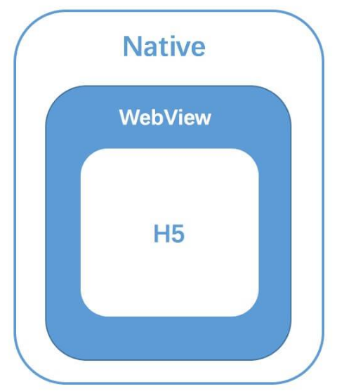

# Hybrid技术原理

1. Hybrid App的本质，其实是在原生的 App 中，使用 WebView 作为容器直接承载 Web页面。

2. 最核心的点就是Native端与H5端 之间的**双向通讯层**，其实这里也可以理解为我们需要一套跨语言通讯方案，来完成 Native(IOS/Android) 与 JS 的通讯。

3. 这个方案就是我们所说的 JSBridge，而实现的关键便是作为容器的 WebView，一切的原理都是基于 WebView 的机制

	

	

## JSBridge

### 起源

1.  JavaScript 主要载体 Web 是当前世界上的 最易编写 、 最易维护 、最易部署 的 UI 构建方式
2. 任何一个移动操作系统中都包含可运行 JavaScript 的容器，因此使用js作为bridge的语言，不像其他语言一样，需要额外的运行环境

