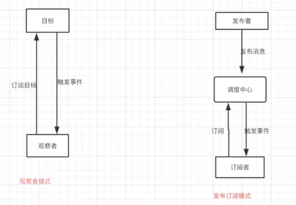

# 观察者模式

1. 当一个对象的状态发生改变时，所有依赖于它的对象都将得到通知

## DOM 事件

1. dom事件是典型的观察者模式

	```javascript
	document.body.addEventListener( 'click', function(){
	    alert(2);
	}, false );
	document.body.click(); // 模拟用户点击
	```

2. 当 body 节点被点击时， body 节点便会向订阅者(function)发布这个消息

## 例子

1. 比如需要实现一个商场项目，用户头像需要用户登录后才能看到，并且有些模块需要在用户登录后进行刷新，常规思路是：

	```javascript
	login.succ(function(data){
	    header.setAvatar( data.avatar); // 设置 header 模块的头像
	    nav.setAvatar( data.avatar ); // 设置导航模块的头像
	    message.refresh(); // 刷新消息列表
	    cart.refresh(); // 刷新购物车列表
	    address.refresh(); // (1)
	    car.refresh();// (2)
	});
	```

2. 但上述方式，如需要新增几个模块，都需要登录后进行刷新，需要增加（1）（2）

3. 如将代码改为观察者模式，则非常简练

	```javascript
	// 发布者
	login.succ(function(data){
	    login.trigger( 'loginSucc', data); // 发布登录成功的消息
	});
	// 订阅者
	var header = (function(){ // header 模块
	    login.listen( 'loginSucc', function( data){
	        header.setAvatar( data.avatar );
	    });
	    return {
	        setAvatar: function( data ){
	            console.log( '设置 header 模块的头像' );
	        }
	    }
	})();
	```

	

# 发布订阅模式

## 与观察者的主要区别

1. 最大的区别就是发布订阅模式有个事件调度中心
2. 
3. 举例说明
   - 观察者模式：吃饭时，顾客等待叫好，餐馆是观察的对象，叫号时通知观察者（顾客）
   - 发布订阅模式：要了号后想四处逛逛，则用微信扫描了二维码，当餐馆叫号后，会通知微信，微信会通知你

## 综述

1. 在观察者模式中，观察者是知道订阅者的，在发布订阅模式中，发布者和订阅者不知道对方的存在。它们只有通过消息代理进行通信。
2. 在发布订阅模式中，组件是松散耦合的，正好和观察者模式相反。
3. 观察者模式大多数时候是同步的，比如当事件触发，Subject就会去调用观察者的方法。而发布-订阅模式大多数时候是异步的（使用消息队列）。