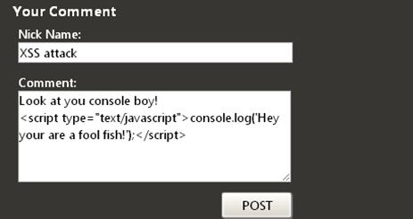

# XSS

## 概述

1. XSS（Cross Site Scripting，跨站点脚本）,是为了不与css混淆，故意弄成这样的
2. XSS根源就是没完全过滤客户端提交的数据。 

## 举例

1. 如对用户不进行过滤，完全信任用户输入，如一个评论框，用户这样输入：
2. 这样无论是谁访问这个页面都会输出console这段内容

## 如何防御

1. 最佳的做法就是对数据进行严格的输出编码，使得攻击者提供的数据不再被浏览器认为是脚本而被误执行
2. 要堵住这个漏洞，关键不在于输入过滤，而在于输出过滤 

# CSRF攻击

## 概述

1. CSRF（Cross Site Request Forgery），中文是跨站点请求伪造。CSRF攻击者在用户已经登录目标网站之后，诱使用户访问一个攻击页面，利用目标网站对用户的信任，以用户身份在攻击页面对目标网站发起伪造用户操作的请求，达到攻击目的。

## 攻击原理

1. 

## 防御手段

### 尽量使用POST，限制GET

1. GET接口太容易被拿来做CSRF攻击，只要构造一个img标签，就可以进行攻击
2. 但对于post请求，攻击者可以构造一个form表单

### 加验证码

1. 验证码能很好遏制CSRF攻击，但出于用户体验的考虑，不能将所有操作都加上验证码

### Referer Check

1. 在 HTTP 头中有一个字段叫 Referer，它记录了该 HTTP 请求的来源地址
2. 对于CSRF攻击，黑客需要在自己网站构造请求，referer值肯定不同
3. 但referer值由浏览器提供，不能保证浏览器没有安全漏洞，而且这种方式是将安全性都依赖于第三方（即浏览器）来保障

## Anti CSRF Token

# 警惕iframe带来的风险

## 概述

1. 前端页面需要用到第三方提供的页面组件，通常会以iframe的方式引入。
2. 如果iframe中的域名因为过期而被恶意攻击者抢注，或者第三方被黑客攻破，iframe中的内容被替换掉了，从而利用用户浏览器中的安全漏洞下载安装木马、恶意勒索软件等等，这问题可就大了 

## 如何防御

1. 在HTML5中，iframe有了一个叫做sandbox的安全属性 
2. 可以对iframe进行细粒度的操作，比如不准提交表单、不准弹窗、不准执行脚本等等 

# SQL注入

1. 之所以会发生SQL注入，主要因为代码中存在拼接SQL语句的情况 