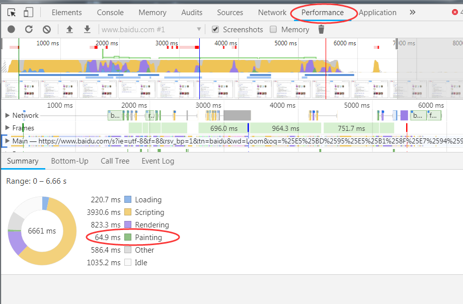

# Browser painting and considerations for web performance

1. https://css-tricks.com/browser-painting-and-considerations-for-web-performance/
2. 20180808

## 读后总结

1. 本文主要讨论painting，并从painting考虑web性能
2. 使用Control+Shift+P可以打开面板的搜索，可以快速打开某个面板
3. 重渲染会影响性能，告知如何看重复渲染

## 内容

1. 浏览器将html、css、js转换为可浏览页面简述为以下步骤
	- 构建DOM和CSSOM
	- 构建render树，即把CSSOM中的style和DOM放入内容中
	- 基于渲染树计算布局和元素位置
	- 浏览器逐个像素地绘制以创建页面
2. pating除了发生在页面开始构建，还会发生在dom或CSSOM改变时
3. react等虚拟dom技术实际上是处理，当真正需要时在改变DOM
4. 在chrome中，使用performance可以看到paintings的绘制时间

## render panel

1. 可以打开如FPS、paint flashing等高级功能
2. layer borders
	- 用于显示由浏览器呈现的层的边界，以便识别变换或形状变化
3. paint flashing
	- 用于突出显示网页中被迫重绘的区域 