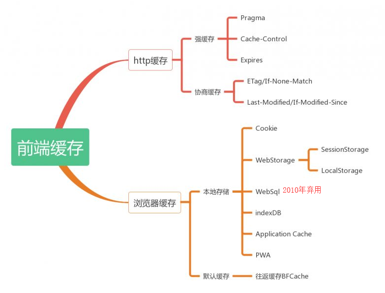
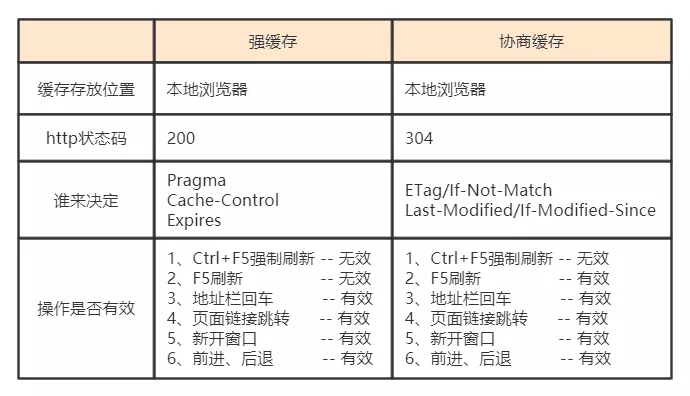

# 前端缓存综述

1. cookie参见《2.网络基础/HTTP》
2. webstorage、indexDB、service worker参见《2-html5/1-离线应用与存储》

# HTTP 缓存

## 什么是HTTP缓存

1. 当客户端向服务器请求资源时，会先抵达浏览器缓存，如果浏览器有“要请求资源”的副本，就可以直接从浏览器缓存中提取而不是从原始服务器中提取这个资源。
2. http缓存都是从第二次请求开始的。第一次请求资源时，服务器返回资源，并在respone header头中回传资源的缓存参数；第二次请求时，浏览器判断这些请求参数，命中强缓存就直接200，否则就把请求参数加到request header头中传给服务器，看是否命中协商缓存，命中则返回304，否则服务器会返回新的资源。

## 缓存分类

### 概述

### 强缓存

1. 强制缓存优先级高于协商缓存，当执行强制缓存的规则时，如果缓存生效，直接使用缓存，不再执行对比缓存规则。

2. | header属性              | 可选值                                                       | 优先级 | 优缺点 |
   | ----------------------- | ------------------------------------------------------------ | ------ | ------ |
   | Pragma(HTTP/1.0)        | no-cache：不直接使用缓存，根据新鲜度来使用缓存               | 高     | 1、只支持请求头 2、为了兼容http1.0 |
   | Cache-Control(HTTP/1.0) | no-cache：不直接使用缓存，根据新鲜度来使用缓存 no-store：不存储任何缓存 max-age：设置缓存存储的最大周期，单位秒 public/private（响应头）：是否被单个用户使用，默认是private must-revalidate（响应头）：每次访问需要缓存校验 |       中 | 1、通用头，即请求头与响应头都支持这个属性 |
   | Expires(HTTP/1.0+)      | h                                                    | 低 | 1、服务器与客户端时间不一致会出问题 2、响应头 3、表示缓存何时过期，如值为0，则表示过去的时间，即缓存已过期 |

   

### 协商缓存

1. 当第一次请求时服务器返回的响应头中

   - 没有Cache-Control和Expires
   - Cache-Control和Expires过期
   - Cache-control属性设置为no-cache时
   - 即不走强缓存时，那么浏览器第二次请求时就会与服务器进行协商，与服务器端对比判断资源是否进行了修改更新。
   - 如果服务器端的资源没有修改，那么就会返回304状态码，使用缓存

2. 与协商缓存相关的请求头

   