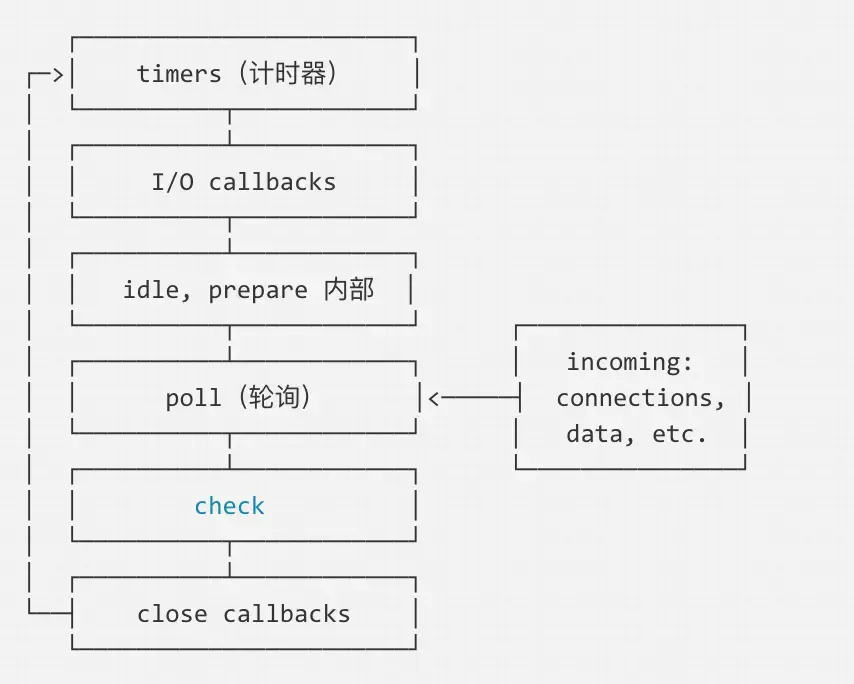

# 事件循环

## 概述

1. node的event Loop有六个阶段
	- timers 阶段：执行 setTimeout、setInterval 的 callback 回调。
	- I/O callbacks阶段：除了定时器与close事件
	- idle，prepare阶段：node内部，process.nextTick在此阶段
	- poll 阶段：获取新的IO事件
	- check 阶段：执行setImmediate回调
	- close阶段：close的回调，如socket.on('close', callback);

## node里面的微任务

1. process.nextTick ，promise在各个阶段切换的中间执行,即从一个阶段切换到下个阶段前执行