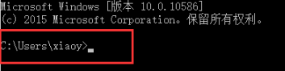
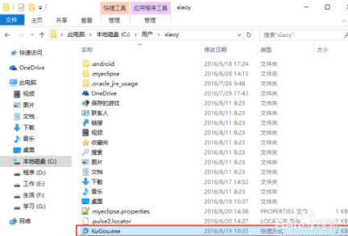

# windows下快捷使用

## 如何cmd命令行快速打开git

1. 打开命令行，打开命令行中默认的路径 
2. 复制git.exe快捷方式到当前目录下
3. 然后，直接运行"git.exe.lnk"，方便起见，直接利用tab

# git命令

1. git init
	- 把这个目录变成Git可以管理的仓库 
2. cd /f/
	- 跳转到f盘
3. mkdir
	- 创建目录
4. 