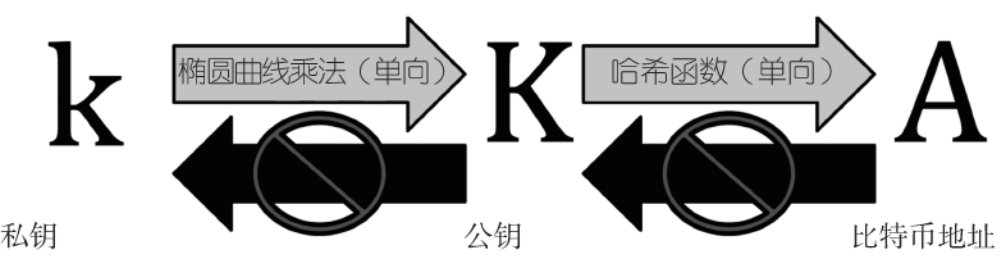

比特币是由被称为挖矿的过程产生的，它是一种在验证比特币交易的过程中竞争解决一类数学问题的机制

比特币系统由以下部分组成。
●去中心化的点对点网络（比特币协议）。
●公共交易账本（区块链）。
●去中心化的基于数学的确定性的货币发行体系（分布式挖矿）。

去中心化的交易验证系统（交易脚本）。

中本聪的发明也是对之前未能解决的分布式计算问题（拜占庭将军问题）的一个实用解决方案。简单来说，问题在于如何在一个不可靠且存在潜在背叛风险的网络中交换信息并达成共识。中本聪的解决方案是在一个没有中央可信节点的情况下，利用工作量证明来达成共识，它标志着分布式计算科学的一个重大创新，它的适用性要远远超越货币领域

比特币客户端会生成一个1或3的比特币地址，可以生成任意多的比特币地址，所有这些地址都可以让收到的资金直接进入你的钱包。钱包就是简单的一堆地址和它们内含的解锁资金的密钥的集合

密钥、地址、钱包

1. “数字密钥实际上并不存储于网络中，而是由用户创建并以文件或者简单数据库的形式由用户自行保存，叫作钱包”，“是完全独立于比特币协议的”

2. “为了能够加入区块链中，每个比特币交易都需要提供一个有效签名，这个签名只能由有效的数字密钥产生”

3. “在比特币的支付环节，接收者的公钥由其数字指纹替代，被称为比特币地址”

4. “密钥对由私钥和公钥（由私钥派生而来）组成，公钥用于接收比特币，私钥用于对支付比特币的交易进行签名”

   

比特币钱包

“比特币钱包通常包含一些密钥对的集合，每个密钥对包含一个私钥和一个公钥。私钥（k），是个数字，通常随机获取。从私钥出发，利用椭圆曲线乘法（一种单向加密函数），可以计算出一个公钥（K）。从公钥出发，利用单向加密哈希函数可以生成比特币地址（A）”

私钥

1. “用户交易时想证明使用的资金是他自己的，必须使用其私钥对交易进行签名”
2. “如果私钥丢失，将是不可恢复的，“受它保护的资金也就彻底丢失了。”

公钥

1. “公钥是使用椭圆曲线乘法（非对称加密算法）从私钥计算得来的，这是一个不可逆的过程:K=k×G，其中，k是私钥，G是一个常数点（被称为生成点）”

   

比特币地址

1. “比特币地址是一串由数字和字母构成的字符串，可以分享给任何想给你转钱的人”
2. “比特币地址是通过一种单向的加密哈希算法从公钥推导出来的”
3. “比特币地址基本上是以Base58Check编码形式展现给用户的，它使用58个字符（一个Base58数字系统）和一个校验码，能够达到方便阅读、避免歧义等

